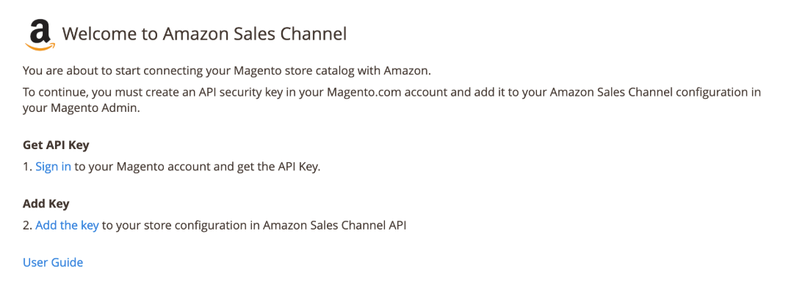
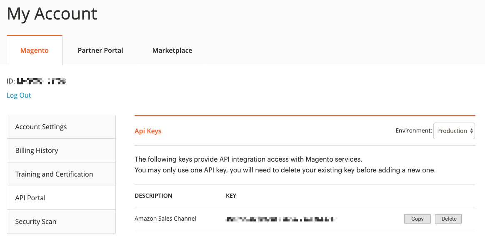

The Amazon Sales Channel extension installs and adds features to integrate your Magento catalog with Amazon Seller Accounts to sell through the Amazon Marketplace. To review additional information, see the [Amazon Sales Channel Marketplace](http://marketplace.magento.com/magento-module-amazon.html) page.

## Requirements

- **Magento Instance**: Amazon Sales Channel can be installed on instances with {{site.data.var.ce}} and {{site.data.var.ee}} versions 2.2.4+ and 2.3.X. We do not support the extension on Magento 2.1 or Magento 1.
- **Magento Web Account**: You should have a Magento web account, which is used to create and track an API key.
- **API Key**: Get a Amazon Sales Channel API key through your Magento web account. The following instructions include these steps.

## Install

Amazon Sales Channel install is a `.zip` file available from the Magento Marketplace. It includes a composer.json which provides the name `magento/amazon-sales-channel` and the available version.

1. Log in with your Magento web account.
1. Click the **Marketplace** tab, then click **My Purchases**.
1. Locate and select Amazon Sales Channel.
1. On the extension page, select the version from the drop-down menu.
1. For the component name and version, click **Technical Details**.
1. Click **Download**.
1. Export the contents to your Magento root.
1. Follow all instructions for Extension [Installation]({{ site.baseurl }}/extensions/install/).
1. Update the services connector entry in your `composer.json` file
    - Add the extension’s name and version to your composer.json file:
    - Navigate to your Magento project directory and update your composer.json file.

      ```bash
      composer require magento/services-connector:~1.0.3
      ```

    - Enter your [authentication keys]({{ site.baseurl }}/guides/v{{ site.version }}/install-gde/prereq/connect-auth.html). Your public key is your username; your private key is your password.
    - Wait for Composer to finish updating your project dependencies and make sure there aren’t any errors.
1. After installing, enter an [API Key](https://docs.magento.com/m2/ce/user_guide/sales-channels/amazon/amazon-verify-api-key.html) to complete configuration.

## Add the Amazon Sales Channel API key

To add the Amazon Sales Channel API key:

1. Log into the Magento Admin.

1. On the Admin sidebar, click **Marketing**. Then under **Channels**, click **Amazon**.

    If you need an API Key, the following screen displays.

    

1. Click **Sign in** to access your Magento web account. The [Magento Accounts](https://account.magento.com/customer/account/login) page loads, displaying the **API Portal** tab.

    You may need to login with your Magento web account credentials. If you need to create an account, visit [here](https://account.magento.com/customer/account/login) and register.

1. API keys are available through the **API Portal** tab. Copy the key.

    If you need to create a new key, enter a description like "Amazon Sales Channel" and click **Add**. Copy this new key.

    

1. Return to the Magento Admin tab and click **Add the key** on the Amazon welcome screen.

    A store configuration page opens to **Stores** > **Configuration** > **Services** > **Magento Services**.

1. On the Api Keys screen, paste the key you copied for **Production API Key**.

1. Click **Save Config**.

1. On the Admin sidebar, click **Marketing**. Then under **Channels**, click **Amazon**. Magento verifies and validates the entered API key, continuing with onboarding.

See [Onboarding Amazon Sales Channel](https://docs.magento.com/m2/ce/user_guide/sales-channels/amazon/amazon-onboarding-home.html) to continue.

## Amazon Sales Channel configuration options

You have the following options for configuring Amazon Sales Channel. You do not need to modify these settings to begin onboarding and selling on Amazon. We recommend advanced administrators consider these options.

1. Log into the Magento Admin.

1. On the Admin sidebar, click **Stores**. Then under **Settings**, click **Configuration**.

1. Click **Sales Channels**, then **Global Settings**.

1. For **Show Dashboard Chart**, set to "Yes" if you want to display the **Revenue** section on the store's dashboard screen.

1. For **Clear Log History**, indicate the interval for clearing the collected logs. Options include Once Daily, Once Weekly, and Once Monthly (default).

1. Advanced users recommended: **Background Tasks (CRON) Source**. All background tasks are handled by CRON jobs using the Magento CRON. Advanced users can change this setting to Command Line (CLI) CRON.

1. Click **Save Config**.

## Update

1. Log in with your [Magento web account](https://account.magento.com/applications/customer/login/).
1. Click the **Marketplace** tab, then open **My Profile**.
1. Click **My Purchases**.
1. Locate and select Amazon Sales Channel.
1. On the extension page, select the version from the drop-down menu.
1. For the component name and version, click **Technical Details**.
1. Click **Download**.

Complete the upgrade following the instructions [Upgrade an extension]({{site.baseurl}}/extensions/install/#upgrade-an-extension).
