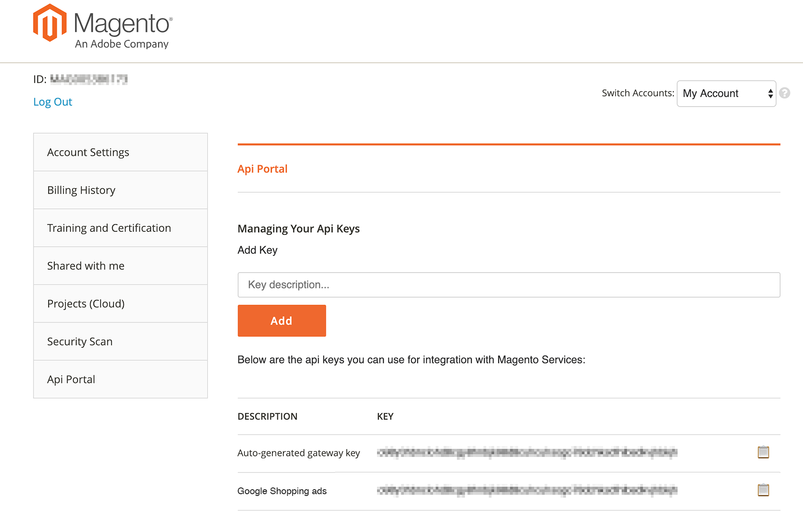

The Amazon Sales Channel extension installs and adds Amazon Sales features to Magento. To review additional information, see the [Amazon Sales Channel Marketplace page](http://marketplace.magento.com/magento-module-amazon.html).

## Requirements

- **Magento Instance**: Amazon Sales Channel can be installed on instances with {{site.data.var.ce}} and {{site.data.var.ee}} versions 2.2.X and 2.3.X. We do not support the extension on Magento 2.1 or Magento 1.
- **Magento Web Account**: You should have a Magento web account, which is used to create and track an API key.
- **API Key**: Get an Amazon Sales Channel API key through your Magento web account. The following instructions include these steps.
- **Amazon accounts**: During onboarding, you will create and configure an Amazon Seller account. Consider using email accounts for your business as the account will be the primary owner (admin) of the Amazon accounts you set in this integration.

## Install

See [Installation]({{site.baseurl}}/extensions/install/).

The name of the extension is `magento/module/amazon`.

## Add the Amazon API key

To add the Amazon API Key:

1. On the Admin sidebar, click **Marketing**. Then under **Channels**, click **Amazon**.

    If you need an API Key, the following screen displays.

    

1. Tap **Get API Key**. A new tab opens with [Magento Accounts](https://account.magento.com/customer/account/login) with the **Api Portal** tab open displaying the key.

1. You may need to login with your Magento web account credentials. If you need to create an account, visit [here](https://account.magento.com/customer/account/login) and register. This account should be part of your company or business.

1. API keys are available through the **Api Portal** tab. Tap  to copy your key.
  
    If you need to create a new key, enter a description like "Google Shopping ads" and click **Add**. Copy this new key.

    

1. Return to the Magento Admin tab and click **Add Key** on the Google welcome screen.

    A store configuration page opens to **Stores** > **Configuration** > **Sales** > **Sales Channel**.

1. In the Google Shopping ads section, paste the key you copied for **API key**.

1. Tap **Save Config**.

    

1. On the Admin sidebar, click **Marketing**. Then under **Channels**, click **Amazon**. Magento verifies and validates the entered API key, continuing with onboarding.