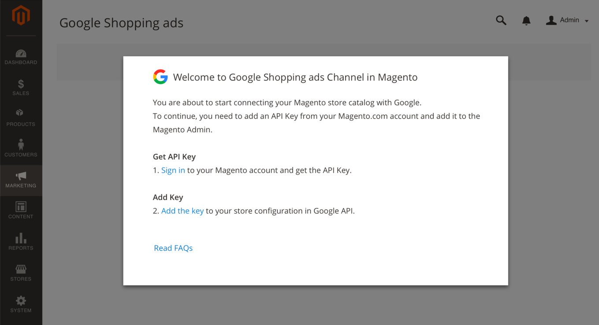
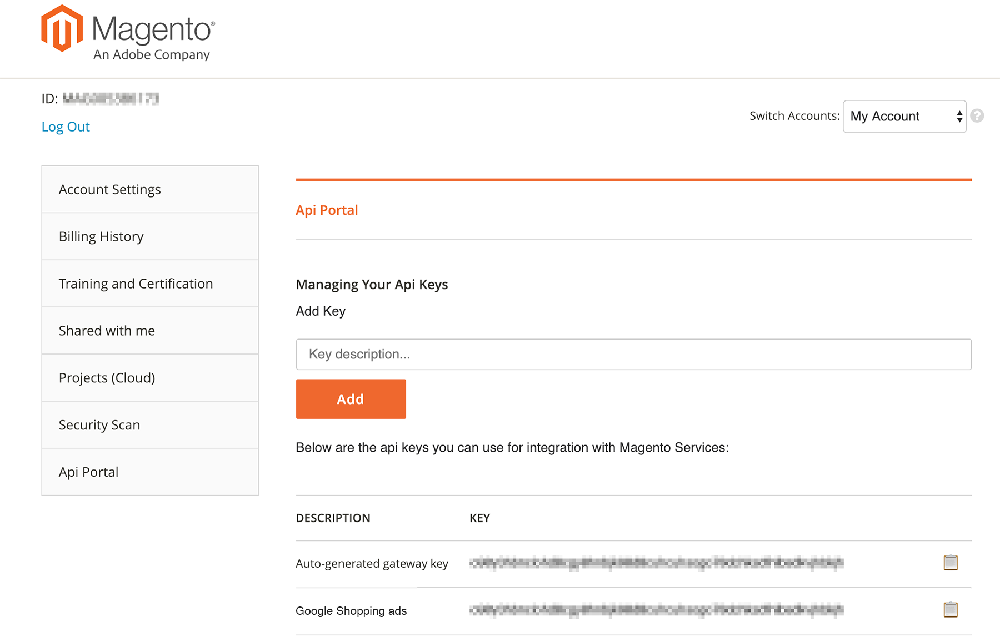
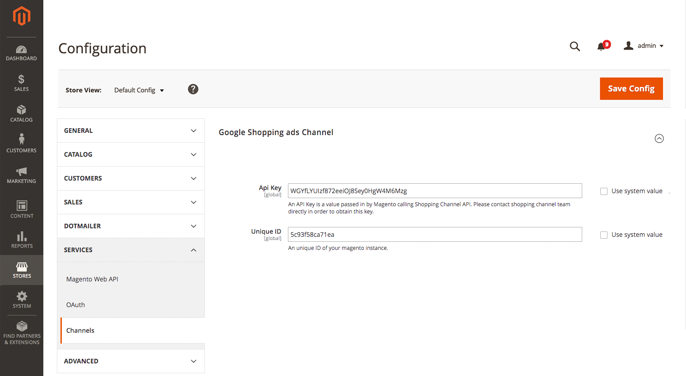
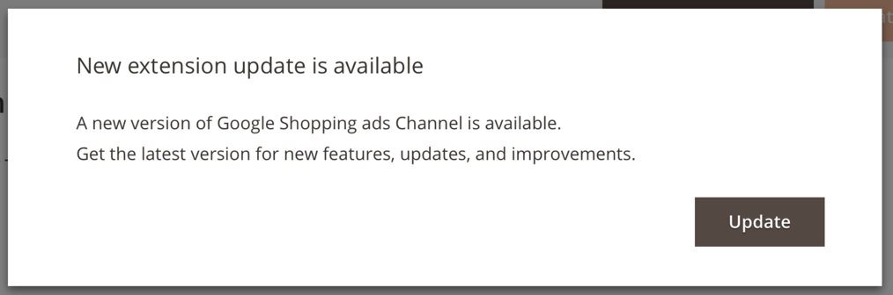

The Google Shopping ads extension installs and adds Google Shopping features to Magento. To review additional information, see the [Google Shopping ads Channel Marketplace page](http://marketplace.magento.com/magento-google-shopping-ads.html).

## Requirements

- **Magento Instance**: Google Shopping ads Channel can be installed on instances with {{site.data.var.ce}} and {{site.data.var.ee}} versions 2.2.4+ and 2.3.x. We do not support the extension on Magento 2.1 or Magento 1.
- **Magento Web Account**: You should have a Magento web account, which is used to create and track an API key.
- **API Key**: Get a Google Shopping ads API key through your Magento web account. The following instructions include these steps.
- **Google accounts**: During onboarding, you will create and configure any required Google accounts and settings. Consider using email accounts for your business as the account will be the primary owner (admin) of the Google, Google Merchant Center and Google Ads accounts you set in this integration.
  - Google account: We recommend using a Google account for your business or company, not a personal Google account.
  - Google Merchant Center account: You will create these accounts during onboarding. You cannot use an existing GMC account. If you have store URLs claimed and verified by an existing GMC account, you will need to unclaim.
  - Google Ads account: You will create these accounts during onboarding. You cannot use an existing Google ads account.

## Install

Google Shopping ads Channel install is a `.zip` file available from the Magento Marketplace. It includes a composer.json which provides the name `magento/google-shopping-ads` and the available version.

1. Log in with your Magento web account.
1. Click the **Marketplace** tab, then click **My Purchases**.
1. Locate and select Google Shopping ads Channel.
1. On the extension page, select the version from the drop-down menu.
1. For the component name and version, click **Technical Details**.
1. Click **Download**.
1. Export the contents to your Magento root.
1. Follow all instructions for Extension [Installation]({{site.baseurl}}/extensions/install/).
1. After installing, enter an API Key to complete configuration.

## Add the Google API key

To add the Google API key:

1. Log into the Magento Admin.

1. On the Admin sidebar, click **Marketing**. Then under **Advertising Channels**, click **Google Shopping ads**.

    If you need an API Key, the following screen displays.

    

1. Click **Sign in** to access your Magento web account. The [Magento Accounts](https://account.magento.com/customer/account/login) page loads, displaying the **Api Portal** tab.

    You may need to login with your Magento web account credentials. If you need to create an account, visit [here](https://account.magento.com/customer/account/login) and register.

1. API keys are available through the **Api Portal** tab. Copy the key.

    If you need to create a new key, enter a description like "Google Shopping ads" and click **Add**. Copy this new key.

    

1. Return to the Magento Admin tab and click **Add Key** on the Amazon welcome screen.

    A store configuration page opens to **Stores** > **Configuration** > **Services** > **Channel**.

1. In the Google Shopping ads section, paste the key you copied for **API key**.

1. Click **Save Config**.

    

    {:.bs-callout-info}
    Beginning with version 3.0.0, you can also [Enable Service Logs](https://docs.magento.com/m2/ce/user_guide/configuration/services/channels.html) during this step. This option is disabled by default and should only be used when needed for troubleshooting, as continued logging will negatively impact performance.

1. On the Admin sidebar, click **Marketing**. Then under **Advertising Channels**, click **Google Shopping ads**. Magento verifies and validates the entered API key, continuing with onboarding.

See [Onboarding Google Shopping ads](https://docs.magento.com/m2/ce/user_guide/sales-channels/google-ads/onboarding-google.html) to continue.

## Update

If an update is available, a message displays when opening Google Shopping ads Channel.

1. Click **Update**.
1. Log in with your Magento web account.
1. Click the **Marketplace** tab, then click **My Purchases**.
1. Locate and select Google Shopping ads Channel.
1. On the extension page, select the version from the drop-down menu.
1. For the component name and version, click **Technical Details**.
1. Click **Download**.

Complete the upgrade following the instructions [Upgrade an extension]({{site.baseurl}}/extensions/install/#upgrade-an-extension).
