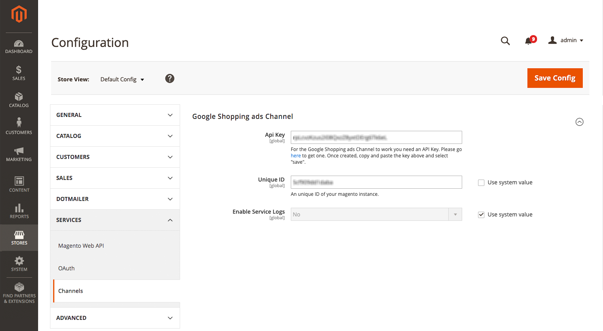

The Google Shopping ads extension installs and adds Google Shopping features to Magento. To review additional information, see the Magento Marketplace page.

{:.bs-callout .bs-callout-info}
Due to the technical nature of this installation, these instructions may require developer assistance.

## Requirements

- **Magento Instance**: Google Shopping Ads Channel can be installed on instances with Magento Open Source, Magento Commerce, and Magento Commerce Cloud versions, 2.2.X and 2.3.X. We do not support the extension on Magento 2.1 or Magento 1.
- **Magento Web Account**: You should have a Magento web account, which is used to create and track an API key.
- **API Key**: Get a Google Shopping ads API key through your Magento web account. The following instructions include these steps.
- **Google accounts**: During onboarding, you will create and configure any required Google accounts and settings. Consider using email accounts for your business as the account will be the primary owner (admin) of the Google, Google Merchant Center, and Google Ads accounts you set in this integration.
  - Google Account: We recommend using a Google account associated to your business or company.
  - Google Merchant Center Account: You will create these accounts during onboarding. You can use an existing GMC account. It will also have payment methods and complete purchases for Google Ads services for your company or business.
  - Google Ads Account: You should not use an existing Google Ads accounts. If you plan on using the same email and contact information for this account with this integration, please change those settings with Google or use a different email account during onboarding.

## Install

See [Installation]({{site.baseurl}}/extensions/install/).

The name of the extension is `magento/google-shopping-ads`.

## Add the Amazon API key

To add the Amazon API Key:

1. On the Admin sidebar, tap **Marketing**. Then under Advertising Channels, tap **Amazon Sales Channel**.

    If you need an API Key, the following screen displays to walk through the process.

    

1. Tap **Get API Key**. A new tab opens with [Magento Accounts](https://account.magento.com/customer/account/login) with the **Api Portal** tab open displaying the key.

1. You may need to login with your Magento web account credentials. If you need to create an account, visit [here](https://account.magento.com/customer/account/login) and register. This account should be part of your company or business.

1. API keys are available through the **Api Portal** tab. Tap  to copy your key.
  
    If you need to create a new key, enter a description like "Amazon Sales Channel" and tap **Add**. Copy this new key.

    

1. Return to the Magento Admin tab and tap **Add Key** on the Amazon welcome screen.

    A store configuration page opens to **Stores** > **Configuration** > **Sales** > **Sales Channel**.

1. In the Amazon Sales Channel section, paste the key you copied for **API key**.

1. Tap **Save Config**.

    

1. On the Admin sidebar, tap **Marketing**. Then under Advertising Channels, tap **Amazon Sales Channel**. Magento verifies and validates the entered API key, continuing with onboarding.
