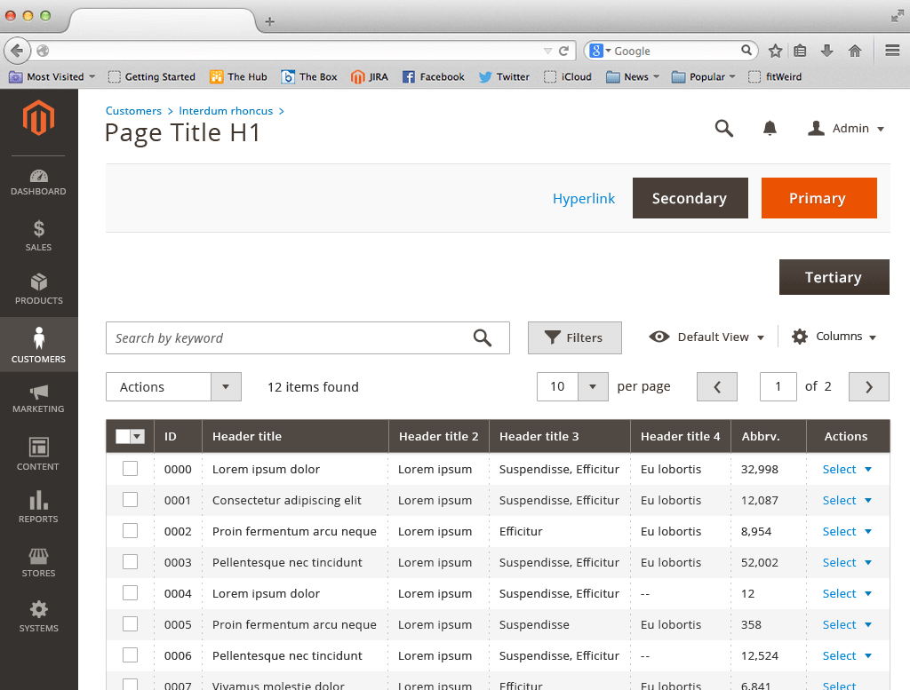
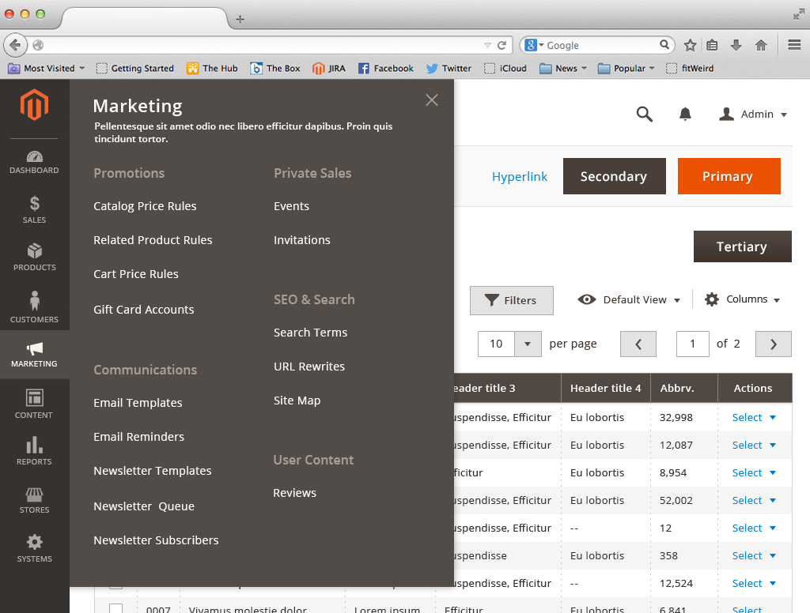
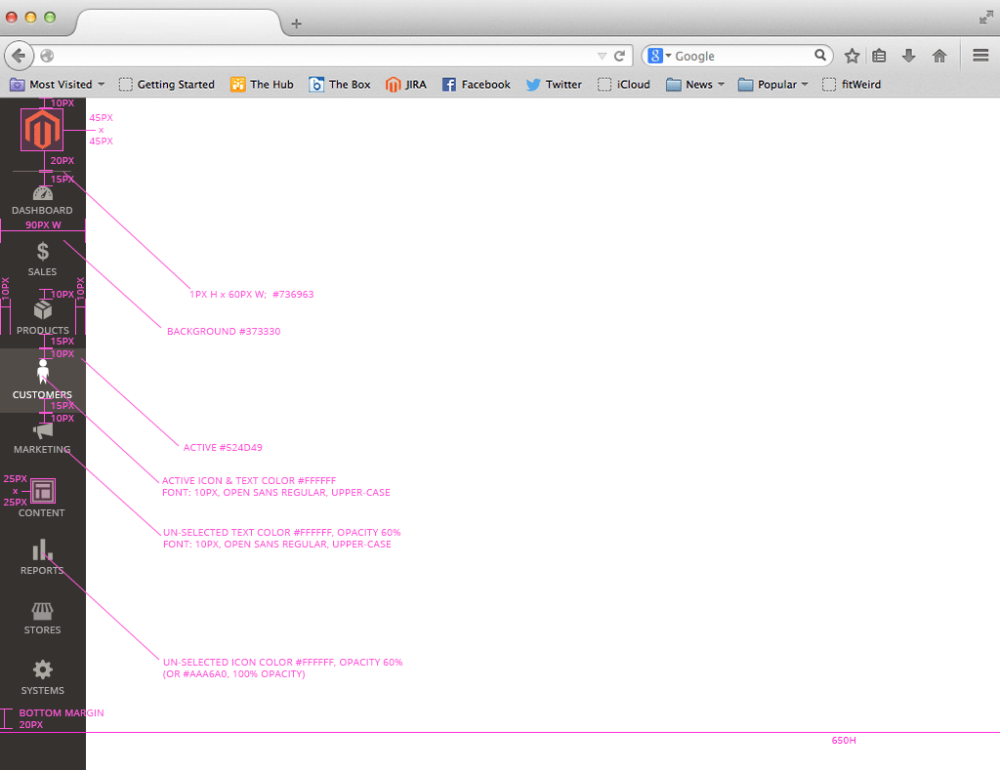
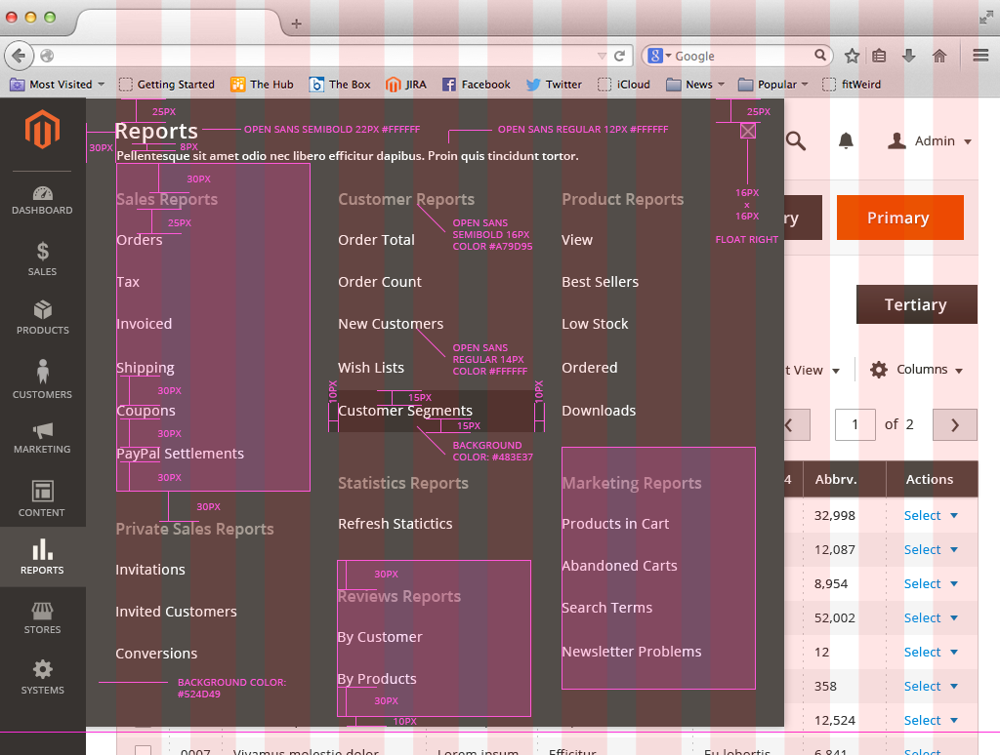
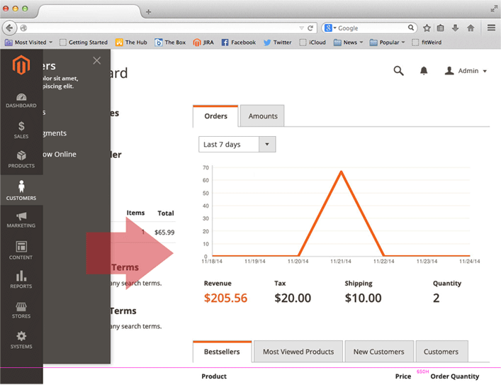
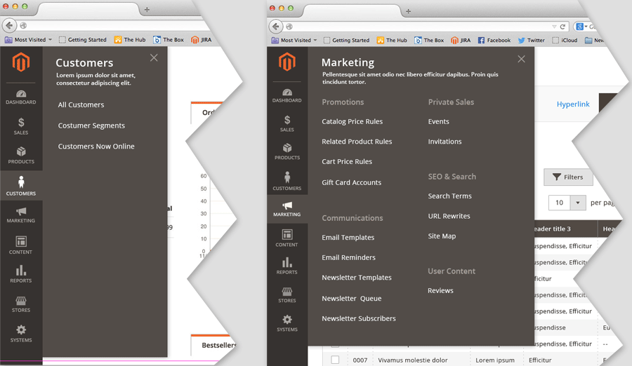

<h2> Primary Navigation </h2>

<h3>Contents</h3>

* <a href="#overview">Overview</a>
* <a href="#use">When to Use</a>
* <a href="#no_use">When Not to Use</a>
* <a href="#appearance">Appearance and Behavior</a>
* <a href="#primary">Primary Level</a>
* <a href="#secondary">Secondary Level</a>
* <a href="#behavior">Behaviors</a>
* <a href="#variations">Variations</a>
* <a href="#access">Accessibility</a>
* <a href="#assets">Assets</a>

<h3 id="overview">Overview</h3>
The Primary Navigation is the primary navigational control for the site that allows Users to immediately access the features and functions they need intuitively and quickly.

Primary Navigation was re-designed to optimize for the User’s experience and efficiency by de-emphasizing links that are never or rarely used (Website re-indexing, Import/Export, etc.). This enables the ability to bring the most commonly used Actions to the closer to the front and provide them greater prominence making getting to features and functions that much faster.

Likewise, following numerous mental models exercises, the Navigation mirrors the categorical configuration established over hundreds of years of retail, which has become standard in e-commerce. This enhances the intuitiveness of the site’s navigation. 

The Primary Navigation is also persistent on all administrative pages, adding to its usefulness and usage. 

What may prove to be the most important improvement to the navigation is that there are now established rules, criteria and oversight from Product, Design and Marketing for what links can be added and where they should be located. There is strategic guidance for link placement.

In an effort to optimize the user interface for ‘touch’, Primary Navigation has a vertical orientation, running down the left side of the screen and persists throughout the experience. This allows for quick access on hand-held devices. The main categories of navigation are represented with an icon and text. Tapping/clicking the icon reveals the sub-menu of the category via a fly-out panel. This provides immediate visibility and understanding of Categories and Sub-categories and the links that can be found under them, which is ideal for first time and new users making the site’s Taxonomy quickly understood. 

<h3 id="use">When to Use</h3>
Always on the browser proper: Always present and available.

<h3 id="no_use">When not to use</h3>
The primary reason to not use, disable or hide the Primary Navigation is when the user flow and experience should not allow or make difficult the ability for the User to leave or abandon the process they are in, specifically, processes that are Cancel/Commit in nature. For example, during a critical setup process that might fail or do damage to the user if not completed, we do not want to make available the Primary Navigation (or any other for that matter). It simply increases the possibility Users will not complete critical processes.

Primary Navigation should never appear in a Modal or any other pattern that utilizes a new layer of functionality as this introduces the possibility of two different sites and usage at the same time, which can cause numerous UX and functionality issues.

<h3 id="appearance">Appearance and Behavior</h3>
<h4>Position and dimensions</h4>
* Primary Navigation runs the length of the left side of the page.
* The Magento logo (Brand) is found at the top of Global Navigation.
* Primary menu is always visible with a visual indication of the currently selected category.
* The width of the menu should be no less than 64px wide.
* Category titles should be concise to minimize wrapping, but titles should wrap when necessary, as opposed to truncating the title.
* The sub-category fly-out should be just large enough accommodate the options available for their respective categories.

<h4>Sample of Primary Navigation</h4>

<h4>Sample of Secondary Level menu</h4>

 
 

<h3 id="primary">Primary Level</h3>
Primary Level menu items consist of an Icon and Text Label
Navigation container = 90px W, background color = #373330
Padding above menu icon = 10px
Padding beneath menu title = 15px
Padding on left and right (of icon and title pair) = 10px
Active/Selected state background = #524d49 

<h4>Primary Navigation Specs</h4>

<h3 id="secondary">Secondary Level</h3> 
The Category title should appear at the top of the Secondary Level menu, it is recommended a description of the category follow the title.
Secondary Level menu may have link groups. When groups exist, the group must have a label.
Navigation container = Variable width, background color = #524D49
Padding above group title = 30px
Padding beneath group title = 25px
Padding between links = 30px
Active/Selected state background = #524d49 

<h4>Secondary Level Specs</h4>

 
 

<h3 id="behavior">Behaviors</h3>
<h4>Visual Behavior</h4>
* If Secondary menu contains:
  1. Only a single section, Section Label should be omitted.
  2. More than one section, each section MUST use a Section Label
* Every effort should be made to have both the Primary and Secondary Level menu items appear above the “page fold” (Secondary when visible) under minimum supported resolution (ideally no greater than 650px in height).
* The Secondary Level menu should ‘emerge’ from beneath the Primary menu, sliding out left-to-right

<h4><small>Second Level "slide out"</small></h4>

 
 

* The footprint of the Secondary Level menu should not be excessive and only a large as necessary to contain the related options for the relative category, in units consisting of three page-grid columns. Therefore the various Second Level menus may vary in size from one another.

<h4><small>Second Level "footprints"</small></h4>

 
 

* Selected/Active items should adopt a ‘highlight’ to indicate to the user what is currently selected.
  1. This highlight can appear over selectable menu items on hover (desktop only)

<h4><small>Hover state (desktop only)</small></h4>

 
 

<h4>Functional Behavior</h4>
* Only by clicking/tapping an option in Primary menu will reveal the Secondary Level menu for that category, via fly-out panel sliding into view from left-to-right.
* Sub-menus should NOT be revealed on hover.
* Secondary Level menu **closes** when the following occurs:
  1. A selection is made from the sub-menu
  2. The sub-menu closes and selected page content loads
  3. The close control is clicked/tapped
* When closing, the sub-menu slides out of view (from right-to-left)
* When another category is selected from the Primary menu
  1. The opened sub-menu slides out of view, from right-to-left.
  2. The sub-menu of the ‘newly’ selected category should open.
* Primary and sub menu items that take you to different pages should use "pointer" mouse cursor (desktop only).

<h3 id="variations">Variations</h3>
Any examples of pattern variations should be presented and described here.

<h3 id="access">Accessibility</h3>
Implementation of this menu must comply with WCAG AAA or AA standards at least.
HTML element must:

1. Use NAV HTML5 element
2. Utilize following roles: “menu”, “menubar”, “menuitem”
3. Utilize following ARIA attributes:
  * <a href="http://www.w3.org/TR/wai-aria/roles#menu" target="new">http://www.w3.org/TR/wai-aria/roles#menu</a>
  * <a href="http://www.w3.org/TR/wai-aria/roles#menubar" target="new">http://www.w3.org/TR/wai-aria/roles#menubar</a>
  * <a href="http://www.w3.org/TR/wai-aria/roles#menuitem" target="new">http://www.w3.org/TR/wai-aria/roles#menuitem</a>
4. Utilize following HTML5 attributes: “tabindex”, “role”, “title”

<h3 id="assets">Assets</h3>
PSD files and PNG images can be found here:
<a href="src/primary_nav.zip">Download Forms Patterns source (PSD) and PNGs</a>

For any other resources, please contact the Magento UX Design Team
