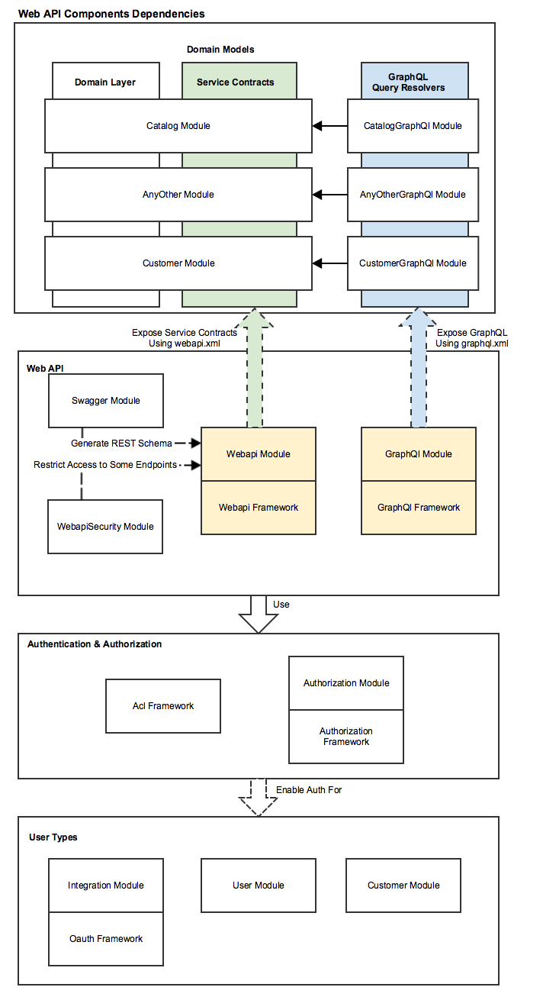
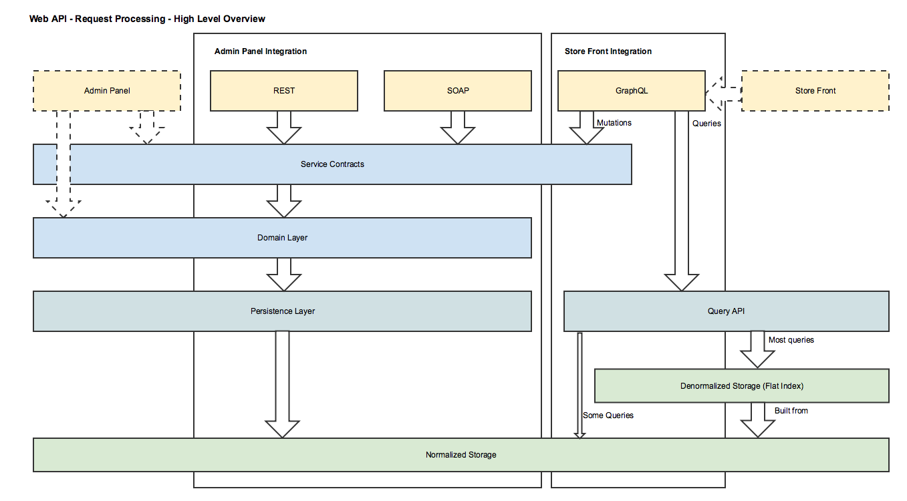

Web API is crucial for Magento because of the need to integrate with order management, customer management and other enterprise management software systems.

There are a lot of headless magento installations, where Magento functionality is used only partially, while the other pieces of eCommerce website are provided by other systems. 

See [more details](https://en.wikipedia.org/wiki/Web_API) about importance of web APIs in modern web applications.

### Components Dependencies
Below are some basic examples of what you can do with markdown.

### High-level Architecture

### Extension Scenarios

#### Declare new REST and SOAP endpoint

Any [service contract]({{page.baseurl}}extension-dev-guide/service-contracts/service-contracts.html) can be [exposed as REST and SOAP]({{page.baseurl}}extension-dev-guide/service-contracts/service-to-web-service.html) endpoint via configuration in webapi.xml.

#### Declare new GraphQL query

1. Create custom resolvers
1. Declare custom query and all necessary types in `graphql.xml`

If target module is called `MyModule`, then resolvers and configuration should be created in a new module called `MyModuleGraphQl`.

See the [documentation](http://devdocs.magento.com/guides/v2.3/graphql/index.html) for the details.

#### Add custom authentication mechanism

1. Provide custom implementation of `\Magento\Authorization\Model\UserContextInterface`, in which, user identity should be verified using custom authentication mechanism
1. Declare custom user context in the composite user context for the target area(s) (`webapi_rest`, `webapi_soap`, `webapi_graphql`) :

~~~
<type name="Magento\Authorization\Model\CompositeUserContext">
    <arguments>
        <argument name="userContexts" xsi:type="array">
            <item name="customUserContext" xsi:type="array">
                <item name="type" xsi:type="object">Vendor\Module\Model\Authentication\CustomUserContext</item>
                <item name="sortOrder" xsi:type="string">100</item>
            </item>
        </argument>
    </arguments>
</type>
~~~

#### Modify schema of existing SOAP and REST endpoint

For modifications of the interface, recommended approach is to define a new endpoint, because schema modification may break existing integrations or extensions.

In case of extending interface, [extension attributes]({{page.baseurl}}extension-dev-guide/attributes.html) can be used.

#### Modify schema of existing GraphQL query

Add `graphql.xml` which will be merged with configurations from other modules (merge rules are the same as for any other configuration type in Magento)
Write necessary plugins for existing resolvers related to the query, or create custom resolver and enable it via override in `graphql.xml`

### Model Consistency Constraints

Any new design related to Web API must satisfy the following constraints to keep the model consistency.

**Generic**

1. REST and SOAP must be designed for Admin Panel integrations and have parity in terms of coverage. GraphQL should be designed for store front scenarios.
1. Any identifiers exposed in guest APIs (for example cart ID) must be masked to prevent possibility of unauthorized access to the data of other guest users.
1. Authentication must be done via `\Magento\Authorization\Model\UserContextInterface`.
1. Customer-specific identifiers (like customer ID or cart ID) must be deducted from the record of successfully authenticated customer. They must not be accepted via request parameters.
1. All new web API endpoints must be covered with web API functional tests. 
    1. For REST and SOAP, by default, the same test will be executed in scope of different continuous integration jobs. Base class for REST and SOAP tests: `\Magento\TestFramework\TestCase\WebapiAbstract`
    1. Base class for GraphQL tests: `\Magento\TestFramework\TestCase\GraphQlAbstract`
1. Web API requests must be processed by custom front controllers with optimized routing to prevent execution of routers from admin and store front areas.
1. Web API schema should be strictly typed (all complex types should eventually be resolved to scalar types)
1. Authentication parameters must be be passed via headers
1. Throttling must be configured by the system integrator and is not supported by Magento
1. Internal server errors must be masked and never shown to the user in production mode. In developer mode original exceptions must never be masked and should be displayed along with related stacktrace
1. Pagination must be supported by all list operations

**GraphQL**

1. Unlimited nesting should be supported during requests for related entities (e.g. get Order => Order Items => Products => Related Products)
1. Fields filtration must be done using SQL queries, not on application layer after fetching all possible fields
1. 3rd party customizations must be done separately for Service Contracts and for GraphQL
1. GraphQL configuration must be declared in separate modules for modularity purposes. I.e. to expose GraphQL for `ModuleA`, `graphql.xml` must be created in `ModuleAGraphQl` module
1. Is primarily designed for store-front one-page apps and mobile applications. Supports token and cookie authentication, as well as guest access to public queries
1. Must return 200 HTTP status code for all queries. In case of exceptional situation, error should be returned in response body. Schema requests may return 500 HTTP status code.
1. Store code should be passed via headers

**REST**

1. Resource URL should be versioned (e.g. V1). Version must be specified in the following format: "V\\d.+"
1. Resource names in URL should be in plural form (e.g. products, carts)
1. ID parameters for operations on entities should be part of resource URL (e.g. /V1/products/**:sku**)
1. POST should be used for entity(s) creation
   PUT should be used for entity(s) update
   PATCH should be used for patch entity(s) update (when unchanged fields are omitted in the request)
1. Is designed for system integrations, mobile app integrations as well as for one-page apps. Supports tokens, cookies and OAuth 1.0 with token exchange, as well as guest access to public resources
1. Must return responses with standard [HTTP status codes](https://en.wikipedia.org/wiki/List_of_HTTP_status_codes)
1. Store code must be passed via URL. E.g. GET /rest/frenchStoreView/V1/products. Persistence operations that should be performed for all stores at once, should have 'all' store code in URL1. 

**SOAP**

1. Is designed for systems integration. Supports token authentication for customers and admins, as well as no authentication for anonymous service methods. Cookie authentication and OAuth 1.0 are not supported
1. Schema is available for all exposed services in form of WSDL
1. Must return 200 HTTP status code in all cases. In case of exceptional situation, error should be returned in the response
