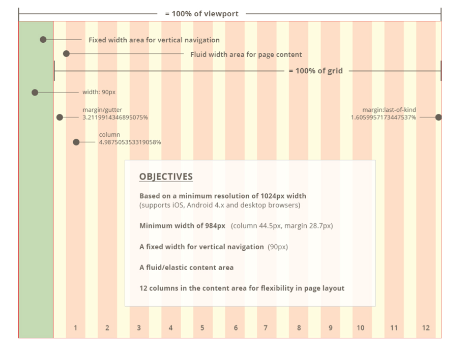
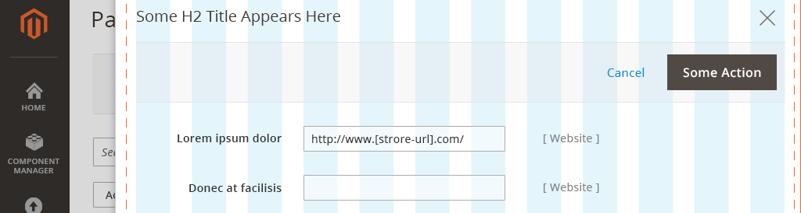
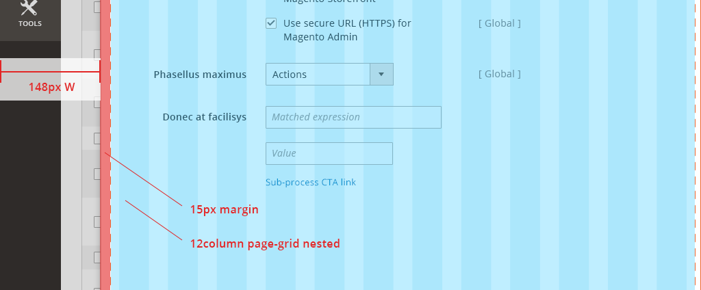
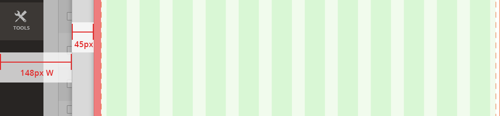

<h2 id="page-grid">Page Grid</h2>

<h3 id="page">Page</h3>

<ul>
	<il>A 12-column fluid-width content grid is placed next t othe page’s 1-column fixed-width left navigation</il>
	<il>The 12-column grid’s minimum width spans 984px. The grid expands its layout across larger screens.</il>
	<il>For views smaller than 984px, a page’s layout doesn’t change as the page shrinks to fit smaller screen widths.</il>
</ul>

<h3 id="slide-out">Slide-outs Grid</h3>

A Slide-out panel, similar to a modal window, breaks apart and simplifies a complex subtask that is included within a primary task. 

For example: 
<ul>
	<il>On a product details form page, a user clicks "Add Attribute".</il>
	<il>A panel slides over the parent page and shows "Add Attribute" functionality.</il>
	<il>When the user finishes adding attributes, the panel disappears, and the user returns the 		product details form page.</il>
</ul>

<b>Layout and behavior:</b> When a panel spawns, it slides from right to left atop and almost completely over the parent page. A narrow gutter of space remains at left, showing the left navigation and a small sliver of the parent page.

Standard layout within the edges of a browser screen

(Panel position in relation to browser edge) 

<b>Spacing:</b> Slide-out content is contained in a 12-column page grid, with additional 15px padding on the left edge. The gutter spacing at left is fluid, based on browser width.

(Nested page-grid with additional padding)

<b>Nested Slide-outs:</b> For multiple panels displayed, additional gutter space is used at left to show a small sliver of a Slide-out below another Slide-out.

