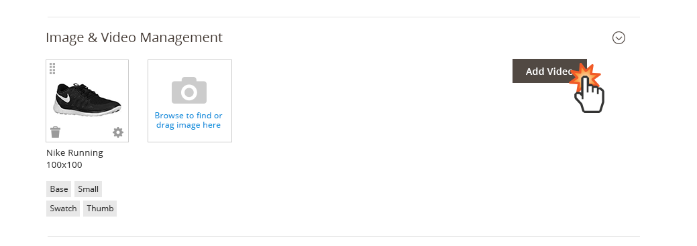
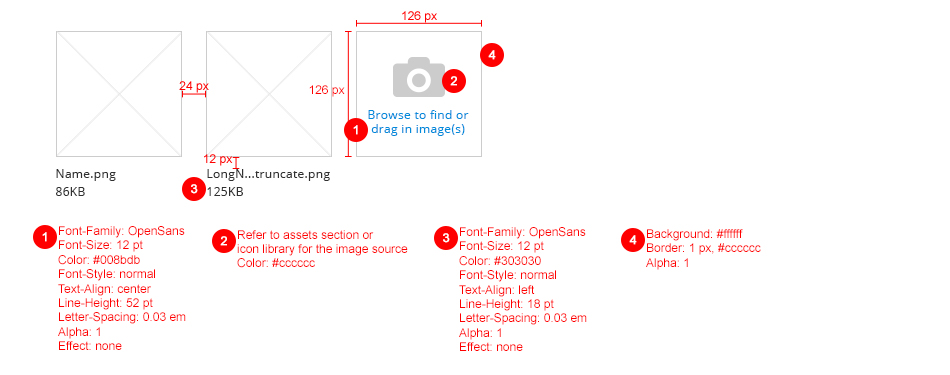

<h2> Image Uploader </h2>

<h3>Contents</h3> 

* <a href="#overview">Overview</a>
* <a href="#whentouse">When to Use</a>
* <a href="#whennottouse">When Not to Use</a>
* <a href="#variations">Variations</a>
* <a href="#behavior">Behavior</a>
* <a href="#style">Dimensions</a>
* <a href="#accessibility">Accessibility</a>
* <a href="#assets">Assets</a>

<h3 id="overview">Overview</h3>
The Image Uploader provides the ability for users to upload a single image, or group of images, to the application, most commonly images associated with Products (during the Product Creation process). These iamges may serve as thumbnail images, detailed Product images, images to within a product gallery, etc.  

<h3 id="whentouse">When to Use</h3>
When it is desireable to allow users to upload a single image or multiple images for display within the Magento Admin or on the Storefront.

<h3 id="whennottouse">When Not to Use</h3>
This pattern should be used specifically to upload images, and not to upload documents such as PDFs, WordDocs, Spreadsheets, etc. Please refer to the "File Upload" pattern.

<h3 id="variations">Variations</h3>

1. Upload Single Image

2. Upload Multiple Images

3. Upload Video Content

<h3 id="behavior">Behavior</h3>

**Uploading via Browser**

The Image Uploader allows the user to browse for images to upload to the Admin application. This can accomodate single or multiple image upload. To initiate this behavior the user clicking on the "Upload Image" link (target area). The user then proceeds to select the desired images via the browser, using SHIFT + click or ALT/COMMAND + click to select multiple image files.

**Uploading via Drap and Drop**

The user may also upload images (single or multiple) by dragging the desired images onto the Image Uplaod target area.

**Uploading Video Content**
To upload a video to the Magento Admin application the user taps the "Add Video" button. 

image-uploader-video-uploaded.jpg

A video settings panel is revealed that allows the user to provide the URL location of the video, write a description and upload a preview image for the video. The user taps the "Save" button to upload the information.

Once the video information is saved, the video settings panel closes and the user is returned to the image uploader (section) where the video preview image now appear.

NOTE: Currently Magento 2 does not allow Drag and Drop for Video Content.

**Drag to Arrange Order**
The order in which images are displayed can be arranged by dragging the image or video to the desired position.

**Image Settings**
In some areas of the Magento Admin application uploaded images my have additional settings that effect the display of these images on the Storefront (e.g. Product Creation). These settings can be accessed via the "gear" icon found on the image thumbnail.

**Deleting an Image**
Likewise, an image may be removed from the Magento Admin application by tapping the "trashcan" icon.

<h3 id="style">Dimensions</h3>

<h3 id="accessibility">Accessibility</h3>
To initiate the uploader, the buttons should follow button accessibility guidelines: [http://www.w3.org/TR/WCAG10-HTML-TECHS/#forms-graphical-buttons](http://www.w3.org/TR/WCAG10-HTML-TECHS/#forms-graphical-buttons)

In the browser upload window, standard behavior should be kept.

<h3 id="assets">Assets</h3>
PSD files can be found here:
<a href="src/Image_Video_Uploader.psd">Download Image Uploader PSD source</a>
