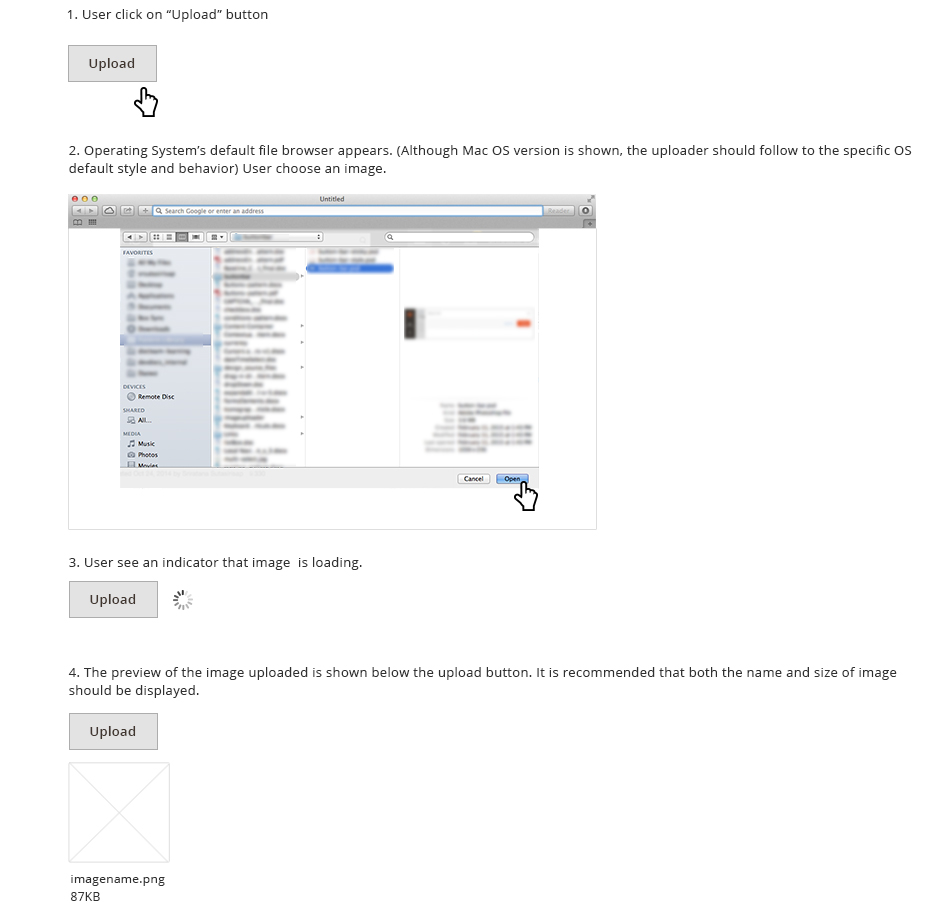
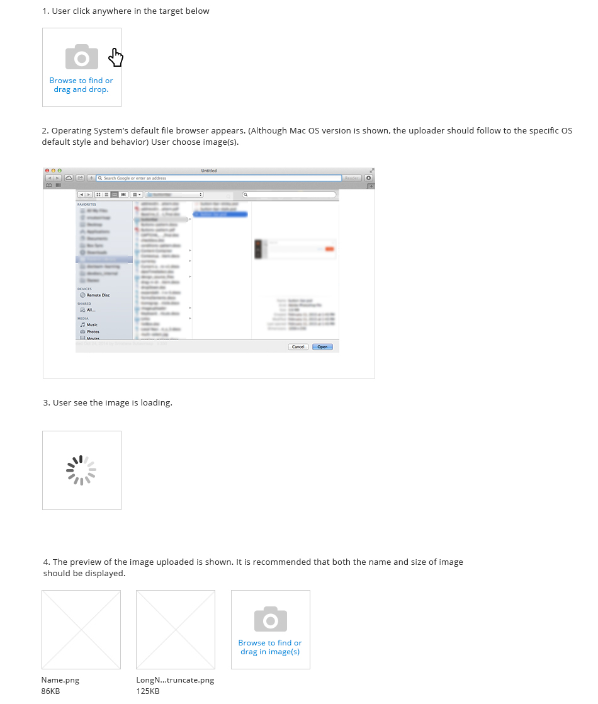
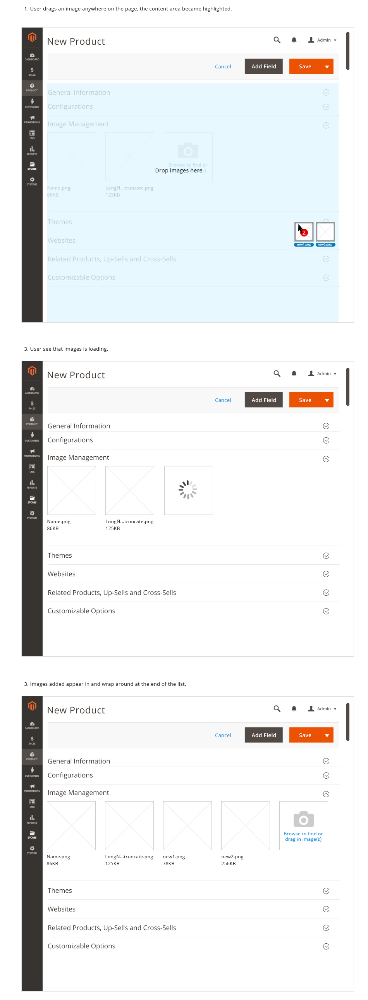
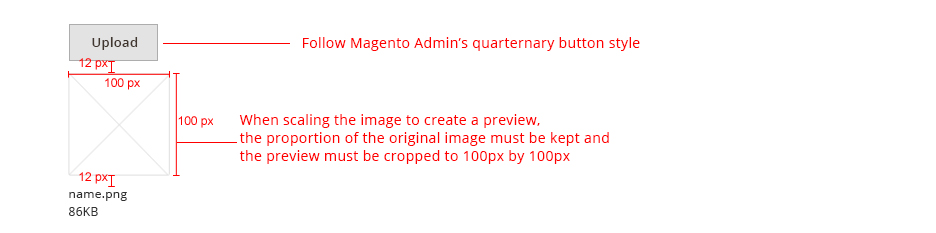
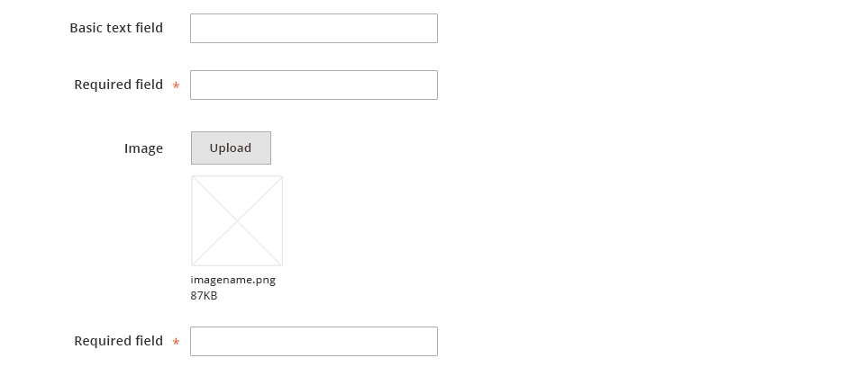
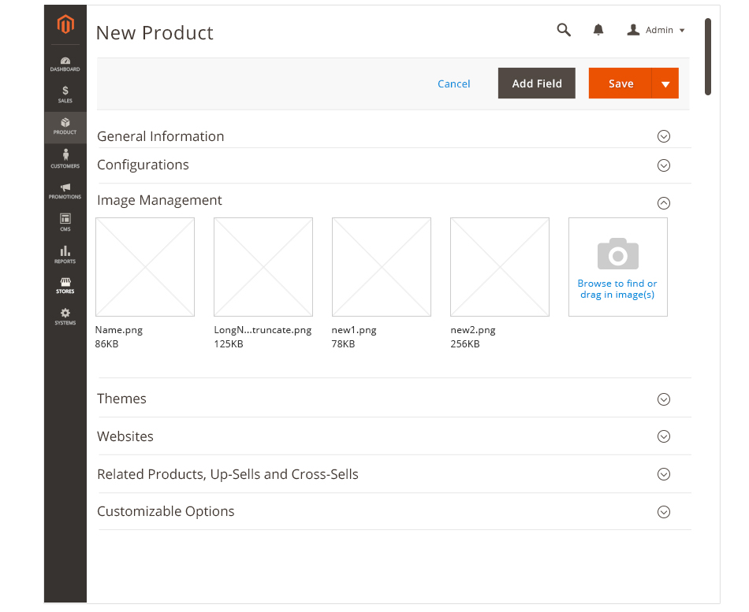

<h2> Image Uploader </h2>

<h3>Contents</h3> 

* <a href="#overview">Overview</a>
* <a href="#whentouse">When to Use</a>
* <a href="#whennottouse">When Not to Use</a>
* <a href="#variations">Variations</a>
* <a href="#behavior">Behavior</a>
* <a href="#style">Style</a>
* <a href="#examples">Examples</a>
* <a href="#accessibility">Accessibility</a>
* <a href="#assets">Assets</a>

<h3 id="overview">Overview</h3>
Within the Magento application, user often need to upload images onto the application for use. 

The use of image uploader should follow this guideline.

<h3 id="whentouse">When to Use</h3>
* When user is required to upload a single image or multiple images onto the application.

<h3 id="whennottouse">When Not to Use</h3>
* This guide is for image upload, not addressing file uploads.

<h3 id="variations">Variations</h3>
There are two variations:

1. Upload Single Image

2. Upload Multiple Images

Refer to the rest of this document for details of behavior and style on each variations.

<h3 id="behavior">Behavior</h3>

####1. Upload Single Image

####2. Upload Multiple Images

Users can upload the images by either browsing through their files or drag and drop the images.

**Upload by browsing**

**Drag & Drop Images**

<h3 id="style">Style</h3>

####1. Upload Single Image

####2. Upload Multiple Images

<h3 id="examples">Examples</h3>

####1. Upload Single Image

####2. Upload Multiple Images

<h3 id="accessibility">Accessibility</h3>
To initiate the uploader, the buttons should follow button accessibility guidelines: [http://www.w3.org/TR/WCAG10-HTML-TECHS/#forms-graphical-buttons](http://www.w3.org/TR/WCAG10-HTML-TECHS/#forms-graphical-buttons)

In the browser upload window, standard behavior should be kept.

<h3 id="assets">Assets</h3>
PSD files can be found here:
<a href="src/magento-image-uploader.psd">Download Image Uploader PSD source</a>
