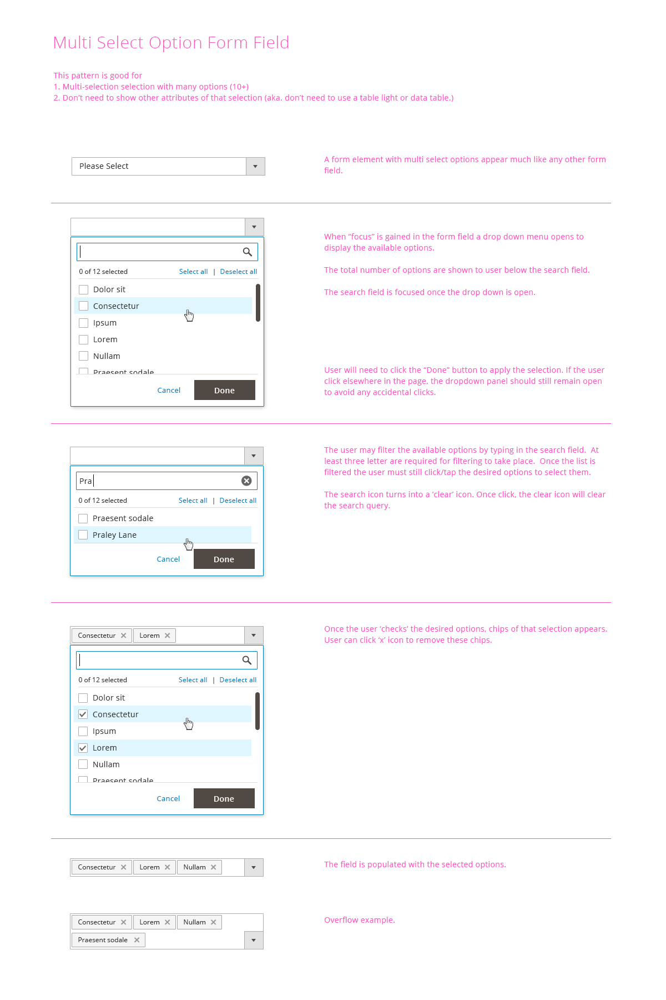
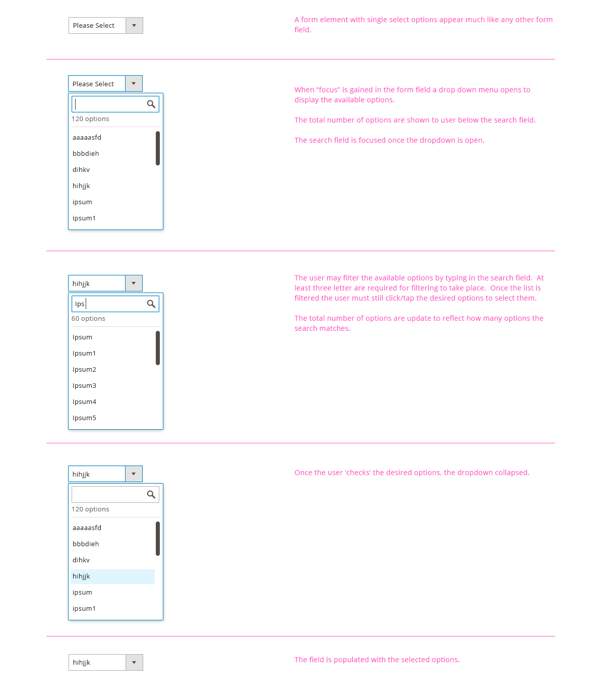
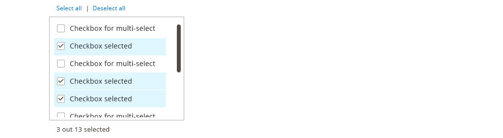
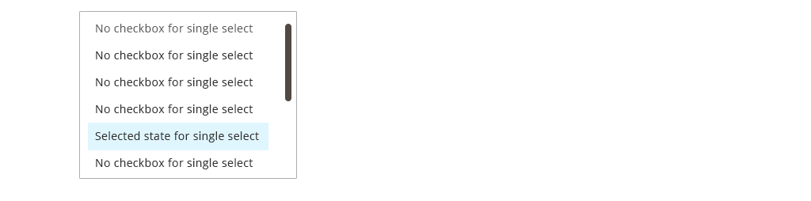

## Select from list
In the Magento Admin, user will often times need to select item(s) from a list of items. This pattern address the variations of list pattern.

<h3 id="whentouse">When to Use</h3>
* When user need to select item(s) from a list of items, and each item can be identified simply by one label

<h3 id="variations">Variations</h3>

<h4>1. Multi-select Dropdown (aka ultra-selector)</h4>

This variation is good for Multi Selection with many options (10+), when the option does not need to be shown immediately or when space needs to be preserved.

<h4>2. Single Select Dropdown </h4>

This variation is good for Single Selection with many options (10+), when the option does not need to be shown immediately or when space needs to be preserved.mmediately or when space needs to be preserved.

<h4>3. Multi-Select List Box</h4>

The advantage of a list box is that it exposes more options to the user. The list can be made scroll-able when space is a consideration and/or the list is long. A list box is mandatory when the list of options exceeds 6 items.

<h4>4. Single Select List Box</h4>

The advantage of a list box is that it exposes more options to the user. The list can be made scroll-able when space is a consideration and/or the list is long. A list box is mandatory when the list of options exceeds 6 items.

<h3 id="accessibility">Accessibility</h3>

The form drop down, scroll area, and selections should be accessible via keyboard.

Follow this form control accessibility guideline: 
 <a href="http://www.w3.org/TR/WCAG10-HTML-TECHS/#forms">http://www.w3.org/TR/WCAG10-HTML-TECHS/#forms <a>

<h3 id="assets">Assets</h3>
PSD files can be found here:
<a href="src/Magento_select_from_list_srce.zip">Download Variations of Select-From-List ZIP File</a>
