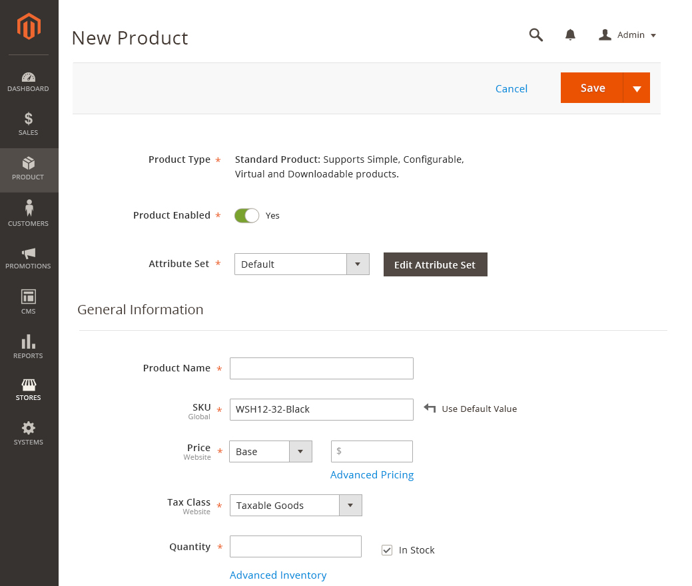

<h2> Use Default Config </h2>

<h3>Contents</h3> 

* <a href="#overview">Overview</a>
* <a href="#whentouse">When to Use</a>
* <a href="#whennottouse">Variations</a>
* <a href="#behavior">Behavior</a>
* <a href="#style">Style</a>
* <a href="#variation">Variations</a>
* <a href="#example">Example</a>
* <a href="#accessibility">Accessibility</a>
* <a href="#assets">Assets</a>

<h3 id="overview">Overview</h3>
In Magento Admin, the default value of certain textfield can be pre-set and overwrite at the page-specific level. The feature “Use Default Config” reverse the custom value to the default value.

<h3 id="whentouse">When to Use</h3>
* When the value of a textfield has a default value set.

<h3 id="whennottouse">When Not to Use</h3>
* When the value of a textfield does not have a default value set.

<h3 id="behavior">Behavior</h3>

<h3 id="style">Style</h3>

<h3 id="variation">Variations</h3>
There are two variations. The behavior and style remains the same. The label is changed to identify the origin of this value.

<h4>Use Default Value</h4>
Value is taken from default scope and user needs to switch to default scope to change the default value

<h4>Use Configuration Value</h4>
Value is set in Stores > Store configuration and user has to go there to change the default.

<h3 id="example">Example</h3>
Example Use Case: In product creation, system generated a default SKU, and the user can change to a custom SKU.

<h3 id="accessibility">Accessibility</h3>

User should be able to access this control via their keyboard and it should be legible if the user use voice navigation. Follow this accessibility guideline: <a href="http://www.w3.org/TR/WCAG10-HTML-TECHS/#link">http://www.w3.org/TR/WCAG10-HTML-TECHS/#link <a>

<h3 id="assets">Assets</h3>
PSD files can be found here:
<a href="src/defaultconfig.psd">Download Default Config PSD source</a>
