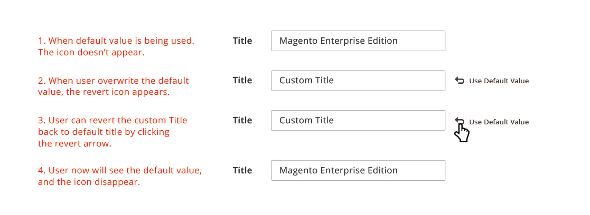
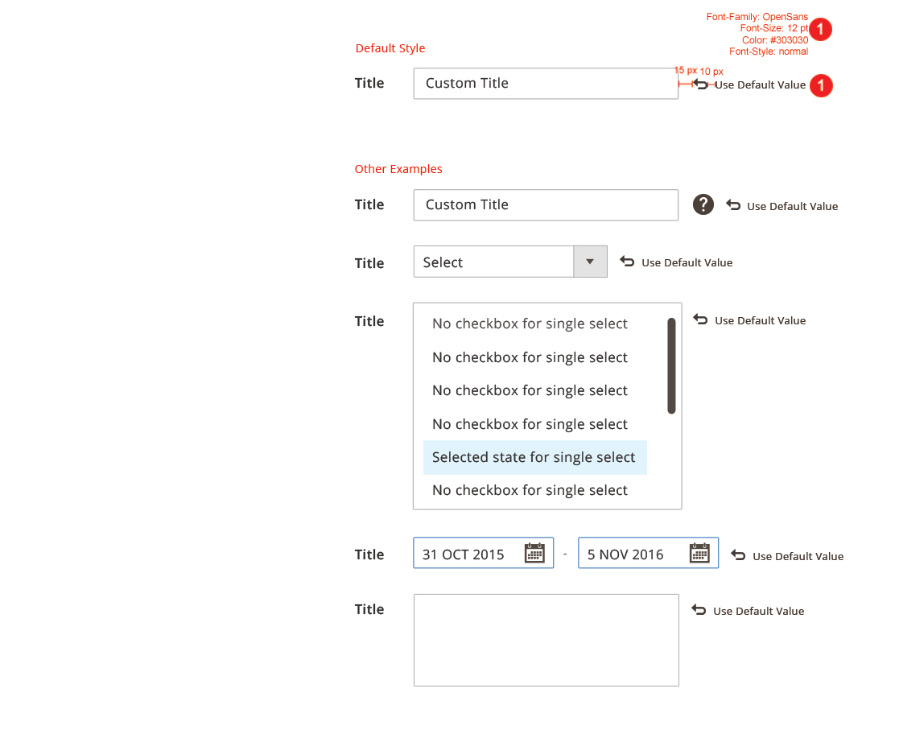

<h2> Use Default Config </h2>

<h3>Contents</h3> 

* <a href="#overview">Overview</a>
* <a href="#whentouse">When to Use</a>
* <a href="#whennottouse">Variations</a>
* <a href="#behavior">Behavior</a>
* <a href="#style">Style</a>
* <a href="#variation">Variations</a>
* <a href="#accessibility">Accessibility</a>
* <a href="#assets">Assets</a>

<h3 id="overview">Overview</h3>
In the Magento Admin some textfields can inherit default values (which have been set in config by the Merchant). A user has the ability to overwrite these default values at the page level. The "Use Default Value" or "Use Configuration Value" controls allow the user to revert an overwritten textfield value to the original default value.

<h3 id="whentouse">When to Use</h3>
* To be used when a text field inherits its value by default.  It can be overridden by the user.   If the user has overridden the default value this control provides a convenient method to recover the original inherited value.

<h3 id="whennottouse">When Not to Use</h3>
* When the value of a textfield does not have a default value set.

<h3 id="behavior">Behavior</h3>

<h3 id="style">Style</h3>

<h3 id="variation">Variations</h3>
There are two variations. The behavior and style remains the same. The label is changed to identify the origin of this value.

<h4>"Use Default Value"</h4>
Value is taken from default scope and user needs to switch to default scope to change the default value

<h4>"Use Configuration Value"</h4>
Value is set in Stores > Store configuration and user has to go there to change the default.

<h3 id="accessibility">Accessibility</h3>

User should be able to access this control via their keyboard and it should be legible if the user use voice navigation. Follow this accessibility guideline: <a href="http://www.w3.org/TR/WCAG10-HTML-TECHS/#link">http://www.w3.org/TR/WCAG10-HTML-TECHS/#link <a>

<h3 id="assets">Assets</h3>
PSD files can be found here:
<a href="src/defaultconfig.psd">Download Default Config PSD source</a>
