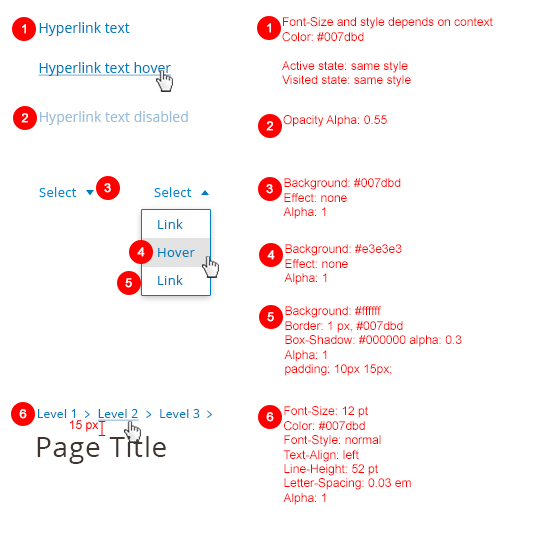
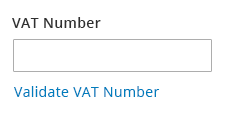
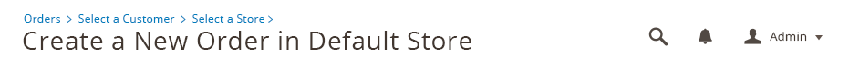

<h2> Links </h2>

<h3> Contents </h3>

* <a href="#overview">Overview</a>
* <a href="#when-to-use">When to Use</a>
* <a href="#when-not-to-use">When Not to Use</a>
* <a href="#style">Style</a>
* <a href="#accessibility">Accessibility</a>
* <a href="#examples">Usage Examples</a>
* <a href="#assets">Assets</a>

<h3 id="overview">Overview</h3>

Within the Magento application, users often need to navigate through information inside or outside of the application by using links. These links should follow this guideline.

<h3 id="when-to-use">When to Use</h3>
* Navigating between pages inside of the application.
* Navigating to pages outside of the application.
* Open a slide-in panel or modal (if a button could not be used)

<h3 id="when-not-to-use">When Not to Use</h3>
* When initiating an action or a process

<h3 id="style">Style</h3>

<h3 id="accesibility">Accessibility</h3>

Full Guideline Reference: [http://www.w3.org/TR/WCAG10-HTML-TECHS/#links](http://www.w3.org/TR/WCAG10-HTML-TECHS/#links)

#### Links Text
* Clearly identify the target of each link. (Good link text should not be overly general; don't use "click here.")
* Provide a text equivalent for every non-text element

#### Grouping and Bypassing Links 
* Group related links, identify the group (for user agents), and, until user agents do so, provide a way to bypass the group. 
* Until user agents (including assistive technologies) render adjacent links distinctly, include non-link, printable characters (surrounded by spaces) between adjacent links. 

#### Keyboard Access
* Create a logical tab order through links, form controls, and objects.
* Provide keyboard shortcuts to important links (including those in client-side image maps), form controls, and groups of form controls.

#### Anchors and Target
* Until user agents allow users to turn off spawned windows, do not cause pop-ups or other windows to appear and do not change the current window without informing the user. 

<h3 id="examples"> Usage Examples </h3>

#### Links in forms/body of text that goes to an external page

#### Breadcrumbs

**Guideline**

1. Must always locate above the title as shown.
2. Not be used if all the pages are on the same level. Breadcrumbs are intended to show hierarchy.
3. Show hierarchy and not history. To go back, users use the browser’s back button. Replicating this facility defies the purpose of having breadcrumbs.
4. Progress from the highest level to the lowest, one step at a time.
5. Have a simple link for each level. 
6. Include the full page title in the breadcrumb trail. Also ensure consistency between the page address and the breadcrumb. If the page titles include keywords, then this will make your breadcrumbs both human and search engine friendly.
7. Include the full navigational path from the homepage to last level of current page. Not displaying certain levels will confuse users.
8. Never replace primary navigation. They have been devised as a secondary navigation aid and should always be used as such.

**Example**

<h3 id="assets">Assets</h3>

Please reach out to the Magento UX Design team if you need anything else.

<a href="src/magento-links.psd">Download Links PSD source</a>

