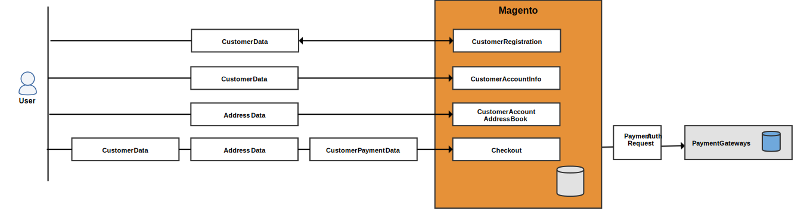
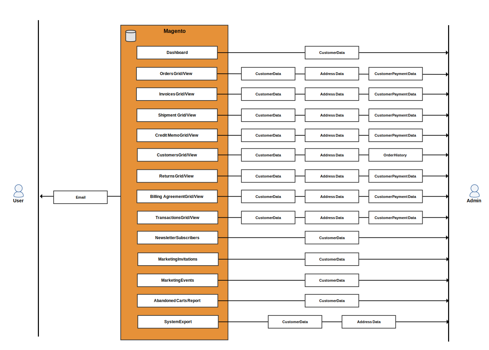

## Frontend data entry points

## Frontend data access points

## Backend data entry points

## Backend data access points

## Database entities

### Customer data

`customer_entity`
---
  `email` varchar(255)
  `prefix` varchar(40)
  `firstname` varchar(255)
  `middlename` varchar(255)
  `lastname` varchar(255)
  `suffix` varchar(40)
  `dob` date
  `gender` smallint(5)

### Address data

### Order data

### Quote data

### Payment data

### Invitation data

### Miscellaneous tables that reference customer
