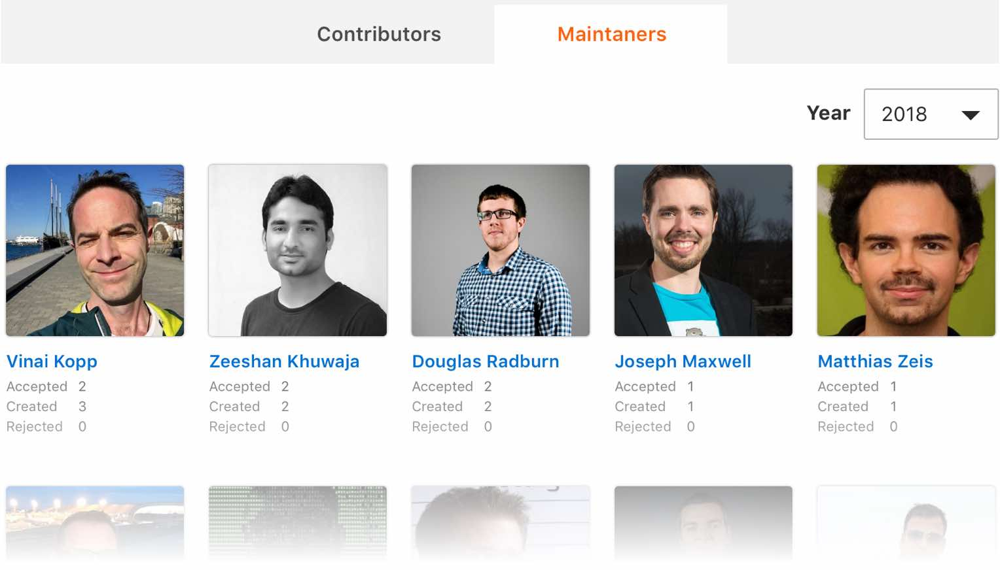

We do our best to process all issues and pull requests that the community opens on the [devdocs](https://github.com/magento/devdocs){:target="_blank"} GitHub repository, but keeping up with all the activity can be a challenge.

Luckily, the Magento community is full of knowledgeable people that enjoy sharing solutions with each other.

## New team

We have decided to form a [devdocs-maintainers](https://github.com/orgs/magento/teams/devdocs-maintainers/members){:target="\_blank"} team on GitHub. This team is similar to the [Community Maintainers](https://magento.com/magento-contributors#maintainers){:target="_blank"} team that supports the Magento application codebase.

{:.text-center}
{:width="600"}
  _Here's a preview of how this page will look soon. These people are not actual maintainers._

## What will the team do?

Review documentation-related issues and pull requests and allow us to publish updates more quickly. We have granted members of this team permission to _accept_ and _reject_ pull requests. All pull requests must go through an editorial review by a Magento DevDocs team member before they can be merged.

We are in the process of contacting frequent contributors to the site and codebase to see who may be interested in becoming a maintainer.
  
[Become a Maintainer](mailto:DL-Magento-Doc-Feedback@magento.com?subject=I want to become a maintainer){:class="btn btn-large btn-primary"}

