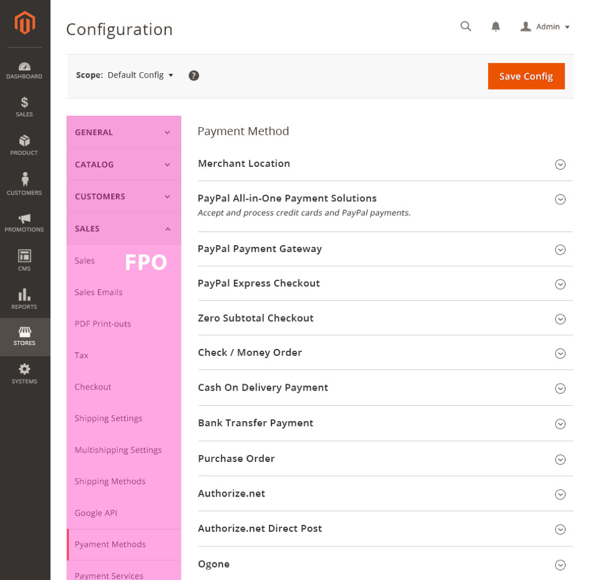
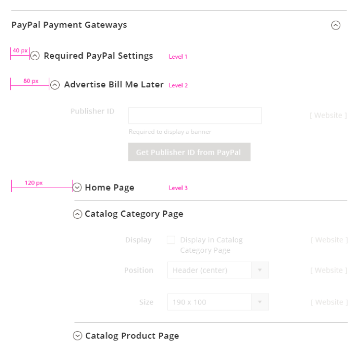
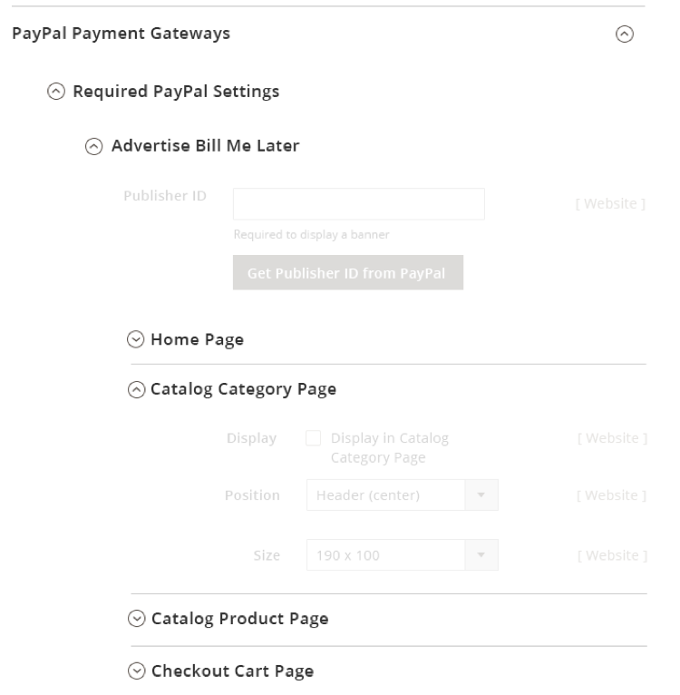
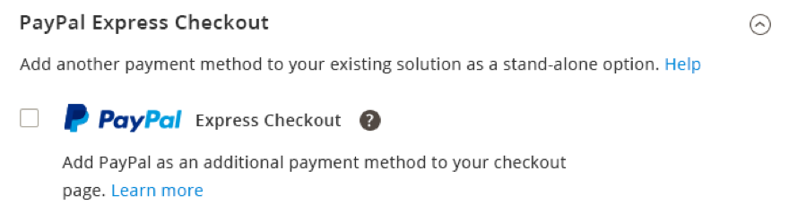
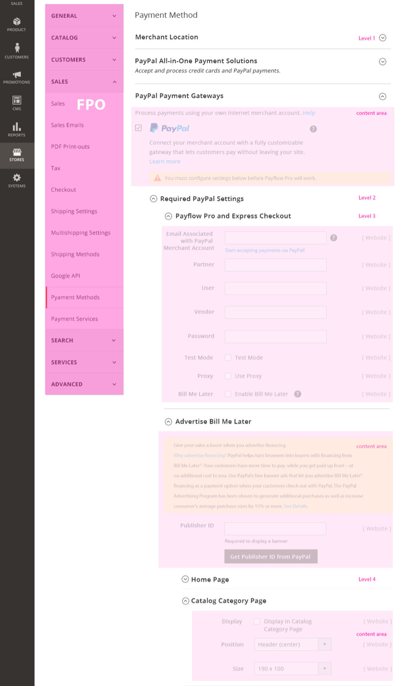

<h2> Expandable Sections </h2>
_(AKA Expand-Collapse, Collapsible panels)_

<h3> Contents </h3>

* <a href="#overview">Overview</a>
* <a href="#behavior">Appearance and Behavior</a>
* <a href="#function">Functional Behavior</a>
* <a href="#variations">Variations</a>
* <a href="#assets">Assets</a>

<h3 id="overview">Overview</h3>

Expandable Sections are expandable content areas which are useful in cases where a lot of information must be accommodated in limited space thereby reducing clutter and allowing to focus on primary task.  Typically the information to be accomodated can be separated into various sections and/or sub-sections, or topics.

**Note:** Expandable Sections should not be confused with the 'Progressive Disclosure checkbox' control.

<h3 id="behavior">Appearance and Behavior</h3>
Required fields should not be located within a collapsed section as this increases the chance of error for the user. If a field within a collapsed section is _made a required field_ based on a User interaction, that section should be automatically expanded to reveal this requirement to the user. As a best practice, the first Expandable Section should be expanded by default. For pages with several Expandable Sections it is recommended to locate all required fields in a Section that cannot be collapsed above the expandable sections. 

**Position and Dimensions**
* Expandable Sections can exist with or without a left side bar. 
* Level 1 expandable section has 24px top padding and 30px bottom padding of the section title. 
* Level 2, 3 and 4 has 18px top and bottom padding of the section title. Each expandable sub-section is indented by 40px._*_

* If the expandable section belongs to a layout with a side bar:
..* And the content area contains forms, then the form field starts at the 7th column for level 2 and at 8th column for level 3 and 4
* The content areas in the expandable section has 30px padding at the top and bottom.
 
_* The current design proposal accommodates 4 levels of nested expandable sections._

**Visual Appearance**
* A “Simple” expandable section is a container with a border, section header and a toggle arrow (right aligned) to control the showing / hiding of content.

* A "Nested" expandable section is in fact a sub-section within an expandable section. The nested expandable section has all the same features as the "simple" expandable section, HOWEVER the expand/collapse control is located on the left. This is to help the User more easily identify the expandable sub-sections within an expanded section.

* When expanded the control (chevron) points upward, points downward when closed or collapsed. These indicate the "direction" the section will expand or collapse when clicked.
* The Section Header title font size is 17px Semibold.

<h3 id="function">Functional Behavior</h3>
* Expandable Sections should expand to become visible when the heading or toggle arrow is clicked/tapped.
* Several expandable sections can be kept open at the same time.
* When a page contains several expandable sections, all sections remain collapsed by default. 
..* Once the user expands / collapsed few panels, the system remembers the panels states and on a return visit the same states are displayed.
* For Nested Panels:
..* If a section is collapsed, all "nested" expandabed sections within that section should be collapsed as well.

<h3>Variations</h3>
1.“Simple” – a section that contains a single level of expansion in a section (no nested expandable sub-sections).

2.“Nested” – a section that contains one or more expandable sub-sections.

3. Single Expandable – a section that contains only one expandable section. Usually used to hide additional information.

<h3 id="assets">Assets</h3>

Please reach out to the Magento UX Design team if you need anything else.

<a href="src/Magento_expandable_section.zip">Download Expandable Section ZIP file</a>

