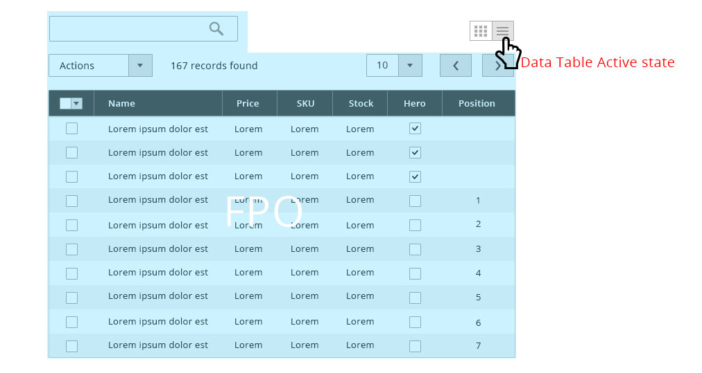
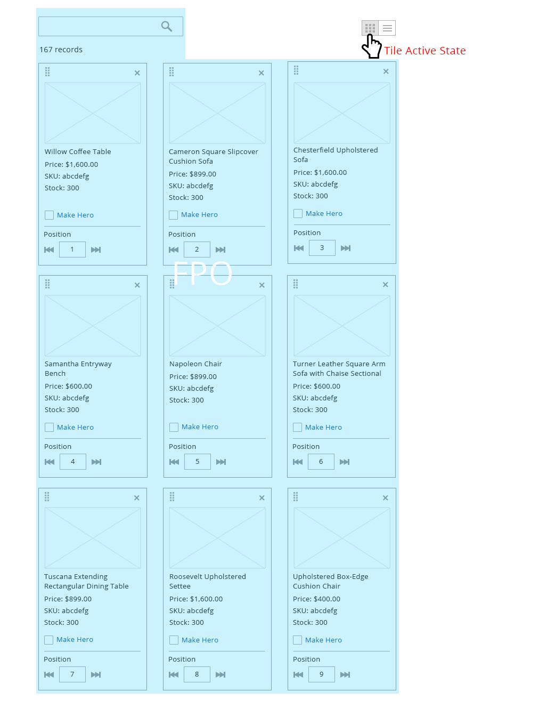
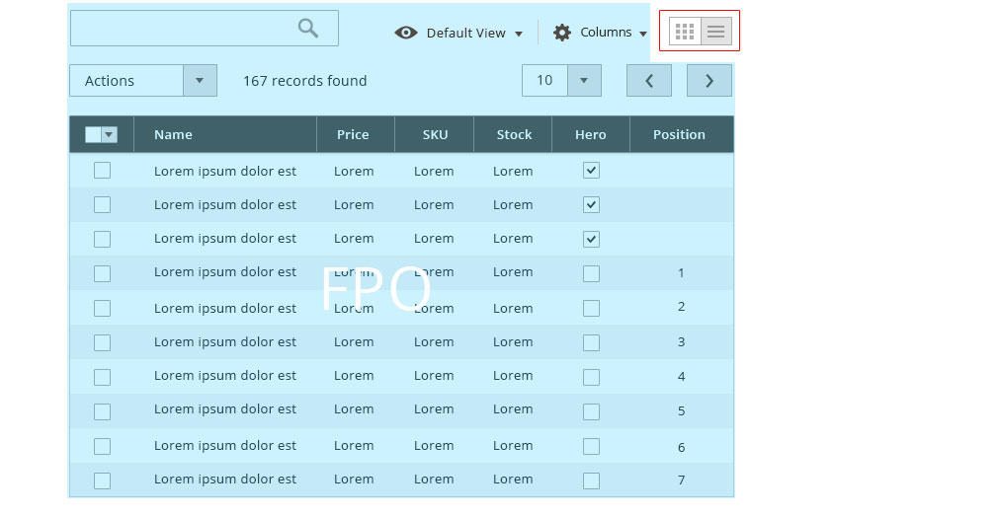
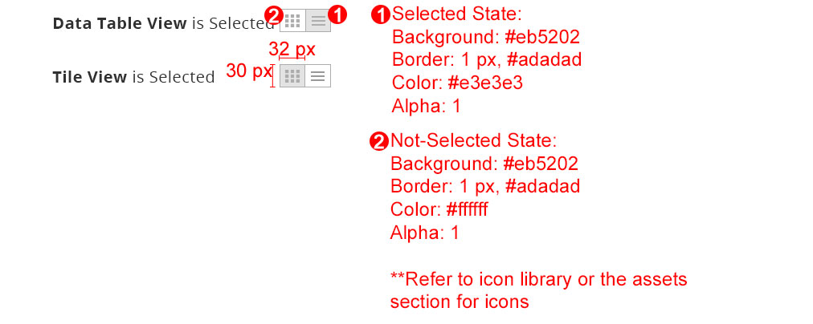

<h2> View Controller </h2>

<h3> Contents </h3>

* <a href="#overview">Overview</a>
* <a href="#when-to-use">When to Use/When Not to Use</a>
* <a href="#variations">Variations</a>
* <a href="#behavior">Behavior</a>
* <a href="#placement">Placement</a>
* <a href="#style">Style</a>
* <a href="#accessibility">Accessibility</a>
* <a href="#assets">Assets</a>

<h3 id="overview">Overview</h3>

Within the Magento application, user may need to view a set of data in more than one way. The view controller isused to switch between the views of data set.

For solutions not described in this article, please refer to other related patterns or contact the Magento UX Design Team.

<h3 id="when-to-use">When to Use/When Not to Use</h3>
Only use for switching between views of data set.

<h3 id="variations">Variations</h3>

Follow are variations of icons to use for their corresponding data set views:

<h3 id="behavior">Behavior</h3>

User switches between the views using the view controller. User can click on the view, that is corresponding to the view they want to see.

In this case, user select data table view control, the data table view is shown.

Then, the user can also switch back to tile view in this example.

<h3 id="placement">Placement</h3>
The view control should always be placed as the most right item on the same row as filter options.

<h3 id="style">Style</h3>

<h3 id="accessibility">Accessibility</h3>

The controller should be accessible by keyboard and have a voice over for screen readers. Accessibility guideline follow buttons' guideline.

PC: <a href="http://support.microsoft.com/kb/126449" target="blank">http://support.microsoft.com/kb/126449</a> 
OS: <a href="http://support.apple.com/en-us/HT201236" target="blank">http://support.apple.com/en-us/HT201236</a> 
(Keyboard shortcut same as checkbox) 

<h3 id="assets">Assets</h3>

Please reach out to the Magento UX Design team if you need anything else.

<a href="src/magento-viewcontrol.psd">Download View Controller PSD source</a>

