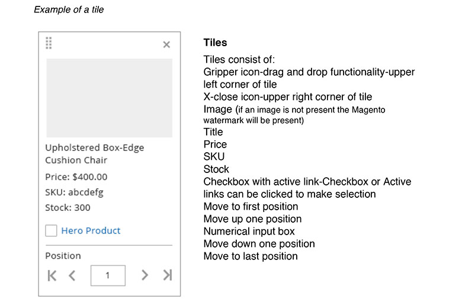
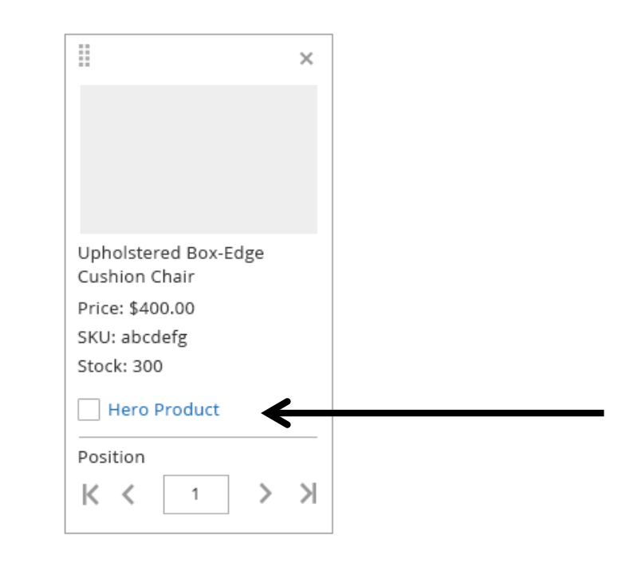
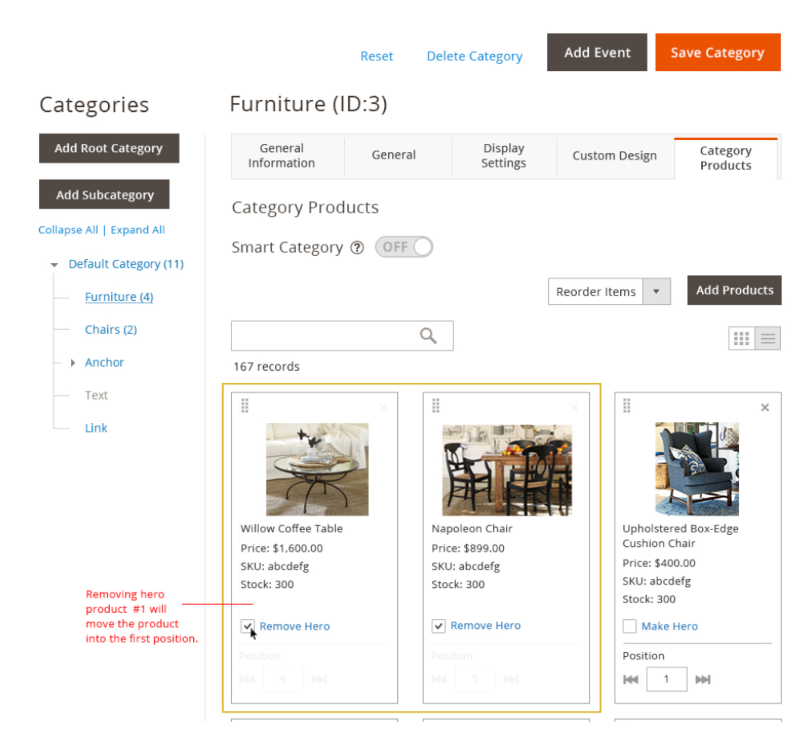
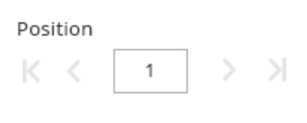
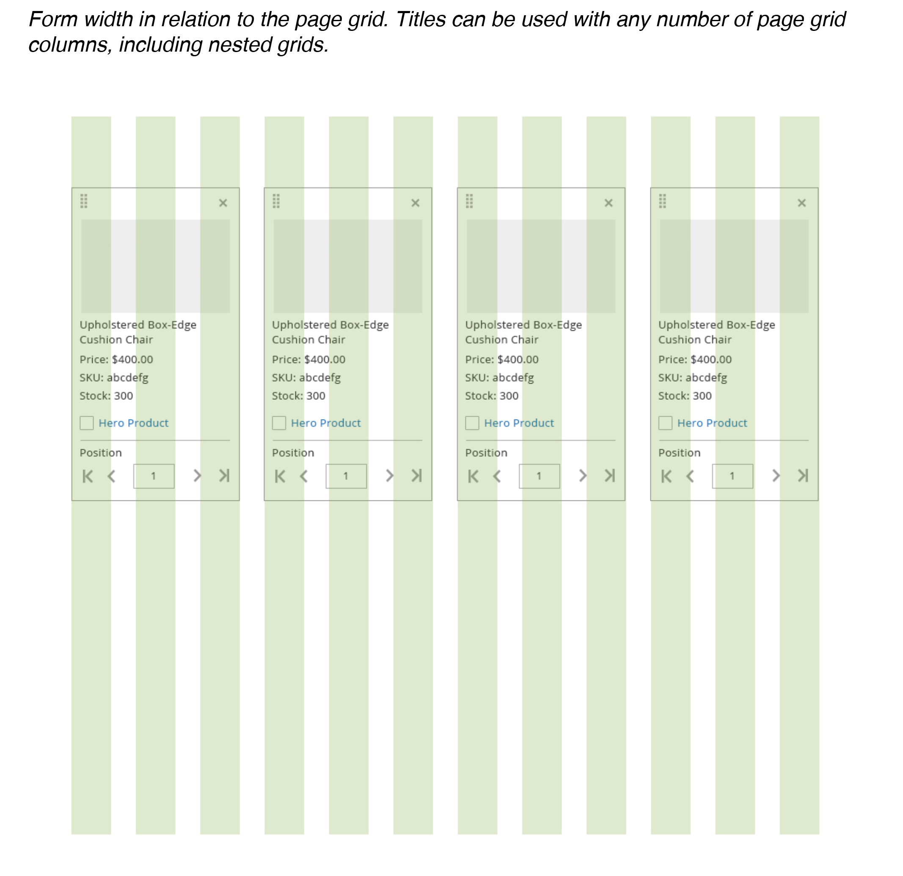
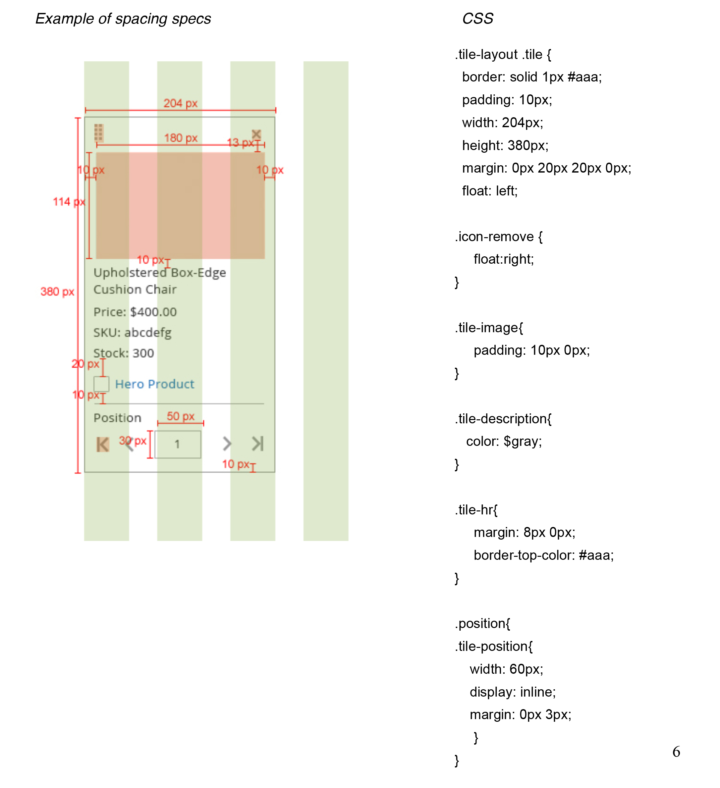

<h2>Tile</h2>

<h3>Contents</h3> 
* <a href="#overview"> Overview</a>
* <a href="#tiles">Use of Tiles</a>
* <a href="#draganddrop">Drag and Drop</a>
* <a href="#remove">Removing Tiles</a>
* <a href="#herocheckbox">Hero Product Checkbox and Link</a>
* <a href="#position">Advancing Position</a>
* <a href="#numerical">Numerical Input</a>
* <a href="#selection">Multi-selection and Selection Indicators</a>
* <a href="#heroproduct">Hero Product Section</a>
* <a href="#styling">Styling and Spacing</a>
* <a href="#assets">Assets</a>

<h3 id="overview">Overview</h3>
This article contains examples of the Tile pattern used in the Admin with functions for single selection, multi selection, drag and drop, and editing inline position. For solutions not described in this article, please refer to other related patterns or contact the Magento UX Design team.

<h2>Functional Behavior</h2>
<ul>
	<li>Drag and Drop</li>
	<li>Remove</li>
	<li>Hero Product checkbox and link</li>
	<li>Advance position left and right</li>
	<li>Numerical input box</li>
	<li>Multi selection</li>
	<li>Hero Product Section</li>

<h3 id="tiles">Use of Tiles</h3>
Tiles will be needed anytime there is a grid view option available. Tiles are a visual representation of the data table and are easily scan-able.
 
 

 
 
 
 
 
 

<h3 id="draganddrop">Drag and Drop</h3>
The gripper handle in the top left corner of the tile is used when the capability of dragging and dropping is needed. When an item is dragged out and moved to a desired location, the drop area is highlighted to show the acceptable region. Once dropped, the pick-up area disappears. If an item cannot be dropped into a specific location-the drop area will not be shown. Drag and drop functionality can only be used on a single page, the user cannot drag and drop across multiple pages. 

<h3 id="remove">Removing Tiles</h3>
The X in the top right corner of the tile will remove the tile from the category but not delete it from the actual product catalog. When a tile is selected to be removed, the user is prompted with a 1-2 second alert stating, “This product is now being removed from the category.”
 
 

<h3 id="herocheckbox">Hero Product Checkbox and Link</h3>
To make a product a Hero Product, the user must select the checkbox and/or the Hero Product link to promote the tile to the top of the category. When the checkbox and/or Hero Product link is selected, a 1-2 second alert stating “This product is now a hero product” will appear and fade away. (The user has the option to opt out of these alerts.) Once a tile becomes a “Hero” a 1px yellow stroke highlights the tile at the top of the category.
 
 

 
 

<h3 id="herocheckbox">Removing Hero Product Checkbox and Link</h3>
To remove a product from the hero space, the user must deselect the checkbox and/or click the Hero Product link. When the checkbox and/or Hero Product link is selected, a 1-2 second alert stating, “This product is being removed” will appear and fade away. (The user has the option to opt out of these alerts.) Once selected, the tile will move to the first position in the category.
 
 

 
 

<h3 id="position">Advancing Position</h3>
The user has the ability to advance a tile to the first position in the category and/or the last position in a category by selecting either the move first position icon, move up one icon, move down one icon or move last position icon. These icons help a user quickly move products around in a category and across multiple pages.
 
 

 
 

<h3 id="numerical">Numerical Input</h3>
Clicking in the input field will allow the user to manually enter a numeric order and have the tile move to the position entered. If a tile is already in the chosen position, the tile will then move one space to the right and the new numeric value entered will take the position. Once the user enters a numeric value, using the keyboard and hitting return will move the tile to the entered position.
 
 

 
 

<h3 id="selection">Multi-selection and Selection Indicators</h3>
The user can select multiple tiles at one time by keyboard command (SHIFT and COMMAND) and selecting individual tiles. When tiles are dropped in the desired location, the tiles will be arranged according to how they were selected. (The first tile selected will be the first tile in the dropped position and all other tiles selected will arrange according to selection.)

<h3 id="heroproduct">Hero Product Section</h3>
Once a tile becomes a “Hero” a 1px yellow stroke highlights the tile at the top of the category. The user can have infinite hero products in a category. When there is more than one product highlighted in the hero space at the top of the category, the user can drag and drop tiles within the highlighted hero space. (Ex: A user can drag and drop the first hero tile to the last hero position as long as it is on the same page) The advance position icons and numeric input field are not active while a tile is in the hero position. To activate the advance position and numeric input field, the user must remove the tile from the hero space.
 
 

 
 

<h3 id="styling">Stlying and Spacing</h3>
For specific details concerning styling including fonts, colors and effects and spacing and padding, please refer to the source PSD files and exports located on Box or contact the Magento Product Design and User Experience team.
 
 

 
 

<h3 id="assets">Assets</h3>
Download <a href="src/tile-pattern-styles.psd">PhotoShop source file</a> .
