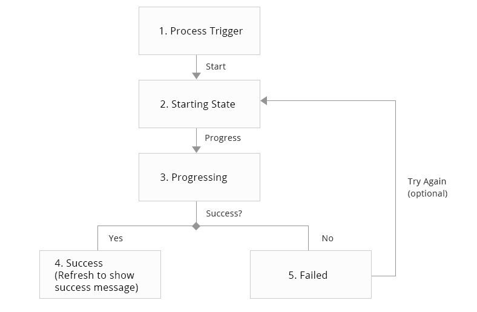
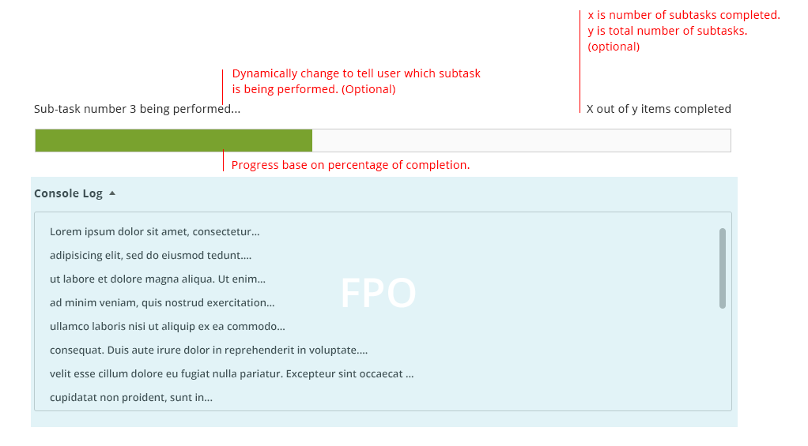
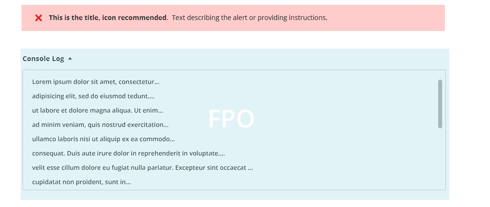
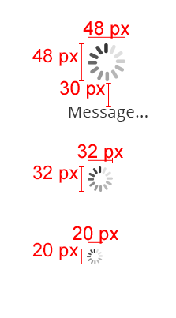
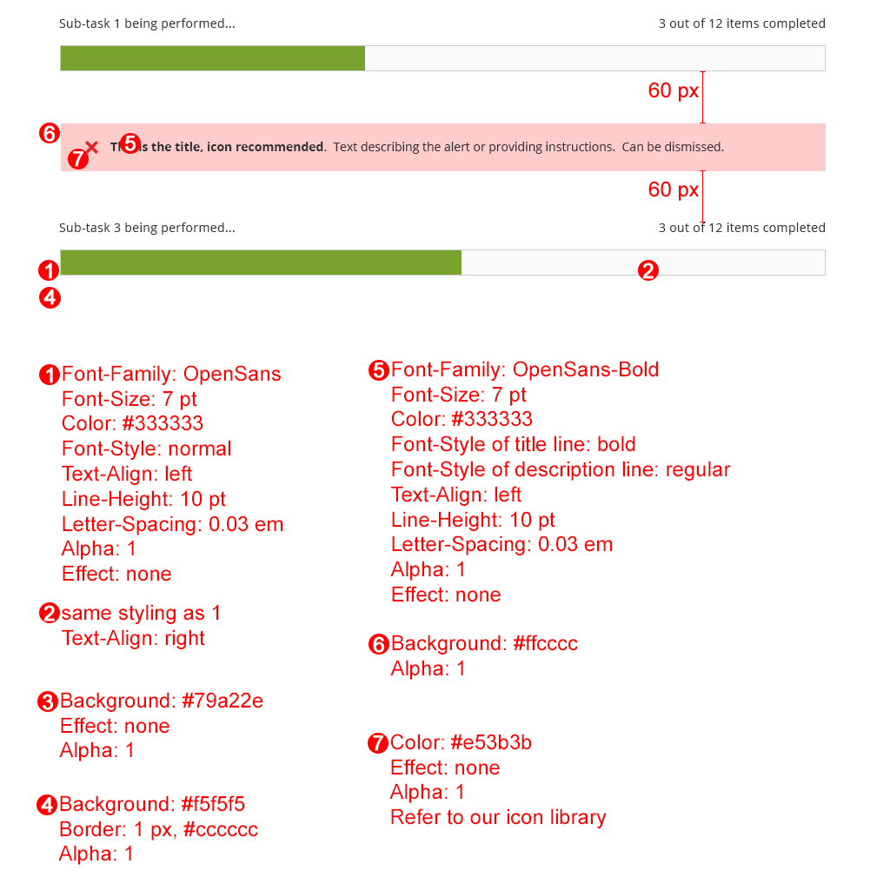

<h2>Progress Indicator</h2>

<h3> Contents </h3>

* <a href="#overview">Overview</a>
* <a href="#when-to-use">When to Use</a>
* <a href="#when-not-to-use">When Not to Use</a>
* <a href="#behavior">Behavior</a>
* <a href="#variations">Variations</a>
* <a href="#style">Style</a>
* <a href="#assets">Assets</a>

<h3 id="overview">Overview</h3>

Within the Magento application, users sometimes need to wait for a process to be completed by the system. In such case, it is best to communicate that to the user that the system is working the process that the user requested. There are two types of progress indicator: 1.) a progress bar and 2.) a spinner. 

The use of progress indicator should follow this guideline.

<h3 id="when-to-use">When to Use</h3>
* Use when needing to provide feedback to the user that a process is running, especially when user initiate the process.
* When a percentage of completion can be shown and the process , use a progress bar.
* When a percentage of completion cannot be shown or the process is relatively short, use a spinner.

<h3 id="when-not-to-use">When Not to Use</h3>
* When process' progress communicates well enough on its own.
* When process completes so quickly that it is distracting to show progress. If the task takes less than 500ms. 
* When the process waits for the user to complete the task. 
* When the user doesn't need to know something is happening
* When the process operates in the background and doesn't block user activity, progress indicator can be used but is not necessary.
* When you can use content from the operation to visualize progress.

<h3 id="behavior">Behavior</h3>

Progress indicator is read-only, not interactive. 

#### Spinner

Spinner is a gif image.

1. Process is triggered
2. Show spinner - To avoid flickering, if a process generally takes 2 seconds to complete, but can be completed under 500ms. Delay 500ms before showing the spinner.
3. Once process is completed, the spinner disappear along with other indicative elements depending on the context.

#### Progress Bar

In general, it is not recommended to use the progress bar if the process can be completed under 3 seconds. To avoid flickering, the minimum time displayed of progress bar should be 3 seconds.

**States Diagram**

1. **Process Trigger**
This process trigger is what the user tell system to start process. It can be anything depending on the context such as a button or a drop action.

2. **Starting State**

3. **Progressing**

4. **Success**
Once success, the page should refresh to show success status. The success status and behavior will depend on context of the scenario. (ie. open new page, stay on the same page, success message, etc.)

5. **Failed**
The progress bar will disappeared and is replaced with this error message.

<h3 id="variations">Variations</h3>

<h3 id="style">Style</h3>

#### Spinner

The spinner can be any of these 4 sizes.

#### Progress Bar

*Refer to Messaging Pattern for final styling on error message.

<h3 id="assets">Assets</h3>
PSD files and gif images can be found here:
<a href="src/magento-progressbar.zip">Download Progress Indicator PSD and GIF source</a>

For any other resources, please contact the Magento UX Design Team
