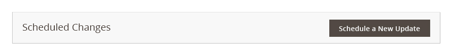
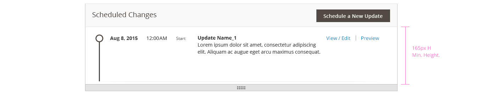
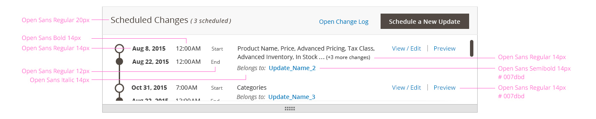

<h2> Scheduled Changes Module </h2>

<h3> Contents </h3>

* <a href="#overview">Overview</a>
* <a href="#when-to-use">When to Use / When Not to Use</a>
* <a href="#examples">Interaction and Behavior</a>
* <a href="#styling">Styling</a>
* <a href="#assets">Assets</a>

<h3 id="overview">Overview</h3>
For all stage-able entities, a Scheduled Changes Module appears on the top of each entity’s page. An entity’s module provides a quick summary of scheduled updates, as well as controls to view, edit and preview individual updates. 

<h3 id="when-to-use">When to Use / When Not to Use</h3>
Use in places where a series of updates needs to be displayed, including a brief summary of their contents. 
The scheduled changes module, as defined below, should only be used with stage-able entities. 

<h3 id="examples">Interaction and Behavior</h3>

#### No Updates View:
When no updates are available to be displayed on the timeline.

#### Multiple Updates View:
Shows when several updates are scheduled for a stage-able entity. 

#### Single Update View:
When a single update is scheduled, the module’s default height is the same as the Multiple Updates View. Users can re-size the module, using the dragger at the bottom of the module.

#### Loading More Updates:
The "Load More" button appears at the bottom of the list of scheduled updates. By default, 5 scheduled updates are displayed. To view more, users can click "Load More" to add the next set of scheduled updates.  

<h3 id="styling">Styling</h3>

#### No Updates View:

#### Single Update View - minimum height:

#### Multiple Updates View style:

<h3 id="assets">Assets</h3>

If you have questions about the Scheduled Update Module, please <a href="https://magento.com/company/contact-us">contact us.</a>

<a href="src/Scheduled Changes Module Source.psd">Download Scheduled Changes Module source</a>
