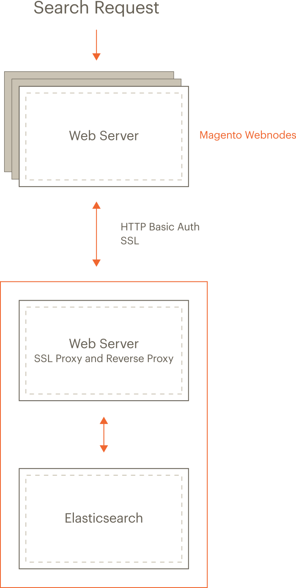

* [Configure nginx and Elasticsearch]({{ page.baseurl }}/config-guide/elasticsearch/es-config-nginx.html)
* [Configure Apache and Elasticsearch]({{ page.baseurl }}/config-guide/elasticsearch/es-config-apache.html)
* [Configure Elasticsearch stopwords]({{ page.baseurl }}/config-guide/elasticsearch/es-config-stopwords.html)

## Elasticsearch overview {#overview}

In Magento 2.1 for the first time, you can use [Elasticsearch](https://www.elastic.co) for searching your catalog.

* Elasticsearch performs quick and advanced searches on products in the catalog
* Elasticsearch Analyzers support multiple languages
* Supports stop words and synonyms
* Indexing does not impact customers until reindex is completed

  Elasticsearch returns search results based on the last generated index until the new one has been completely indexed so there's no disruption to customers

* Accurate, performant, scalable
* Works well out of the box
* Easy to horizontally scale
* Supports real-time data and analysis
* Can be used as a document-oriented data store
* Applications in framework beyond search&mdash;reporting, personalization, performance, and storage

### Supported versions {#es-spt-versions}

{: .bs-callout .bs-callout-warning}
Magento 2.3.1 updates the Elasticsearch module.
This update will only support Elasticsearch versions 5.x and 6.6.x.
Elasticsearch 2.x is not compatible with the Magento 2.3.1 module.
If you must run Elasticsearch 2.x with Magento 2.3.1, you must downgrade the Elasticsearch module.
Follow the instructions in [Downgrade Elasticsearch Module][].

{{site.data.var.ee}} version 2.2.x supports the following Elasticsearch versions:

* Elasticsearch [6.6.x](https://www.elastic.co/downloads/past-releases/elasticsearch-6-6-1)
* Elasticsearch [5.x](https://www.elastic.co/downloads/past-releases/elasticsearch-5-2-2)

Magento 2.2.3 uses [Elasticsearch PHP client](https://github.com/elastic/elasticsearch-php) version 6. (Before version 2.2.3, Magento used PHP client version 5.2.)

### Recommended configuration {#es-arch}

The following figure shows our recommended configuration. All of the tasks we discuss assume you have configured your system this way.

{:width="300px"}

The preceding diagram shows:

* The Magento application and Elasticsearch are installed on different hosts.

  Running on separate hosts is secure, enables Elasticsearch to be scaled, and is necessary for proxying to work. (Clustering Elasticsearch is beyond the scope of this guide but you can find more information in the [Elasticsearch documentation](https://www.elastic.co/guide/en/elasticsearch/guide/current/distributed-cluster.html).)
* Each host has its own web server; the web servers don't have to be the same.

  For example, the Magento application can run Apache and Elasticsearch can run nginx.
* Both web servers use Transport Layer Security (TLS).

  Setting up TLS is beyond the scope of our documentation.

Search requests are processed as follows:

1. A search request from a user is received by the Magento web server, which forwards it to the Elasticsearch server.

   You configure Elasticsearch in the Magento Admin to connect to the proxy's host and port. We recommend the web server's SSL port (by default, 443).
2. The Elasticsearch web server (listening on port 443) proxies the request to the Elasticsearch server (by default, it listens on port 9200).
3. Access to Elasticsearch is further protected by HTTP Basic authentication.

   For any request to reach Elasticsearch, it must travel over SSL *and* provide a valid username and password.
4. Elasticsearch processes the search request.
5. Communication returns along the same route, with the Elasticsearch web server acting as a secure reverse proxy.

## Install prerequisites and Elasticsearch {#es-prereq}

The tasks discussed in this section require the following:

* [Firewall and SELinux](#firewall-selinux)
* [Install the Java Software Development Kit (JDK)](#prereq-java)
* [Install Elasticsearch 6](#es-install-es6)
* [Install Elasticsearch 2.x](#es-install-es)
* [Upgrade from Elasticsearch 2.x to 5.x](#es-upgrade6)
* [Configure Magento to use Elasticsearch]({{page.baseurl}}/config-guide/elasticsearch/configure-magento.html)





### Install Elasticsearch 6 {#es-install-es6}

This section discusses how to install Elasticsearch 6.6 from their repository.

1. Log in to your Magento server as a user with `root` privileges.
1. _CentOS_: Enter the following commands in the order shown:

   rpm --import https://artifacts.elastic.co/GPG-KEY-elasticsearch
   vim /etc/yum.repos.d/Elasticsearch.repo

    Add the following:

    ```bash
    [elasticsearch-5.x]
    name=Elasticsearch repository for 6.x packages
    baseurl=https://artifacts.elastic.co/packages/6.x/yum
    gpgcheck=1
    gpgkey=https://artifacts.elastic.co/GPG-KEY-elasticsearch
    enabled=1
    autorefresh=1
    type=rpm-md
    ```

    Enter the following commands:

    ```bash
    yum -y install elasticsearch
    chkconfig --add elasticsearch
    ```

1. _Ubuntu_: Install the Elasticsearch 6 version using the [Elasticsearch documentation](https://www.elastic.co/guide/en/elasticsearch/reference/6.6/deb.html)

1. Optionally, configure Elasticsearch as needed. See [Configuring Elasticsearch](https://www.elastic.co/guide/en/elasticsearch/reference/6.6/settings.html) for more information.
1. Start Elasticsearch:

    `service elasticsearch start`
1. Verify that Elasticsearch is working by entering the following command on the server on which it's running:

    `curl -XGET '<host>:9200/_cat/health?v&pretty'`

    A message similar to the following is displayed:

    ```terminal
    epoch      timestamp cluster       status node.total node.data shards pri relo init unassign pending_tasks
    1519701563 03:19:23  elasticsearch green           1         1      0   0    0    0        0             0
    ```

### Install Elasticsearch 2.x {#es-install-es}

To install Elasticsearch 2.x, follow the [Elasticsearch Installation documentation][]

1. Open the [Elasticsearch configuration file](https://www.elastic.co/guide/en/elasticsearch/reference/2.0/setup-configuration.html#settings), `elasticsearch.yml`, in a text editor.

   For example, it might be located in `/etc/elasticsearch` or `<elasticsearch install dir>/config`.

1. Save your changes to `elasticsearch.yml` and exit the text editor.

1. Optionally configure the [Elasticsearch service](https://www.elastic.co/guide/en/elasticsearch/reference/2.0/setup-service.html).
1. Start Elasticsearch:

   ```bash
   service elasticsearch start
   ```

1. Verify that Elasticsearch is working by entering the following command on the server on which it's running:

   curl -i localhost:9200/_cluster/health

   Messages similar to the following display if Elasticsearch is running:

   {"cluster_name":"elasticsearch","status":"green","timed_out":false,"number_of_nodes":1,"number_of_data_nodes":1,"active_primary_shards":0,"active_shards":0,"relocating_shards":0,"initializing_shards":0,"unassigned_shards":0,"delayed_unassigned_shards":0,"number_of_pending_tasks":0,"number_of_in_flight_fetch":0,"task_max_waiting_in_queue_millis":0,"active_shards_percent_as_number":100.0}

## Upgrade from Elasticsearch 2.x to 6.6.x {#es-upgrade6}

Refer to [Upgrading Elasticsearch](https://www.elastic.co/guide/en/elasticsearch/reference/5.2/setup-upgrade.html) for full instructions on backing up your data, detecting potential migration issues, and testing upgrades before deploying to production.

Upgrading from 2.x to 6.6.x requires a full cluster restart. See [Full cluster restart upgrade](https://www.elastic.co/guide/en/elasticsearch/reference/5.2/restart-upgrade.html) for details.

{:.bs-callout .bs-callout-info}
Elasticsearch 6.6.x requires JDK 1.8 or higher. Elasticsearch 2.x requires JDK 1.7 or higher. See [Install the Java Software Development Kit (JDK)](#prereq-java) to check which version of JDK is installed.

## Additional resources {#es-resources}

For additional information, see [Elasticsearch documentation](https://www.elastic.co/guide/en/elasticsearch/reference/2.4/index.html)

### Next

* [Configure nginx and Elasticsearch]({{ page.baseurl }}/config-guide/elasticsearch/es-config-nginx.html)
* [Configure Apache and Elasticsearch]({{ page.baseurl }}/config-guide/elasticsearch/es-config-apache.html)
* [Configure Magento to use Elasticsearch]({{ page.baseurl }}/config-guide/elasticsearch/configure-magento.html)

<!-- Link Definitions -->
[Downgrade Elasticsearch Module]: {{page.baseurl}}/config-guide/elasticsearch/es-downgrade.html
[Elasticsearch Installation documentation]: https://www.elastic.co/guide/en/elasticsearch/reference/2.4/setup.html