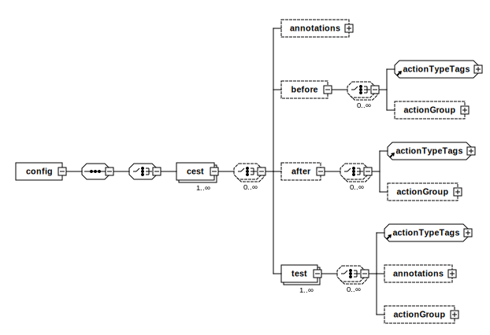

## Overview

Test cases in the MFTF are defined in XML as [cests][cest].
A cest is [Codeception test container][codeception cest] that contains multiple individual tests with cest-level metadata and before/after actions with dependency management.
Tests in the MFTF are considered as a sequence of actions with associated parameters.
Any failed assertion within a test fails that test and the MFTF reports about it using [Allure].

The following diagram demonstrates the structure of a test in the MFTF.



## Format

```xml
<?xml version="1.0" encoding="UTF-8"?>

<config xmlns:xsi="http://www.w3.org/2001/XMLSchema-instance" xsi:noNamespaceSchemaLocation="../../../../../../vendor/magento/magento2-acceptance-test-framework/src/Magento/AcceptanceTestFramework/Test/etc/testSchema.xsd">
    <cest name="">
        <annotations>
            <features value=""/>
            <stories value=""/>
            <group value=""/>
            <env value=""/>
        </annotations>
        <before>
            <annotations>
                <!-- LIST OF ANNOTATIONS -->
            </annotations>
            <!-- LIST OF ACTIONS -->
            <click selector="" mergeKey=""/>
            <!-- ACTION GROUPS -->
            <actionGroup ref="" mergeKey="">
                <argument name="" value=""/>
            </actionGroup>       
        </before>
        <after>
            <annotations>
                <!-- LIST OF ANNOTATIONS -->
            </annotations>
            <!-- LIST OF ACTIONS -->
            <click selector="" mergeKey=""/>
            <!-- ACTION GROUPS -->
            <actionGroup ref="" mergeKey="">
                <argument name="" value=""/>
            </actionGroup> 
        </after>
        <test name="">
            <annotations>
                <title value=""/>
                <description value=""/>
                <severity value=""/>
                <testCaseId value=""/>
            </annotations>
            <!-- LIST OF ACTIONS -->
            <click selector="" mergeKey=""/>
            <!-- ACTION GROUPS -->
            <actionGroup ref="" mergeKey="">
                <argument name="" value=""/>
            </actionGroup>
        </test>
    </cest>
</config> 
```

## Principles

* All names within the framework are in the CamelCase format
* A test may have any number of assertions, at any point within the test

## Cest elements

The following is a list of elements that may be used in cests.

### cest

A cest is a Codeception container for multiple tests. Logically, it is a group of tests that define test flows within a test case.

Attribute|Type|Use
---|---|---
name|string|required

It MUST contain at least one [`<test>`][test].

It MAY contain [`<annotations>`][annotations], [`<before>`][before], [`<after>`][after].

***
***

### annotations

Annotations are supported by both Codeception and Allure.
Codeception annotations typically provide metadata and, also, they are able to influence test selection.
Allure annotations provide metadata for reporting.

Read about annotations in a separate topic [Annotations][annotations].

***
***

### before

Specifies actions to perform before all [tests][test] in a [cest].

Attribute|Type|Use|Default
---|---|---|---
name|string|optional|
remove|boolean|optional|false

It MAY contain the following child elements:
 
 * any [action]
 * [`<annotations>`][annotations]
 * [`<actionGroup>`][action group]

***
***
 
### after

Specifies actions to perform after all tests in cest.

Attribute|Type|Use|Default
---|---|---|---
name|string|optional|
remove|boolean|optional|false

It MAY contain:
 
 * any [action]
 * [`<annotations>`][annotations]
 * [`<actionGroup>`][action group]
 
***
***
 
### test

A set of actions with an assertion.

Attribute|Type|Use|Default
---|---|---|---
name|string|optional|
remove|boolean|optional|false

It MAY contain:
 
 * any [action]
 * [`<annotations>`][annotations]
 * [`<actionGroup>`][action group]
 
***
***

### actionGroup

Calls a corresponding action group

Attribute|Type|Use|Default
---|---|---|---
ref|string|required|	
mergeKey|string|required|	
remove|boolean|optional|false
before|string|optional|	
after|string|optional|

It MAY contain [`<argument>`][argument]


***
***

### argument

Sets an argument that is used in parent [action group]

Attribute|Type|Use
---|---|---
name|string|optional	
value|string|optional


<!-- LINKS DEFINITIONS -->

[action]: ./actions.html
[action group]: #actiongroup
[after]: #after
[annotations]: ./annotations.html
[argument]: #argument
[before]: #before
[cest]: #cest
[test]: #test

[Allure]: https://github.com/allure-framework/
[codeception cest]: http://codeception.com/docs/07-AdvancedUsage#Cest-Classes

<!-- Abbreviations -->

*[MFTF]: Magento Functional Testing Framework 