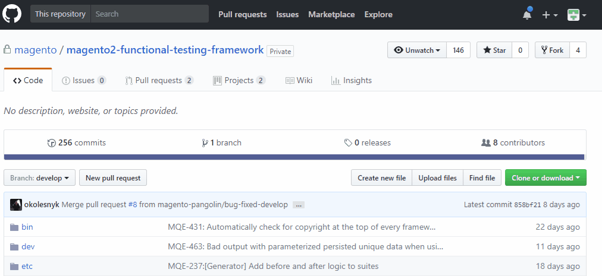
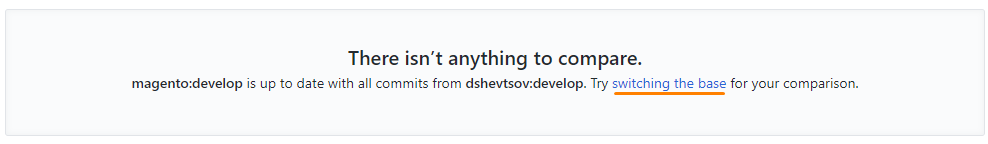
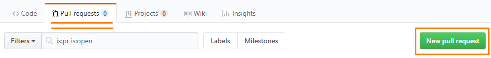
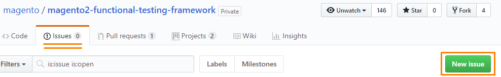

## Contribute to MFTF code

Use the [fork] & [pull] model to contribute to the Magento Functional Testing Framework (MFTF) code base.
This contribution model has contributors maintaining their own copy of the forked code base (which can be easily synced with the main copy).
The forked repository is then used to submit a request to the base repository to pull a set of changes (pull request).

Contributions can take the form of new components or features, changes to existing features, tests, documentation (such as developer guides, user guides, examples, or specifications), bug fixes, optimizations, or just good suggestions.

The MFTF development team reviews all issues and contributions submitted by the community of developers in a FIFO basis.
 During the review we might require clarifications from the contributor.
If there is no response from the contributor for two weeks, the issue is closed.

Often when the MFTF team works on reviewing the suggested changes, we will add a label to the issue to indicate to our internal team certain information, like status or who is working the issue.
If you’re ever curious what the different labels mean, see the [table][labels] below for an explanation of each one.

Please refer to [Magento Contributor Agreement] for detailed information about the License Agreement.
All contributors are required to submit a click-through form to agree to the terms.

## Contribution requirements

1.	Contributions must adhere to [Magento coding standards].
2.	Refer to the Magento development team’s [Definition of Done].
We use these guidelines internally to ensure that we deliver well-tested, well-documented, solid code, and we encourage you to as well!
3.	Pull requests (PRs) must be accompanied by a meaningful description of their purpose.
Comprehensive descriptions increase the chances that a pull request is merged quickly and without additional clarification requests.
4.	Commits must be accompanied by meaningful commit messages.
5.	PRs that include bug fixing must be accompanied by a step-by-step description of how to reproduce the bug.
6.	PRs that include new logic or new features must be submitted along with:
    * Unit/integration test coverage
    * Proposed [documentation update]. Documentation contributions can be submitted [here][devdocs mftf].
7.	For large features or changes, please [open an issue][issue] and discuss first.
This may prevent duplicate or unnecessary effort, and it may gain you some additional contributors.
8.	To report a bug, please [open an issue][issue], and follow [guidelines about bugfix issues][issue reporting].
9.	All automated tests must pass successfully (all builds on [Travis CI] must be green).

## Fork a repository {#fork}

To fork a repository on Github, do the following:

1.	Create or log in to your free account on GitHub.
2.	Navigate to the [MFTF repository].
3.	Click **Fork** at the top right:
4.	Clone the repo into your development environment and start playing.





### Update the fork with the latest changes

As community and Magento writers’ changes are merged to the repository, your fork becames outdated and pull requests might result in conflicts.
To see if your fork is outdated, open the fork page in GitHub and if at the top displays the following message:

``` 
This branch is NUMBER commits behind magento:develop.
```

It means your fork must be updated.
 
There are two ways to update your fork.
The typical way is discussed in [GitHub documentation].
Make sure to update from the correct branch!

There is also a possibility to use the GitHub interface to do that.
This is referred to as a *reverse pull request*.
This method has the downside of inserting unnecessary information into fork commit history. On your fork GitHub page, click **New pull request**.
You should see the following message:



Click the "switching the base" link and then click **Create pull request**.
Provide a descriptive name for your pull request in the provided field.

Scroll to the bottom of the page and click **Merge pull request**, then click **Confirm Merge**.

## Create a pull request {#pull-request}

First, check the [existing PRs] and make sure you are not duplicating others’ work!

To create a pull request do the following:

1.	Create a feature branch for your changes and push those changes to the copy of your repository on GitHub.
 This is the best way to organize and even update your PR.
2.	In your repository, click **Pull requests**, and then click **New pull request**:
    
3.	Ensure that you are creating a PR to the **magento/magento2-functional-testing-framework: develop** branch.
 We accept PRs to this branch only.
4.	Review the changes, then click **Create pull request**.
 Fill out the form, and click **Create pull request** again to submit the PR—that’s it!

After submitting your PR, you can head over to the repository’s [Pull Requests panel][existing PRs] to see your PR along with the others.
 Your PR undergoes automated testing, and if it passes, the core team considers it for inclusion in the Magento Functional Testing Framework core.
 If some tests fail, please make the corresponding corrections in your code.

## Report an issue {#issue}

If you find a bug in Magento Functional Testing Framework code, you can report it by creating an issue in the Magento Functional Testing Framework repository.

<div class="bs-callout bs-callout-info" markdown="1">
Before creating an issue, please do the following:

1.	Read the [issue reporting guidelines][issue reporting] to learn how to create an issue that can be processed in a timely manner.
2.	Check the documentation to make sure the behavior you are reporting is really a bug, not a feature.
3.	Check the [existing issues] to make sure you are not duplicating somebody’s work.
</div>

To add an issue:

1.	In the Magento 2 public repository, click the *Issues* link
    
2.	Click **New issue**
3.	Fill in the **Title** and issue description
4.	Click **Submit new issue**

## Labels applied by the MFTF team {#labels}

Refer to the tables with descriptions of each label below. These labels are applied by the MFTF development team to community contributed issues and pull requests, to communicate status, impact, or which team is working on it.

### Pull Request Status

Label| Description
---|---
**accept**| The pull request has been accepted and will be merged into mainline code. 
**reject**| The pull request has been rejected and will not be merged into mainline code. Possible reasons can include but are not limited to: issue has already been fixed in another code contribution, or there is an issue with the code contribution.
**needsUpdate**| The Magento Team needs additional information from the reporter to properly prioritize and process the pull request.

### Issue Resolution Status

Label| Description
---|---
**acknowledged**| The Magento Team has validated the issue and an internal ticket has been created.
**needsUpdate**| The Magento Team needs additional information from the reporter to properly prioritize and process the issue or pull request.
**cannot reproduce**| The Magento Team has not confirmed that this issue contains the minimum required information to reproduce. 
**non-issue**| The Magento Team has not recognised any issue according to provided information.

### Domains Impacted

Label| Description
---|---
**PROD**| Affects the Product team (mostly feature requests or business logic change).
**DOC**| Affects Documentation domain.
**TECH**| Affects Architect Group (mostly to make decisions around technology changes).

### Type

Label| Description
---|---
**bugfix**| The issue or pull request relates to bug fixing.
**enhancement**| The issue or pull request that raises the MFTF to a higher degree (for example new features, optimization, refactoring, etc).


<!-- LINKS DEFINITIONS -->

[fork]: #fork
[issue]: #issue
[labels]: #labels
[pull]: #pull-request

[Definition of Done]: {{ page.baseurl }}/contributor-guide/contributing_dod.html
[documentation update]: {{ page.baseurl }}/contributor-guide/contributing_docs.html
[Magento coding standards]: {{ page.baseurl }}/coding-standards/bk-coding-standards.html

[devdocs mftf]: https://github.com/magento/devdocs/tree/develop/guides/v2.3/magento-functional-testing-framework
[existing issues]: https://github.com/magento/magento2-functional-testing-framework/issues?q=is%3Aopen+is%3Aissue
[existing PRs]: https://github.com/magento/magento2-functional-testing-framework/pulls?q=is%3Aopen+is%3Apr
[GitHub documentation]: https://help.github.com/articles/syncing-a-fork
[issue reporting]: https://github.com/magento/magento2-functional-testing-framework/wiki/Issue-reporting-guidelines
[Magento Contributor Agreement]: http://www.magento.com/legaldocuments/mca
[MFTF repository]: https://github.com/magento/magento2-functional-testing-framework
[Travis CI]: https://travis-ci.com/magento/magento2-functional-testing-framework/pull_requests

<!-- Abbreviataion -->

*[FIFO]: first-in, first-out
*[MFTF]: Magento Functional Testing Framework
