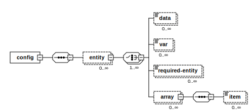

## Overview

## Format

## Principles

## Example

## Available elements

### entity

An element that contains configuration array containing all Entity elements

name	string  : http://www.w3.org/2001/XMLSchema	optional	Name of the Entity
type	string  : http://www.w3.org/2001/XMLSchema	optional	Node containing the exact name of Entity type. Used later to find specific Persistence Layer Model class

### data

Element containing Data/Value pair.

key	string  : http://www.w3.org/2001/XMLSchema	optional	Key attribute of data/value pair
unique	uniquenessEnumType  : 	optional	Add suite or test wide unique sequence as "prefix" or "suffix" to the data value if specified

### var

key	string  : http://www.w3.org/2001/XMLSchema	optional	Key attribute of data/value pair.
unique	uniquenessEnumType  : 	optional	Add suite or test wide unique sequence as "prefix" or "suffix" to the data value if specified.
entityType	string  : http://www.w3.org/2001/XMLSchema	optional	
entityKey	string  : http://www.w3.org/2001/XMLSchema	optional	

### required-entity

Element containing required entity to this parent entity.

type	string  : http://www.w3.org/2001/XMLSchema	optional	Type attribute of required entity.

### array

key	string  : http://www.w3.org/2001/XMLSchema	required	

### item

Individual piece of data to be passed in as part of the parrent array type.
 

