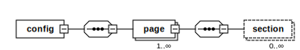

## Overview

## Format

## Principles

## Example

## Available elements

### page

Contains sequence of UI sections in a page.

Attributes|Type|Use|Default|Description
---|---|---|---|---
name|string|required| |Unique page name identifier
urlPath|string|required| |URL path (excluding the base url) for the page. Use `"%s"` for placeholders for variables
module|string|required|	|The name of the module to which the page belongs. For example: `"Magento_Catalog"`
parameterized|boolean |optional| |	
remove	|boolean  |	optional|false|

It may contain several [<section>] elements.

### section

Contains sequence of UI elements.

Attributes|Type|Use|Default|Description
---|---|---|---|---
name|string|required| |The name of the module to which the page belongs. For example: `"Magento_Catalog"`
remove|boolean|optional|false|Set to `true` to remove this element during parsing