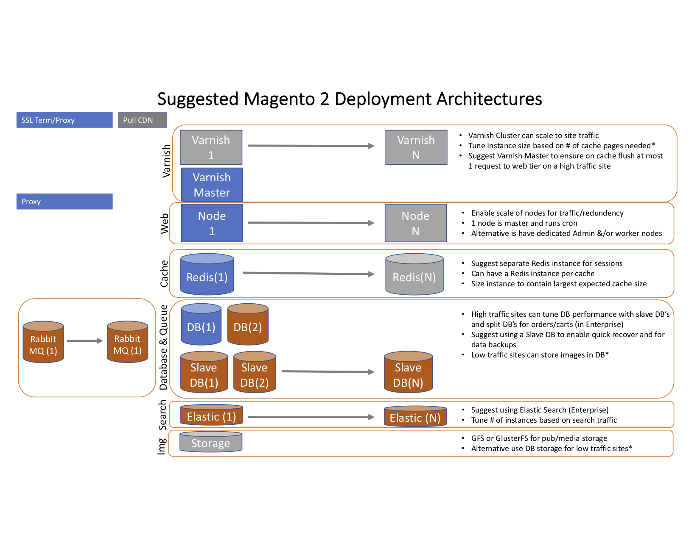

The Magento Reference Architecture diagram represents the best practice approach to setup a scalable Magento site.

## Reference Architecture Diagram

###Notes
* Grey boxes are optional elements
* Orange boxes are Enterprise only optional elements

## Recommended Varnish Reference Architcture

Magento supports several full page caching engines (File, Memcache, Redis, Varnish) out of the box along with expanded coverage through extensions.  The recommended full page cache engine is Varnish.  Magento supports many different Varnish configurations.

For sites that don't require high availability we recommend using a simple Varnish setup with Nginx SSL termination.

For sites that require high availability we recommend using a 2 tier Varnish configuration with an SSL terminating load balancer.

