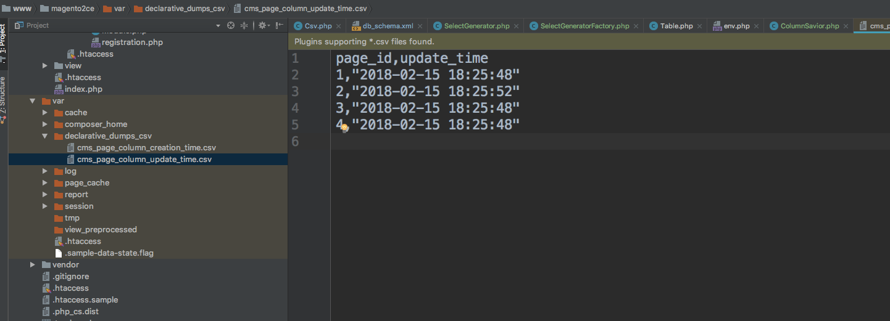

## What is Declarative Setup

At the moment, in order to change the database schema, extension developers need to write code (PHP script) with the desired operations: renaming columns, adding new CMS pages, etc. Currently Magento 2 has 5 types of scripts:

InstallData and InstallSchema scripts, that are executed on a clean (empty) database;
UpgradeData and UpgradeSchema incremental scripts, that supplement an existing Magento database;
Recurring scripts, that are executed each time you install or upgrade Magento.

Each script add its change iteratively. So during installation only changes, that were not applied yet will be applied.
For instance, if you have database version of Magento - 2.0.3 and the latest one is 2.0.6, then upgrade scripts
2.0.4, 2.0.5, 2.0.6 will be applied consistently. That procedure is called `migration setup` or `migration scripts`.
The biggest disadvantage of this approach is that Magento applied changes blindly. So the main goal of alternative approach - to defeat that blindness. From 2.3 release we start using such approach in Magento. The name of it is `declarative setup`
`Declarative setup` is based on database structure declarations, as is done by projects such as Doctrine. 
Schema files (in Magento such files has name: `db_schema.xml`) declare what the database structure should be, 
and Magento determines the differences between the current table structure and what it should be. These differences can be represented with atomic SQL operations. Here is an example of such a declaration:

```xml
<table name="catalog_product_entity_datetime" resource="default" engine="innodb"
           comment="Catalog Product Datetime Attribute Backend Table">
        <column xsi:type="int" name="value_id" padding="11" unsigned="false" nullable="false" identity="true" comment="Value ID"/>
        <column xsi:type="smallint" name="attribute_id" padding="5" unsigned="true" nullable="false" identity="false"default="0" comment="Attribute ID"/>
        <column xsi:type="smallint" name="store_id" padding="5" unsigned="true" nullable="false" identity="false" default="0" comment="Store ID"/>
        <column xsi:type="int" name="entity_id" padding="10" unsigned="true" nullable="false" identity="false" default="0"/>
        <column xsi:type="datetime" name="value" on_update="false" nullable="true" comment="Value"/>
        <constraint xsi:type="primary" name="PRIMARY">
            <column name="value_id"/>
        </constraint>
</table>        
```

## Db Schema Structure

Lets dig into how such `db_schema.xml` should be declared:
The path of `db_schema.xml` file is:

```
--Module_Vendor
    --Module_Name
        --etc
            --db_schema.xml
```

Each db declaration file should consist of: `table` node. This node is represent table in database. 
Table node has next allowed attributes:

 - `name`. Name of the table
 - `engine`. SQL engine
 - `resource`. Means database shard, on which this tables should be installed
 - `comment`. Table comment
 
 Also table node can consist of 3 different subnodes. The type of almost all subnodes is controlled by node name
 and `xsi:type` declaration. For example, for `column` sub-node (which represents table column in SQL) the name of the node
 is `column` and `xsi:type` is regulates, which type of column should be chosen: 
 
 - `int` (smallint, bigint, tinyint)
 - `real` (decimal, float, double, real)
 - `text` (text, mediumtext, longtext)
 - `varchar`
 - `varbinary`
 - `blob` (blob, mediumblob, longblob)
 - `datetime`
 - `timestamp`
 - `date`
 - `boolean`
 
You can read about each type in XSD annotation of each type.
For example, here is XSD for boolean: `urn:magento:setup:Model/Declaration/Schema/etc/types/boolean.xsd`
Each column can have different attributes. For instance, integer column can be auto incremented and text column - not
All attributes are declared in particular XSDs. Also all allowed attributes can be observed, if you will generate urns, by running
this command: [How to generate urns?]
If urns are already generated, you can exploit PHPStorm autocomplete after choosing column `xsi:type`. That is true for other subnodes too.

![Db Schema Autocomplete]

Here is list of all attributes, that can be applied to `column` subnode:
- `padding`. SQL size of integer columns
- `scale`. Number of digits, after dot in real types
- `precision`. Number of allowed digits in real types
- `identity`. Used to say, whether a column is auto incremented or not
- `length`. Used in text and binary types (also in varchar and varbinary), and is used for specifiing length of a column
- `nullable`. Determine, whether column can be nullable or not
- `default`. Initialize column with default value, specified here. Please note, that default value should have the same type, as column   
- `unsigned`. Can be applied only to numeric types, and said whether column can be positive and negative or only positive
- `disabled`. This flag should be used only in case when you want to disable/delete table/column/constraint/index, 
that is declared
- `onCreate`. This is DDL trigger, which allows for example to move data from column you want to remove to newely created column. 
This trigger works only during column creation process.

Example:

```xml
<column xsi:type="int" name="entity_id" padding="10" unsigned="true" nullable="false" identity="true" comment="Credit ID"/>
```

`Constraint` subnode is represented by 3 different types: `primary`, `unique`, `foreign`. The `primary` and `unique` constraints
are called 'internal' constraints, because they can be applied only to scope of a table, where they are created. `Foreign` constraint
is similar to foreign key in SQL and connect two tables with each other.

`Foreign` constraint attributes:

- `column`. Column in current table that refers to specific column in another table
- `referenceTable`. Table to which we do reference
- `referenceColumn`. Column in reference table to which we do reference
- `onDelete`. Foreign key trigger. Here is the list of possible values of this trigger: `CASCADE`, `SET NULL`, `NO ACTION`.

Discover more about foreign key triggers, you can in SQL engines documentation.
Example:

```xml
<constraint xsi:type="foreign" name="COMPANY_CREDIT_COMPANY_ID_DIRECTORY_COUNTRY_COUNTRY_ID"
                    table="company_credit" column="company_id" referenceTable="company" referenceColumn="entity_id"
                    onDelete="CASCADE"/>
```

`Internal` constraints are represented by `name` attribute and `column` subnode. In column subnode you can list columns you want 
to add to constraint:

```xml
<constraint xsi:type="primary" name="PRIMARY">
    <column name="entity_id"/>
</constraint>
```

Third subnode is `index`. `Index` has the same structure as internal constraint, but it is different with it logic. Constraint is used for limitations creation and index is used to speedup DQL operations.

## Migrating from old scripts to new db_schema.xml

As convertion process from old scripts to new declarative schema is long, boring and painstaking we developed tool, which allows to do 
this automatically - `Schema Listener Tool`. The main principle that underpin `Schema Listener Tool` is ordinar Magento Installation / Upgrade, during of which, all schema changes are logged under modules, and after Installation / Upgrade are persisted in `db_schema.xml` files
by modules. As this tool will always listen schema changes and tries to change Magento code, it can be undesirable to run such tool, 
for example, on production, so this tool is disabled by default.

In order to enable it, please add next argument to your `setup:install` or `setup:upgrade` CLI command:

```
--convert_old_scripts=1
```

Please note, that tool can be enabled only through CLI.

#### Tool troubleshooting
 
1. Tool supports only DDL operations represented in `\Magento\Framework\DB\Adapter\Pdo\Mysql`. So all custom DDL operations will be ignored
2. If you have any raw SQL in your `InstallSchema` or `UpgradeSchema` it will ignored too
3. If you have any DDL statements in `Reccurring` file they will not be transfered to new schema, as this file supposed to be running during each 
installation / upgrade

## Backward Compatability and Db whitelist

As many extensions and client code have old scripts, we will support installation from such scripts. Simultaneously execution of installation from old scripts and
declarative schema is called `Mixed Mode` Changes in setup approach are greater, than just replacing old PHP scripts with new XML schema.
Right now db schema is described not only a desired state, but also change approach to sequence in what all changes should be applied.
If with old scripts sequence of changes could be setuped with help of module sequences, for new approach sequence declaration is more difficult.
All changes are split by tables, on which they will be applied. All changes per table are accumulated in one statement: `ALTER`, `CREATE`, `DROP`.
Tables are sorted by references on them. Table without references inside will goes first. All old scripts will be executed only after
declarative schema installation / upgrade. 

As declarative schema makes database schema as in XML files, it will tries to undo all changes done by old scripts. In order to prevent such illegal behavior
we provide `db_schema_whitelist.json` - whitelist of tables, that can be modified and dropped with declarative schema tool.
Such file is auto generated and cummulative. In order to generate such file for your module, please run command, specified below:

```bash
$ magento declaration:generate:whitelist --module-name[=MODULE-NAME]
```

Till we will support backward compatability for this tool, we will not be able to clean 'garbage', like db schema, that is left after removed or disabled module
(of course if this module do not supports new schema)

## Edge cases and frequently asked questions

1. **How to drop column/table/constraint/index?**. If you want to drop a change from your module - you just need to delete it XML declaration
from `db_schema.xml` file. If you want to drop element, declared in another module, you should redeclare it with `disabled` attribute set to 'true'.
2. **How to rename column/table?**.
     - Table renaming is unsupported. You can remove old declaration of table and add new one. Data will not be lost (It will be persisted in CSV dump), but will not be added to new table automatically. You can add it manually with help 
     of data / recurring patches. 
     - Column rename is supported. You should do the same manipulations as for table renaming, but in new column you can specify `onCreate` attribute, which will say from what column, data should be migrated.
     Data can be migrated from the same table, for this you can use next construction:

```xml
onCreate="migrateDataFrom(entity_id)"
```

Also data can be migrated from another table:

```xml
onCreate="migrateDataFromAnotherTable(catalog_category_entity,entity_id)"
```

3. **How to do optimization or non-trivial things with db schema?**. Declarative schema is developed to work with simple operations: add, change, drop structural elements. 
So for all other complex operations, you will need to add PHP handlers into Recurring scripts. Note that Recurring scripts will not be deprecated and will
exists in system in future too.

## Incompatible changes

Incompatable changes - operations that are no longer supported in old manner.

**Rename column**
Column is dropped and recreated. A data source for copying data may be provided, used to migrate data in same module revision (on enabling module or upgrading CE to EE, etc.)
**Rename table**
Table is dropped and recreated once table name in schema is cnanged.
**Disabling a module**
Once module is disabled from console, it's DB schema configuration is no longer read on upgrade or install, so if module was previously installed, then disabled and upgrade is executed schema will be rebuilt excluding DB schema configuration of the disabled module.
**Truncate table**

## Safe installation and rollback

The advantage and the main problem of Declarative Schema is that it can blindly modify database schema. So developer can make mistake and remove some structural element from database and lose data.
The question of this section is how to prevent such mistakable loses of data. Was proposed to dump everything, than can be lost during installation.
Such dump can be restored automatically or manually. This approach allows do not create manual dumps during system upgrade (But please note, that this works only with schema)

With this mechanism 2 additional flags were added to `setup:install` and `setup:upgrade` commands:

`--safe-mode` - If you want to run Magento installation or upgrade and do dumps during this processes, you can add this optional flag to your command
Please note, that this flag is available only from CLI

`--data-restore` - If something goes wrong during installation, you can checkout code to previous version of Magento, and run `setup:upgrade`
with this additional flag

Lets consider during which operations of declarative schema, dumps will be created.

*Destructive operations (DO)* - SQL DDL operations, that cause data deletion or data corruption. Next operations are destructive: 

- deleting table;
- deleting column;
- reducing column length;
- change column precision;
- change column type;

*Opposite to destructive operations (ODO)* - SQL DDL operations, that are reverse to destructive operations, and can be used for rollback, in case of failed Magento installation. For example, changing column type from CHAR to INT will be destructive 
operation, and rollback operation which will change type from INT to CHAR will be opposite one. 
Opposite operations can appears, when we do rollback (`--data-restore`) to previous version in the code.

So during each destructive operation for table or for column - dump will be created. You can find your dumps by this paths:

`Magento_root/var/declarative_dumps_csv/{column_name_column_type_other_dimensions}.csv`
`Magento_root/var/declarative_dumps_csv/{table_name}.csv`

Each dump will be created in CSV.
Here is example of CSV format:

```csv
    column_nam1 | column_name 2 | ... | column_name n
    
    data1              | data 2                 | ... | data n
```

**Dump Example**



## HOWTO

In this section with `git diff` shortly will be described how to do old manilpulations, like creating table in new manner:

**Create table**


**Drop table**


**Create foreign key**


**Drop foreign key**


**Add column to table**


**Drop column from table**


**Change column type**


**Add index**


[How to generate urns?]:{{page.baseurl}}/config-guide/cli/config-cli-subcommands-urn.html
[Db Schema Autocomplete]:image/db_schema_autocomplete.png
[Db Schema Invocation]:image/declarative_schema_invocation.png
