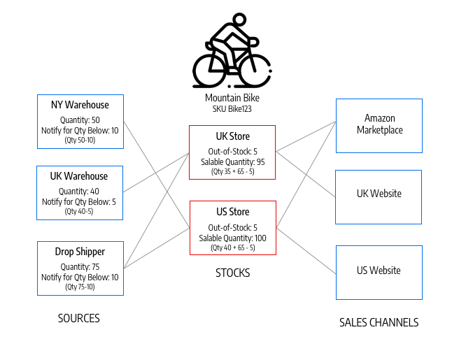

Magento Open Source and Commerce v2.3 include new and expanded features and APIs for Inventory Management. Inventory Management replaces all core APIs in the Open Source `CatalogInventory` module and the `ScalableInventory` module in Commerce. It also provides additional APIs to extend and add functionality.

Inventory Management features include

* Different configurations for merchants whose inventory originates from a single source and from multiple sources
* Stocks for tracking available aggregated quantities through assigned sources
* Concurrent checkout protection
* Shipment matching algorithms

Merchants install Inventory Management as a Core Bundled Extension (CBE) with the name `magento/inventory-composer-metapackage`. It is included in all v2.3 installs and upgrades.

**Magento Community Contribution** – Magento thanks the many contributors to the [Multi Source Inventory (MSI) project]( https://github.com/magento-engcom/msi), developing these features as part of the Magento Community Engineering program.

## Terminology

The following terms are important as you work with Inventory Management APIs:

* **Sources** represent physical locations that store and ship available products. These locations can include warehouses, brick-and-mortar stores, distribution centers, and drop shippers. (Any location can be designated as a source for virtual products.)

* **Stocks** map a sales channel (currently limited to websites) to source locations and on-hand inventory. A stock can map to multiple sales channel, but a sales channel can be assigned to only one stock.

* **Aggregate Salable Quantity** is the total virtual inventory that can be sold through a sales channel. The amount is calculated across all sources assigned to a stock.

* **Reservations** track deductions from the salable quantity as customers add products to carts and complete checkout. When an order ships, the reservation clears and deducts the shipped amounts from specific source inventory quantities.

## A simple scenario

The following diagram illustrates the relationship between source stocks, aggregate stocks, and sales channels:

In this diagram, a bicycle merchant has inventory for a touring bike in a warehouse and two stores. He has three stocks with configured website sales channels and sources. When a customer shops through the UK website, Magento aggregates bike inventory from the warehouse and flagship store sources for a salable quantity of 50. The touring bike can be shipped from either the warehouse or the flagship store, but not the King Street store. The German (DE) webstore same stock draws from the same aggregate stock as the UK webstore.

## Important Inventory Management objects

* `Source` – Defines a physical stock.

* `SourceItem` – A relation object that represents the amount of a specific product at a physical source. We use this entity for updating inventory on each source. Quantities might change as a result of synchronizing with an external Product Information Management (PIM) or Enterprise Resource Planning (ERP) system, or internally as a stock deduction during the checkout process. A `SourceItem` cannot be used for retrieving data that must be rendered on front-end, because only aggregated data should be used for all validations and UI representation.

* `StockItem` – Also known as Aggregated Virtual Stock. This is read-only data that the re-indexation process generates. Based on a pre-defined mapping, we define what sources are assigned to the current scope (sales channel) and aggregate quantities from all assigned sources. We also use `StockItem` to check if a product is in or out of stock.  Making this segregation by Read-Only interface (`StockItem`) and Write-Only interface (`SourceItem`), the Inventory architecture achieves Command Query Responsibility Segregation (CQRS). As a result, all `GET` HTTP requests should use `StockItem` entity, and all `POST/PUT` should use `SourceItem`.

## Shipping algorithms

When merchants are ready to make a partial or full shipment, they select the source or sources from which to send the products. Customers typically want low-cost shipping and a guarantee of safe arrival of products, while the merchant needs to ensure minimal overhead for the inventory storage and shipping costs. Inventory Management includes an algorithm that takes these considerations into account and recommends the best shipping option or options. Magento provides an algorithm for Priority, using the source priority per stock, where each source is given a priority in the scope of a specific sales channel. Inventory Management also supports developer-provided extensions for other algorithms based on criteria such as cheapest shipping and closest GPS location.

## Related information

[Order Processing with Multi Source Inventory]({{ page.baseurl }}/rest/tutorials/inventory/index.html) is a tutorial that uses REST calls to illustrate the life cycle of an order in an Multi Source Inventory environment.

[Manage sources]({{ page.baseurl }}/rest/modules/inventory/manage-sources.html) is the starting point for REST reference documentation.
