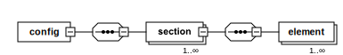

## Overview

## Format

## Principles

## Example

## Available elements

### section

Contains sequence of UI elements in a section of a page.

Attributes|Type|Use|Description
---|---|---|---
name|string|required|Unique section name identifier
remove|boolean|optional|Default: `false`. Set to `true` to remove this element during parsing

### element

Attributes|Type|Use|Description
---|---|---|---
name|string|required|Element name
type*|string|required|The type of the element. Possible values: "text", "textarea", "input", "button", "checkbox", "radio", "checkboxset", "radioset", "date", "file", "select", "multiselect", "wysiwyg", "iframe".
selector|string|required|Selector of the element
timeout*|string|optional|Optional timeout value in seconds to wait for the operation on the element. Use "-" for default value.
parameterized|boolean|optional|
remove|boolean|optional|Default: `false`. Set to `true` to remove this element during parsing.