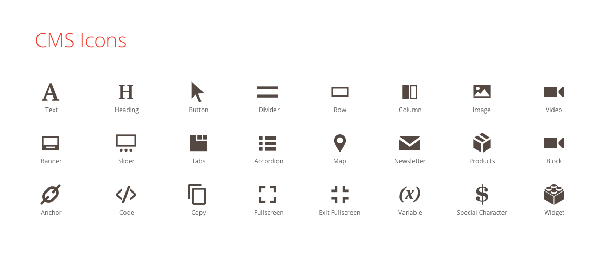

BlueFoot Admin icons follow the same design principles as the core [Magento Admin icons]({{ page.baseurl }}/pattern-library/graphics/iconography/iconography.html), which is to say that they're simple, flat, and monochromatic.

This style prevents the loss of detail at smaller sizes and makes the shapes easier to comprehend.

## Icon library
The following image shows all available BlueFoot Admin icons:

You can use these icons when extending or customizing the Bluefoot CMS module or [create your own]({{ page.baseurl }}/pattern-library/graphics/iconography/iconography.html#creating-icons).

## Icon fonts
We recommend using icon fonts to get the best quality for your icons. The BlueFoot Admin icon fonts can be found <a href="https://github.com/magento-obsessive-owls/bluefoot/tree/master/app/code/Gene/BlueFoot/view/frontend/web/fonts/bluefoot" target="\_blank" data-proofer-ignore>here</a>.


