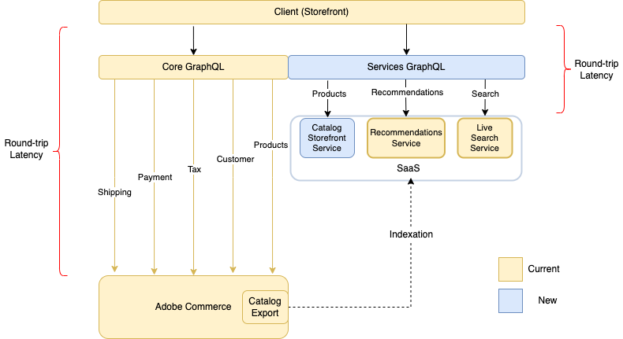

{:.bs-callout-info}
Catalog Service for Adobe Commerce is in Beta release and is available to {{site.data.var.ece}} and {{site.data.var.ee}} customers only. See the Catalog Service [onboarding and installation](
https://experienceleague.adobe.com/docs/commerce-merchant-services/catalog-service/overview.html) documentation for details about signing up for the program.

The Catalog Service is an extension that uses GraphQL to provide rich view-model (read-only) catalog data to quickly and fully render product-related content, including product detail pages and product list pages. Catalog Service, along with [Live Search]({{site.baseurl}}/live-search/overview.html), each implement queries that return information that is not available to the [`products` query]({{site.baseurl}}/guides/v2.4/graphql/queries/products.html) on Adobe Commerce and Magento Open Source. For example, the Catalog Service [`products` query](products.html) treats all products as either simple or complex. Simple products have a single price, while complex products have a price range. The Live Search [`productSearch` query](../live-search/product-search.html) returns detailed facet information.

You run these queries by sending them to a federated gateway. The URL is provided when you onboard.

{:.bs-callout-info}
The gateway is for future integration with Live Search and [Product Recommendations](https://experienceleague.adobe.com/docs/commerce-merchant-services/product-recommendations/overview.html?lang=en). In this release, you can access Catalog Service and Live Search queries from the same endpoint, if you have a valid license key for both products. However, the queries from the two products do not currently share any response data.

## Architecture overview

The two Adobe Commerce GraphQL systems are shown in the following diagram:

In the core GraphQL system, the PWA sends a request to the Commerce application, which receives each request, processes it, possibly sending a request through multiple subsystems, then returns a response to the storefront. This round trip can cause slow page load times, potentially leading to lower conversion rates.

Catalog Service sends queries to a separate GraphQL gateway. The service accesses a separate database that contains product details and related information, such as product attributes, variants, prices, and categories. The service keeps the database in sync with the Adobe Commerce through indexation. Because the service bypasses direct communication with the application, it is able to reduce the latency of the request and response cycle.

The core and service GraphQL systems do not directly communicate with each other. You access each system from a different URL, and calls require different header information. The two GraphQL systems are designed to be used together. The [!DNL Catalog Service] GraphQL system augments the core system to make product storefront experiences faster.

You can optionally implement [API Mesh for Adobe Developer App Builder](https://developer.adobe.com/graphql-mesh-gateway/) to integrate the two Adobe Commerce GraphQL systems with private and third-party APIs and other software interfaces using Adobe Developer. The mesh can be configured to ensure calls routed to each endpoint contain the correct authorization information in the headers.

## Architectural details

The following sections describe some of the differences between the two GraphQL systems.

### Schema management

Since Catalog Service operates as a service, its schema abstracts developers from the version of Adobe Commerce. The syntax of the queries will be the same for all versions. The schema is consistent for all merchants. As a result, it will be easier to establish best practices, and increase reuse of storefront widgets significantly.

### Simplification of product types

The schema reduces the diversity of product types to two use cases:

*  Simple products are those that are defined with a single price and quantity. Catalog Service maps the simple, virtual, downloadable, and gift card product types to `simpleProductViews`.

*  Complex products are comprised of multiple simple products. The component simple products may have different prices. A complex product can also be defined so that the shopper can specify the quanity of component simple products. Catalog Service maps the configurable, bundle, and grouped product types to `complexProductViews`.

Complex product options are unified and distinguished by their behavior, not type. Each option value represents a simple product. This option value has access to the simple product attributes, including price. When the shopper selects all the options for a complex product, the combination of selected options points to a specific simple product. The simple product remains ambiguous until the shopper selects a value for all the available options.

### Prices

Simple products represent the base selling unit that has a price. Catalog Service calculates the regular price before discounts as well as the final price after discounts. Pricing calculations may include fixed product taxes. They exclude personalized promotions.

A complex product does not have a set price. Instead, Catalog Service returns the prices of linked simples. As an example, a merchant could initially assign the same prices to all the variants of a configurable product. If certain sizes or colors are unpopular, the merchant could reduce the prices of those variants. Thus, the price of the complex (configurable) product would at first show a price range, reflecting the price of both standard and unpopular variants. After the shopper has selected a value for all the available options, the storefront displays a single price.
