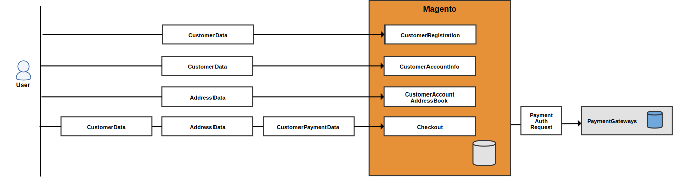
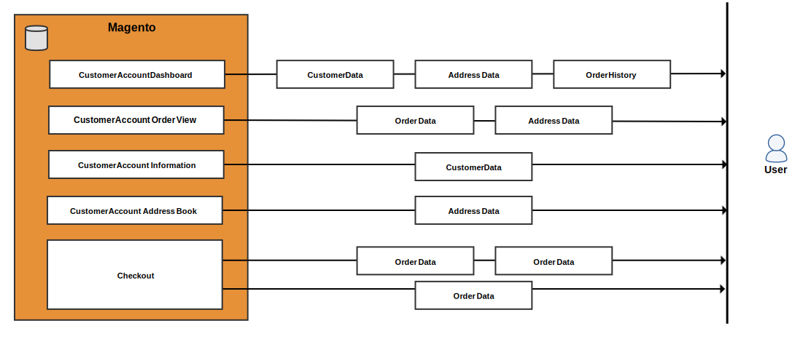
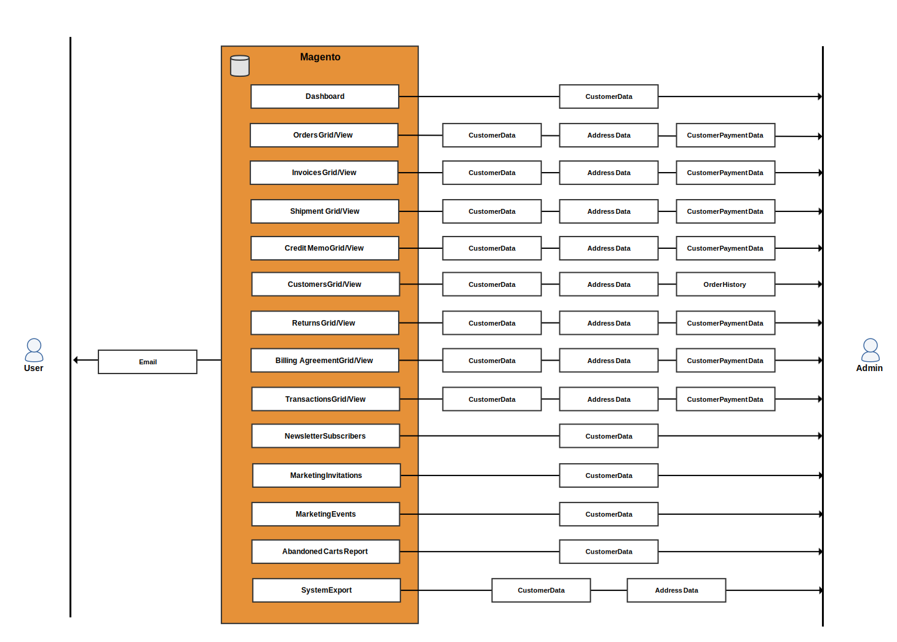

{: .bs-callout-info}
This is one in a series of topics to help Magento merchants and developers prepare for compliance with privacy regulations. Consult with your legal counsel to determine whether and how your business should comply with any legal obligations.

Use the following data flow diagrams and database entity mappings for reference when developing compliance programs for privacy regulations such as:

-  [GDPR]({{ site.baseurl }}/compliance/privacy/gdpr.html)
-  [CCPA]({{ site.baseurl }}/compliance/privacy/ccpa.html)

## Data flow diagrams

The data flow diagrams show the types of data that customers and administrators can enter and retrieve from the storefront and Admin.

### Frontend data entry points

A user can enter customer, address, and payment information when registering for an account, during checkout, and similar events.

### Frontend data access points

Magento loads customer information when the customer logs in and views several different pages, or checks out.

### Backend data entry points

A merchant can enter customer information, address data, and payment data when creating a customer or order from the Admin.

### Backend data access points

Magento loads customer information when a merchant views several types of grids, clicks on a grid to see detailed information, and performs various other tasks.

## Database entities

Magento 2 primarily stores customer-specific information in customer, address, order, quote, and payment tables. Other tables contain references to the customer ID.

### Customer data {#customer-data}

Magento 2 stores the following customer attributes:

-  Date of Birth
-  Email
-  First Name
-  Gender
-  Last Name
-  Middle Name/Initial
-  Name Prefix
-  Name Suffix

#### `customer_entity` and 'customer_entity' references

The following columns in the `customer_entity` table contain customer information:

| Column       | Data type    |
| ------------ | ------------ |
| `email`      | varchar(255) |
| `prefix`     | varchar(40)  |
| `firstname`  | varchar(255) |
| `middlename` | varchar(255) |
| `lastname`   | varchar(255) |
| `suffix`     | varchar(40)  |
| `dob`        | date         |
| `gender`     | smallint(5)  |

These tables reference `customer_entity` and can contain custom customer attributes:

| Table                      | Column  | Data type     |
| -------------------------- | ------- | ------------- |
| `customer_entity_datetime` | `value` | datetime      |
| `customer_entity_decimal`  | `value` | decimal(12,4) |
| `customer_entity_int`      | `value` | int(11)       |
| `customer_entity_text`     | `value` | text          |
| `customer_entity_varchar`  | `value` | varchar(255)  |

#### `customer_grid_flat` table

The following columns in the `customer_grid_flat` table contain customer information:

| Column               | Data type    |
| -------------------- | ------------ |
| `name`               | text         |
| `email`              | varchar(255) |
| `dob`                | date         |
| `gender`             | int(11)      |
| `shipping_full`      | text         |
| `billing_full`       | text         |
| `billing_firstname`  | varchar(255) |
| `billing_lastname`   | varchar(255) |
| `billing_telephone`  | varchar(255) |
| `billing_postcode`   | varchar(255) |
| `billing_country_id` | varchar(255) |
| `billing_region`     | varchar(255) |
| `billing_city`       | varchar(255) |
| `billing_fax`        | varchar(255) |
| `billing_vat_id`     | varchar(255) |
| `billing_company`    | varchar(255) |

### Address data

Magento 2 stores the following customer attributes:

-  City
-  Company
-  Country
-  Fax
-  First Name
-  Last Name
-  Middle Name/Initial
-  Name Prefix
-  Name Suffix
-  Phone Number
-  State/Province
-  State/Province ID
-  Street Address
-  VAT Number
-  Zip/Postal Code

#### `customer_address_entity` and `customer_address_entity` references

The following columns in the `customer_address_entity` table contain customer information:

| Column       | Data type    |
| ------------ | ------------ |
| `city`       | varchar(255) |
| `company`    | varchar(255) |
| `country_id` | varchar(255) |
| `fax`        | varchar(255) |
| `firstname`  | varchar(255) |
| `lastname`   | varchar(255) |
| `middlename` | varchar(255) |
| `postcode`   | varchar(255) |
| `region`     | varchar(255) |
| `region_id`  | int(10)      |
| `street`     | text         |
| `suffix`     | varchar(40)  |
| `telephone`  | varchar(255) |
| `vat_id`     | varchar(255) |

These tables reference `customer_address_entity` and can contain custom customer attributes:

| Table                              | Column  | Data type     |
| ---------------------------------- | ------- | ------------- |
| `customer_address_entity_datetime` | `value` | datetime      |
| `customer_address_entity_decimal`  | `value` | decimal(12,4) |
| `customer_address_entity_int`      | `value` | int(11)       |
| `customer_address_entity_text`     | `value` | text          |
| `customer_address_entity_varchar`  | `value` | varchar(255)  |

### Order data

The `sales_order` and related tables contain the customer name, billing and shipping addresses, and related data.

#### `sales_order` table

The following columns in the `sales_order` table contain customer information:

| Column                | Data type    |
| --------------------- | ------------ |
| `customer_dob`        | datetime     |
| `customer_email`      | varchar(128) |
| `customer_firstname`  | varchar(128) |
| `customer_gender`     | int(11)      |
| `customer_group_id`   | int(11)      |
| `customer_id`         | int(10)      |
| `customer_lastname`   | varchar(128) |
| `customer_middlename` | varchar(128) |
| `customer_prefix`     | varchar(32)  |
| `customer_suffix`     | varchar(32)  |
| `customer_taxvat`     | varchar(32)  |
| `quote_address_id`    | int(11)      |
| `remote_ip`           | varchar(32)  |
| `x_forwarded_for`     | varchar(32)  |

#### `sales_order_address` table

The `sales_order_address` table contains the customer's address.

| Column                | Data type    |
| --------------------- | ------------ |
| `customer_address_id` | int(11)      |
| `quote_address_id`    | int(11)      |
| `region_id`           | int(11)      |
| `customer_id`         | int(11)      |
| `fax`                 | varchar(255) |
| `region`              | varchar(255) |
| `postcode`            | varchar(255) |
| `lastname`            | varchar(255) |
| `street`              | varchar(255) |
| `city`                | varchar(255) |
| `email`               | varchar(255) |
| `telephone`           | varchar(255) |
| `country_id`          | varchar(2)   |
| `firstname`           | varchar(255) |
| `suffix`              | varchar(255) |
| `company`             | varchar(255) |

#### `sales_order_grid` table

The following columns in the `sales_order_grid` table contain customer information:

| Column                 | Data type    |
| ---------------------- | ------------ |
| `customer_id`          | int(10)      |
| `shipping_name`        | varchar(255) |
| `billing_name`         | varchar(255) |
| `billing_address`      | varchar(255) |
| `shipping_address`     | varchar(255) |
| `shipping_information` | varchar(255) |
| `customer_email`       | varchar(255) |
| `customer_name`        | varchar(255) |

### Quote data

Quotes contain a customer's name, email, address, and related information.

#### `quote` table

The following columns in the `quote` table contain customer information:

| Column                | Data type    |
| --------------------- | ------------ |
| `customer_id`         | int(10)      |
| `customer_email`      | varchar(255) |
| `customer_prefix`     | varchar(40)  |
| `customer_firstname`  | varchar(255) |
| `customer_middlename` | varchar(40)  |
| `customer_lastname`   | varchar(255) |
| `customer_dob`        | datetime     |
| `remote_ip`           | varchar(32)  |
| `customer_taxvat`     | varchar(255) |
| `customer_gender`     | varchar(255) |

#### `quote_address` table

The following columns in the `quote_address` table contain customer information:

| Column        | Data type    |
| ------------- | ------------ |
| `customer_id` | int(10)      |
| `email`       | varchar(255) |
| `prefix`      | varchar(40)  |
| `firstname`   | varchar(255) |
| `middlename`  | varchar(40)  |
| `lastname`    | varchar(255) |
| `suffix`      | varchar(40)  |
| `company`     | varchar(255) |
| `street`      | varchar(255) |
| `city`        | varchar(255) |
| `region`      | varchar(255) |
| `region_id`   | int(10)      |
| `postcode`    | varchar(20)  |
| `country_id`  | varchar(30)  |
| `telephone`   | varchar(255) |
| `fax`         | varchar(255) |

### Payment data

The `sales_order_payment` table includes credit card information and other transactional information.

| Column                   | Data type    |
| ------------------------ | ------------ |
| `cc_exp_month`           | varchar(12)  |
| `echeck_bank_name`       | varchar(128) |
| `cc_last_4`              | varchar(100) |
| `cc_owner`               | varchar(128) |
| `po_number`              | varchar(32)  |
| `cc_exp_year`            | varchar(4)   |
| `echeck_routing_number`  | varchar(32)  |
| `cc_debug_response_body` | varchar(32)  |
| `echeck_account_name`    | varchar(32)  |
| `cc_number_enc`          | varchar(128) |
| `additional_information` | text         |

### Invitation data

Magento can be configured so that customers can send invitations to private sales and events.

#### `magento_invitation` table

The `magento_invitation` table contains the customer ID, email, and referral ID.

| Column        | Data type    |
| ------------- | ------------ |
| `customer_id` | int(10)      |
| `email`       | varchar(255) |
| `referral_id` | int(10)      |

#### `magento_invitation_track` table

The `magento_invitation_track` table also contains customer information.

| Column        | Data type |
| ------------- | --------- |
| `inviter_id`  | int(10)   |
| `referral_id` | int(10)   |

### Miscellaneous tables that reference customer

The following tables contain a `customer_id` column:

-  `catalog_compare_item`
-  `catalog_product_frontend_action`
-  `downloadable_link_purchased`
-  `magento_customerbalance`
-  `magento_customersegment_customer`
-  `magento_reward`
-  `magento_rma`
-  `oauth_token`
-  `paypal_billing_agreement`
-  `persistent_session`
-  `product_alert_price`
-  `product_stock_alert`
-  `report_compared_product_index`
-  `report_viewed_product_index`
-  `review_detail`
-  `salesrule_coupon_usage`
-  `salesrule_customer`
-  `wishlist`
