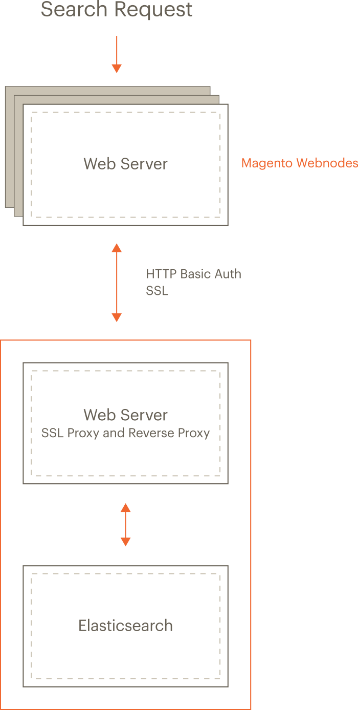

*  [Configure nginx and Elasticsearch][]
*  [Configure Apache and Elasticsearch][]
*  [Configure Elasticsearch stopwords][]

## Elasticsearch overview {#overview}

In Magento 2.2, you can use [Elasticsearch][] for searching your [catalog](https://glossary.magento.com/catalog).

*  Elasticsearch performs quick and advanced searches on products in the catalog
*  Elasticsearch Analyzers support multiple languages
*  Supports stop words and synonyms
*  Indexing does not impact customers until reindex is completed

   Elasticsearch returns search results based on the last generated index until the new one has been completely indexed so there's no disruption to customers

*  Accurate, performant, scalable
*  Works well out of the box
*  Easy to horizontally scale
*  Supports real-time data and analysis
*  Can be used as a document-oriented data store
*  Applications in framework beyond search&mdash;reporting, personalization, performance, and storage

### Supported versions {#es-spt-versions}

{:.bs-callout-warning}
Magento 2.2.8 adds support for Elasticsearch 6.x, and it is enabled by default.
Magento still provides modules for Elasticsearch 2.x and 5.x, but these must be enabled in order to use these versions.
Elasticsearch 2.x is still supported, but strongly discouraged.
If you must run Elasticsearch 2.x or 5.x with Magento 2.3.1, you must change the Elasticsearch php client.
Follow the instructions in [Downgrade Elasticsearch Client][].

{{site.data.var.ee}} version 2.2.x supports the following Elasticsearch versions:

*  Elasticsearch [6.6.x][]

Magento 2.2.8 uses [Elasticsearch PHP client][] version 6.
(Before version 2.2.3, Magento used PHP client version 5.1.)

### Recommended configuration {#es-arch}

The following figure shows our recommended configuration. All of the tasks we discuss assume you have configured your system this way.

{:width="300px"}

The preceding diagram shows:

*  The Magento application and Elasticsearch are installed on different hosts.

   Running on separate hosts is secure, enables Elasticsearch to be scaled, and is necessary for proxying to work.
  Clustering Elasticsearch is beyond the scope of this guide but you can find more information in the [Elasticsearch documentation][].

*  Each host has its own web server; the web servers don't have to be the same.

   For example, the Magento application can run Apache and Elasticsearch can run nginx.

*  Both web servers use Transport Layer Security (TLS).

   Setting up TLS is beyond the scope of our documentation.

Search requests are processed as follows:

1. A search request from a user is received by the Magento web server, which forwards it to the Elasticsearch server.

   You configure Elasticsearch in the Magento Admin to connect to the proxy's host and port. We recommend the web server's SSL port (by default, 443).

1. The Elasticsearch web server (listening on port 443) proxies the request to the Elasticsearch server (by default, it listens on port 9200).
1. Access to Elasticsearch is further protected by HTTP Basic authentication.

   For any request to reach Elasticsearch, it must travel over SSL *and* provide a valid username and password.

1. Elasticsearch processes the search request.
1. Communication returns along the same route, with the Elasticsearch web server acting as a secure reverse proxy.

## Install prerequisites and Elasticsearch {#es-prereq}

The tasks discussed in this section require the following:

*  [Firewall and SELinux][]
*  [Install the Java Software Development Kit (JDK)][]
*  [Install Elasticsearch 6][]
*  [Upgrade from Elasticsearch 2.x/5.x to 6.x][]
*  [Configure Magento to use Elasticsearch][]





### Install Elasticsearch 6.x {#es-install-es6}

1. Log in to your Magento server as a user with `root` privileges.
1. _CentOS_: Install Elasticsearch 6.x using the [Elasticsearch RPM documentation][]

1. _Ubuntu_: Install Elasticsearch 6.x using the [Elasticsearch Ubuntu documentation][]

1. Optionally, configure Elasticsearch as needed. See [Configuring Elasticsearch][] for more information.

1. If not already running, start Elasticsearch:

   ```bash
   sudo service elasticsearch start
   ```

1. Verify that Elasticsearch is working by entering the following command on the server on which it is running:

   ```bash
   curl -XGET '<host>:9200/_cat/health?v&pretty'
   ```

   A message similar to the following is displayed:

   ```terminal
   epoch      timestamp cluster       status node.total node.data shards pri relo init unassign pending_tasks
   1519701563 03:19:23  elasticsearch green           1         1      0   0    0    0        0             0
   ```

## Upgrading Elasticsearch {#es-upgrade6}

Refer to [Upgrading Elasticsearch][] for full instructions on backing up your data, detecting potential migration issues, and testing upgrades before deploying to production.

Upgrading from 2.x to 6.x requires a full cluster restart.
See [Full cluster restart upgrade][] for details.

{:.bs-callout-info}
Elasticsearch 6.x requires JDK 1.8 or higher. Elasticsearch 2.x requires JDK 1.7 or higher. See [Install the Java Software Development Kit (JDK)](#prereq-java) to check which version of JDK is installed.

## Additional resources {#es-resources}

For additional information, see [Elasticsearch documentation][]

{:.ref-header}
Next step

*  [Configure nginx and Elasticsearch]({{ page.baseurl }}/config-guide/elasticsearch/es-config-nginx.html)
*  [Configure Apache and Elasticsearch]({{ page.baseurl }}/config-guide/elasticsearch/es-config-apache.html)
*  [Configure Magento to use Elasticsearch]({{ page.baseurl }}/config-guide/elasticsearch/configure-magento.html)

<!-- Link Definitions -->
[Downgrade Elasticsearch Client]: {{page.baseurl}}/config-guide/elasticsearch/es-downgrade.html
[Elasticsearch Installation documentation]: https://www.elastic.co/guide/en/elasticsearch/reference/current/setup.html
[Configure nginx and Elasticsearch]: {{ page.baseurl }}/config-guide/elasticsearch/es-config-nginx.html
[Configure Apache and Elasticsearch]: {{ page.baseurl }}/config-guide/elasticsearch/es-config-apache.html
[Configure Elasticsearch stopwords]: {{ page.baseurl }}/config-guide/elasticsearch/es-config-stopwords.html
[Elasticsearch]: https://www.elastic.co
[Elasticsearch PHP client]: https://github.com/elastic/elasticsearch-php
[6.6.x]: https://www.elastic.co/downloads/past-releases/elasticsearch-6-6-1
[Elasticsearch documentation]: https://www.elastic.co/guide/en/elasticsearch/guide/current/distributed-cluster.html
[Firewall and SELinux]: #firewall-selinux
[Install the Java Software Development Kit (JDK)]: #prereq-java
[Install Elasticsearch 6]: #es-install-es6
[Upgrade from Elasticsearch 2.x/5.x to 6.x]: #es-upgrade6
[Configure Magento to use Elasticsearch]: {{page.baseurl}}/config-guide/elasticsearch/configure-magento.html
[Upgrading Elasticsearch]: https://www.elastic.co/guide/en/elasticsearch/reference/current/setup-upgrade.html
[Full cluster restart upgrade]: https://www.elastic.co/guide/en/elasticsearch/reference/6.1/restart-upgrade.html
[Elasticsearch documentation]: https://www.elastic.co/guide/en/elasticsearch/reference/current/index.html
