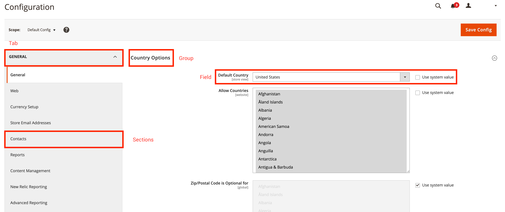

The `system.xml` file allows you to manage the Magento system configuration. Use this topic as a general reference for the `system.xml` file. The `system.xml` file is located under `etc/adminhtml/system.xml` in a given Magento 2 extension.

The following code snippet shows the bare skeleton of the file:

```xml
<?xml version="1.0" ?>
<config xmlns:xsi="http://www.w3.org/2001/XMLSchema-instance" xsi:noNamespaceSchemaLocation="urn:magento:module:Magento_Config:etc/system_file.xsd">
    <system>
        <!-- PLACE YOUR MODULE SPECIFIC CONFIGURATION HERE -->
    </system>
</config>
```

{:.bs-callout-tip}
If you want instant *XSD validation in your IDE, you can run `bin/magento dev:urn-catalog:generate [--ide IDE] [--] <path>`.

## Tabs // Sections // Groups // Fields

In the `system.xml` file, it is possible to define four different types of entities, which are related to each other. The following section describes the relationship between tabs, sections, groups, and fields. The following screenshot displays the Magento 2 System Configuration in the Admin backend.
The red squares mark the different types that are defined in the `system.xml` file:



Tabs are used to split different configuration areas semantically. Each tab can contain one or more sections, which can also be referenced as submenus. A section contains one or more groups.
Each group lists one or more fields. You can also use a group to add a general description for the following fields. As mentioned, each group can have one or more fields. Fields are the smallest entity
in the system configuration context.

## Tabs

A `<tab>`-Tag references to either an existing or a new tab in the system configuration.

### Tab attribute reference

A `<tab>`-Tag can have the following attributes:

| Attribute   | Description                                                                                                                              | Type     | Required |
|-------------|------------------------------------------------------------------------------------------------------------------------------------------|----------|----------|
| `id`        | Defines the identifier that is used referencing the section.                                                                             | `typeId` | required |
| `translate` | Defines the field that should be translatable. Provide `label` to make the label translatable.                                           | `string` | optional |
| `type`      | Defines the input type of the rendered HTML element—defaults to `text`.                                                                  | `string` | optional |
| `sortOrder` | Defines the sort order of the section. High numbers push the section to the bottom of the page; low numbers push the section to the top. | `float`  | optional |
| `class`     | Adds a defined CSS class to the rendered tab HTML element.                                                                               | `string` | optional |

### Tab node reference

A `<tab>`-Tag can have the following child:

| Node    | Description                                          | Type     |
|---------|------------------------------------------------------|----------|
| `label` | Defines the label that is displayed in the frontend. | `string` |

### Example: Create a new tab

The following code snippet demonstrates the creation of a new tab with example data.

```xml
<?xml version="1.0" ?>
<config xmlns:xsi="http://www.w3.org/2001/XMLSchema-instance" xsi:noNamespaceSchemaLocation="urn:magento:module:Magento_Config:etc/system_file.xsd">
    <system>
        <tab id="A_UNIQUE_ID" translate="label" class="a-custom-css-class-to-style-this-tab" sortOrder="10">
            <label>A meaningful label</label>
        </tab>
    </system>
</config>
```

The snippet above creates a new tab with the identifier `A_UNIQUE_ID`. As the `translate`-attribute is defined and references the label, the `label`-node is translatable. During the rendering process, the CSS class `a-custom-css-class-to-style-this-tab` will be applied on the HTML element that was created for this tab.
The `sortOrder`-attribute with the value of `10` defines the position of the tab in the list of all tabs when rendered.

## Sections

A `<section>`-Tag references to either an existing or a new section in the system configuration.

### Section attribute reference

A `<section>`-Tag can have the following attributes:

| Attribute       | Description                                                                                                                                        | Type     | Required |
|:----------------|:---------------------------------------------------------------------------------------------------------------------------------------------------|:---------|:---------|
| `id`            | Defines the identifier that is used referencing the section.                                                                                       | `typeId` | required |
| `translate`     | Defines the field that should be translatable. Provide `label` to make the label translatable.                                                     | `string` | optional |
| `type`          | Defines the input type of the rendered HTML element. Defaults to `text`.                                                                           | `string` | optional |
| `sortOrder`     | Defines the sort order of the section. High numbers will push the section to the bottom of the page; low numbers will push the section to the top. | `float`  | optional |
| `showInDefault` | Defines whether the section is shown in the default configuration scope. Specify `1` to show the section and `0` to hide the section.              | `int`    | optional |
| `showInStore`   | Defines whether the section is shown on store level. Specify `1` to show the section and `0` to hide the section.                                  | `int`    | optional |
| `showInWebsite` | Defines whether the section is shown on website level. Specify `1` to show the section and `0` to hide the section.                                | `int`    | optional |
| `canRestore`    | Defines if the  section can be restored to default.                                                                                                | `int`    | optional |
| `advanced`      | Deprecated since 100.0.2.                                                                                                                          | `bool`   | optional |
| `extends`       | By providing an identifier of another section, the content of this node extends the section that you referenced.                               | `string` | optional |

### Section node reference

A `<section>`-Tag can have the following children:

| Node             | Description                                                                                                           | Type                |
|------------------|-----------------------------------------------------------------------------------------------------------------------|---------------------|
| `label`          | Defines the label that is displayed in the frontend.                                                                  | `string`            |
| `class`          | Adds a defined CSS class to the rendered section HTML element.                                                        | `string`            |
| `tab`            | References the associated tab. Expects the ID of the tab.                                                             | `typeTabId`         |
| `header_css`     | Neither used nor evaluated at the time of this writing.                                                               | `string`            |
| `resource`       | References an ACL resource to provide permission settings for this section.                                           | `typeAclResourceId` |
| `group`          | Define one or more subgroups.                                                                                         | `typeGroup`         |
| `frontend_model` | Specifies a different frontend model to change the rendering and modify the output.                                   | `typeModel`         |
| `include`        | Used to include additional `system_include.xsd` compatible files. Usually used to structure large `system.xml` files. | `includeType`       |

### Example: Create a new section and assign it to a tab

The following code snippet demonstrates the basic usage of creating a new section.

```xml
<?xml version="1.0" ?>
<config xmlns:xsi="http://www.w3.org/2001/XMLSchema-instance" xsi:noNamespaceSchemaLocation="urn:magento:module:Magento_Config:etc/system_file.xsd">
    <system>
        <tab id="A_UNIQUE_ID" translate="label" class="a-custom-css-class-to-style-this-tab" sortOrder="10">
            <label>A meaningful label</label>
        </tab>

        <section id="A_UNIQUE_SECTION_ID" showInDefault="1" showInWebsite="0" showInStore="1" sortOrder="10" translate="label">
            <label>A meaningful section label</label>
            <tab>A_UNIQUE_ID</tab>
            <resource>VENDOR_MODULE::path_to_the_acl_resource</resource>
        </section>
    </system>
</config>
```

The section described above defines the ID `A_UNIQUE_SECTION_ID`, is visible in the default config view and in a store context. The `label`-node is translatable. The section is associated to the tab with the ID `A_UNIQUE_ID`. The section can only be accessed by users that have the permissions defined in the ACL `VENDOR_MODULE::path_to_the_acl_resource`.

## Groups

The `<group>`-Tag is used to group fields together.

### Group attribute reference

A `<group>`-Tag can have the following attributes:

| Attribute       | Description                                                                                                                                        | Type     | Required |
|:----------------|:---------------------------------------------------------------------------------------------------------------------------------------------------|:---------|:---------|
| `id`            | Defines the identifier that is used referencing the group.                                                                                         | `typeId` | required |
| `translate`     | Defines the fields that should be translatable. Provide `label` to make the label translatable. Multiple fields should be separated by a space.    | `string` | optional |
| `type`          | Defines the input type of the rendered HTML element. Defaults to `text`.                                                                           | `string` | optional |
| `sortOrder`     | Defines the sort order of the section. High numbers will push the section to the bottom of the page; low numbers will push the section to the top. | `float`  | optional |
| `showInDefault` | Defines whether the group is shown in the default configuration scope. Specify `1` to show the group and `0` to hide the group.                    | `int`    | optional |
| `showInStore`   | Defines whether the group is shown on store level. Specify `1` to show the group and `0` to hide the group.                                        | `int`    | optional |
| `showInWebsite` | Defines whether the group is shown on website level. Specify `1` to show the group and `0` to hide the group.                                      | `int`    | optional |
| `canRestore`    | Defines if the group can be restored to default.                                                                                                   | `int`    | optional |
| `advanced`      | Deprecated since 100.0.2.                                                                                                                          | `bool`   | optional |
| `extends`       | By providing an identifier of another group, the content of this node extends the section that you referenced.                                 | `string` | optional |

### Group node reference

A `<group>`-Tag can have the following children:

| Node                        | Description                                                                                                                                                                               | Type          |
|-----------------------------|-------------------------------------------------------------------------------------------------------------------------------------------------------------------------------------------|---------------|
| `label`                     | Defines the label that is displayed in the frontend.                                                                                                                                      | `string`      |
| `fieldset_css`              | Adds one or more CSS classes to a group fieldset.                                                                                                                                         | `string`      |
| `frontend_model`            | Specifies a different frontend model to change the rendering and modify the output.                                                                                                       | `typeModel`   |
| `clone_model`               | Specifies a given model to clone fields.                                                                                                                                                  | `typeModel`   |
| `clone_fields`              | Enabled or disabled cloning of fields.                                                                                                                                                    | `int`         |
| `help_url`                  | Not extensible. See below.                                                                                                                                                                | `typeUrl`     |
| `more_url`                  | Not extensible. See below.                                                                                                                                                                | `typeUrl`     |
| `demo_link`                 | Not extensible. See below.                                                                                                                                                                | `typeUrl`     |
| `comment`                   | Adds a comment below the group label. By using `<![CDATA[//]]>` HTML can be applied.                                                                                                      | `string`      |
| `hide_in_single_store_mode` | Whether the group should be visible in single store mode. `1` hides the group; `0` shows the group.                                                                                       | `int`         |
| `field`                     | Define one or more fields that should be available under this group.                                                                                                                      | `field`       |
| `group`                     | Define one or more subgroups.                                                                                                                                                             | `unbounded`   |
| `depends`                   | Can be used to declare dependencies on other fields. Is used to show specific fields/groups only when a given field has a value of `1`. This node expects a `section/group/field`-string. | `depends`     |
| `attribute`                 | Custom attributes can be used by frontend models. Usually used to make a given frontend model more dynamic.                                                                               | `attribute`   |
| `include`                   | Used to include additional `system_include.xsd` compatible files. Usually used to structure large `system.xml` files.                                                                     | `includeType` |

{:.bs-callout-warning}
The nodes `more_url`, `demo_url` and `help_url` are defined by a PayPal frontend model that is only used once. These nodes are not reusable.

### Example: Create a new group for a given section

The following code snippet demonstrates the basic usage of creating a new group.

```xml
<config xmlns:xsi="http://www.w3.org/2001/XMLSchema-instance" xsi:noNamespaceSchemaLocation="urn:magento:module:Magento_Config:etc/system_file.xsd">
    <system>
        <tab id="A_UNIQUE_ID" translate="label" class="a-custom-css-class-to-style-this-tab" sortOrder="10">
            <label>A meaningful label</label>
        </tab>

        <section id="A_UNIQUE_SECTION_ID" showInDefault="1" showInWebsite="0" showInStore="1" sortOrder="10" translate="label">
            <label>A meaningful section label</label>
            <tab>A_UNIQUE_ID</tab>
            <resource>VENDOR_MODULE::path_to_the_acl_resource</resource>

            <group id="A_UNIQUE_GROUP_ID" translate="label comment" sortOrder="10" showInDefault="1" showInWebsite="0" showInStore="1">
                <label>A meaningful group label</label>
                <comment>An additional comment helping users to understand the effect when configuring the fields defined in this group.</comment>
                <!-- Add your fields here. -->
            </group>
        </section>
    </system>
</config>
```

The group described above defines the ID `A_UNIQUE_GROUP_ID`, is visible in the default config view and in a store context. Both, the `label` and the `comment` are marked as translatable.

## Fields

The `<field>`-Tag is used inside of `<group>`-Tags to define specific configuration values.

### Field attribute reference

A `<field>`-Tag can have the following attributes:

| Attribute       | Description                                                                                                                                        | Type     | Required |
|:----------------|:---------------------------------------------------------------------------------------------------------------------------------------------------|:---------|:---------|
| `id`            | Defines the identifier that is used referencing the field.                                                                                         | `typeId` | required |
| `translate`     | Defines the fields that should be translatable. Provide `label` to make the label translatable. Multiple fields should be separated by a space.    | `string` | optional |
| `type`          | Defines the input type of the rendered HTML element. Defaults to `text`.                                                                           | `string` | optional |
| `sortOrder`     | Defines the sort order of the section. High numbers will push the section to the bottom of the page; low numbers will push the section to the top. | `float`  | optional |
| `showInDefault` | Defines whether the field is shown in the default configuration scope. Specify `1` to show the field and `0` to hide the field.                    | `int`    | optional |
| `showInStore`   | Defines whether the field is shown on store level. Specify `1` to show the field and `0` to hide the field.                                        | `int`    | optional |
| `showInWebsite` | Defines whether the field is shown on website level. Specify `1` to show the field and `0` to hide the field.                                      | `int`    | optional |
| `canRestore`    | Defines if the field can be restored to default.                                                                                                   | `int`    | optional |
| `advanced`      | Deprecated since 100.0.2.                                                                                                                          | `bool`   | optional |
| `extends`       | By providing an identifier of another field, the content of this node will extend the section that you referenced.                                 | `string` | optional |

### Field type reference

A `<field>`-Tag can have the following values for the `type=""` attribute:

| Type            | Description                                                                                                                                                                                                                   |
|-----------------|-------------------------------------------------------------------------------------------------------------------------------------------------------------------------------------------------------------------------------|
| `text`          | Standard, single row text field                                                                                                                                                                                               |
| `textarea`      | Text block                                                                                                                                                                                                                    |
| `select`        | Normal dropdown, may need a custom `source_model`. Also used for `Yes/No` selections. See `Magento\Search\Model\Adminhtml\System\Config\Source\Engine` for an example.                                                                     |
| `multiselect`   | Like `select` but multiple options are valid.                                                                                                                                                                              |
| `button`        | A button that triggers an immediate event. Requires custom front-end model to define the button text and the action. See `Magento\ScheduledImportExport\Block\Adminhtml\System\Config\Clean` for an example. |
| `obscure`       | A text field with the value encrypted and displayed as `****`.  Changing the type using "Inspect Element" in the browser does not reveal the value.                                                                                             |
| `password`      | Like `obscure` except that the hidden value is not encrypted, and forcibly changing the type using "Inspect Element" in the browser does reveal the value.                                                                                 |
| `file`          | Allows a file to be uploaded for processing.                                                                                                                                                                                   |
| `label`         | Displays a label instead of an editable field. Use this type when a field is editable only on specific scopes, for example Store View level only.                                                                     |
| `time`          | Control to set time using three dropdowns–Hour, minute and second.                                                                                                                                         |
| `allowspecific` | A multiselect list of specific countries. Requires a `source_model` such as `Magento\Shipping\Model\Config\Source\Allspecificcountries`                                                                               |
| `image`         | Allows an image to be uploaded.                                                                                                                                                                                                                                                                                                                                   |
| `note`          | Allows an informational note to be added to the page. This type requires a `frontend_model` to render the note. |

It is also possible to create a custom field type. This is often done when a special button, with an action, is required. To do this requires two main elements:

-  Creating a block in the `adminhtml` area
-  Setting the `type=""` to the path to this block

The block itself requires, at a minimum, a `__construct` method and a `getElementalHtml()` method. The [Magento_OfflineShipping]({{ site.mage2bloburl }}/{{ page.guide_version }}/app/code/Magento/OfflineShipping) is a simple example of a custom type.

For example, in the OfflineShipping module, the Export button is defined in `Magento\OfflineShipping\Block\Adminhtml\Form\Field\Export` and the field definition looks like:

```xml
<field id="export" translate="label" type="Magento\OfflineShipping\Block\Adminhtml\Form\Field\Export" sortOrder="5" showInDefault="0" showInWebsite="1" showInStore="0">
    <label>Export</label>
</field>
```

### Field node reference

A `<field>`-Tag can have the following children:

| Node                        | Description                                                                                                                                                                               | Type             |
|-----------------------------|-------------------------------------------------------------------------------------------------------------------------------------------------------------------------------------------|------------------|
| `label`                     | Defines the label that displays in the frontend.                                                                                                                                      | `string`         |
| `comment`                   | Adds a comment below the group label. Use `<![CDATA[//]]>` to apply HTML formatting   | `string`         |
| `tooltip`                   | Frontend element to provide contextual help for the field. Displays as a small icon beside the field.                                        | `string`         |
| `hint`                      | Displays additional information. Only available with specific `frontend_model`.                                                                                                           | `string`         |
| `frontend_class`            | Adds a defined CSS class to the rendered section HTML element.                                                                                                                            | `string`         |
| `frontend_model`            | Specifies a different frontend model to change the rendering and modify the output.                                                                                                       | `typeModel`      |
| `backend_model`             | Specifies a different backend model to modify the configured values.                                                                                                                      | `typeModel`      |
| `source_model`              | Specifies a different source model that provides a specific set of values.                                                                                                                | `typeModel`      |
| `config_path`               | Can be used to overwrite the generic config path of a field.                                                                                                                              | `typeConfigPath` |
| `validate`                  | Define different validation rules (comma separated). Full reference list of available validation rules is listed below.                                                                   | `string`         |
| `can_be_empty`              | Used when `type` is `multiselect` to specify that a field can be empty.                                                                                                                   | `int`            |
| `if_module_enabled`         | Used to display a field only when a given module is enabled.                                                                                                                              | `typeModule`     |
| `base_url`                  | Used in combination with `upload_dir` for file uploads.                                                                                                                                   | `typeUrl`        |
| `upload_dir`                | Specify a target directory for uploads. This node has additional attributes and nodes. Look them up before using this.                                                                    | `typeUploadDir`  |
| `button_url`                | Displays a button if `button_url` and `button_label` are specified. Usually used in combination with a custom frontend model.                                                             | `typeUrl`        |
| `button_label`              | Displays a button if `button_label` and `button_url` are specified. Usually used in combination with a custom frontend model.                                                             | `string`         |
| `more_url`                  | Not extensible. See below.                                                                                                                                                                | `typeUrl`        |
| `demo_url`                  | Not extensible. See below.                                                                                                                                                                | `typeUrl`        |
| `hide_in_single_store_mode` | Whether the group should be visible in single store mode. `1` hides the group; `0` shows the group.                                                                                       | `int`            |
| `source_service`            | Service used to populate select options.                                                                                                                                                  | `complexType`    |
| `options`                   | Not used. Potentially deprecated.                                                                                                                                                         | `complexType`    |
| `depends`                   | Can be used to declare dependencies to other fields. Is used to only show specific fields/groups when a given field has a value of `1`. This node expects a `section/group/field`-string. | `complexType`    |
| `attribute`                 | Custom attributes can be used by frontend models. Usually used to make a given frontend model more dynamic.                                                                               | `complexType`    |
| `requires`                  | Not extensible. See below.                                                                                                                                                                | `complexType`    |

{:.bs-callout-warning}
The nodes `more_url`, `demo_url`, `requires` and `options` are defined by a different core payment model and are only used once. These nodes are not reusable.

### Example: Create two fields in a given group

```xml
<config xmlns:xsi="http://www.w3.org/2001/XMLSchema-instance" xsi:noNamespaceSchemaLocation="urn:magento:module:Magento_Config:etc/system_file.xsd">
    <system>
        <tab id="A_UNIQUE_ID" translate="label" class="a-custom-css-class-to-style-this-tab" sortOrder="10">
            <label>A meaningful label</label>
        </tab>

        <section id="A_UNIQUE_SECTION_ID" showInDefault="1" showInWebsite="0" showInStore="1" sortOrder="10" translate="label">
            <label>A meaningful section label</label>
            <tab>A_UNIQUE_ID</tab>
            <resource>VENDOR_MODULE::path_to_the_acl_resource</resource>

            <group id="A_UNIQUE_GROUP_ID" translate="label" sortOrder="10" showInDefault="1" showInWebsite="0" showInStore="1">
                <label>A meaningful group label</label>
                <comment>An additional comment helping users to understand the effect when configuring the fields defined in this group.</comment>

                <field id="A_UNIQUE_FIELD_ID" translate="label" sortOrder="10" showInDefault="0" showInWebsite="0" showInStore="1" type="select">
                    <label>Feature Flag Example</label>
                    <comment>This field is an example for a basic yes or no select.</comment>
                    <tooltip>Usually these kinds of fields are used to enable or disable a given feature. Other fields might be dependent to this and will only appear if this field is set to yes.</tooltip>
                    <source_model>Magento\Config\Model\Config\Source\Yesno</source_model>
                </field>

                <field id="ANOTHER_UNIQUE_FIELD_ID" translate="label" sortOrder="10" showInDefault="0" showInWebsite="0" showInStore="1" type="text">
                    <label>A meaningful field label</label>
                    <comment>A descriptive text explaining this configuration field.</comment>
                    <tooltip>Another possible frontend element that also can be used to describe the meaning of this field. Will be displayed as a small icon beside the field.</tooltip>
                    <validate>required-entry no-whitespace</validate> <!-- Field is required and must not contain any whitespace. -->
                    <if_module_enabled>VENDOR_MODULE</if_module_enabled>
                    <depends> <!-- This field will only be visible if the field with the id A_UNIQUE_FIELD_ID is set to value 1 -->
                        <field id="A_UNIQUE_FIELD_ID">1</field>
                    </depends>
                </field>
            </group>
        </section>
    </system>
</config>
```

The example above creates two fields, both visible/configurable in default and in store view. Both fields have a comment and a tooltip to describe their purpose to the user. The `label`-node is translatable.
The field with the identifier `ANOTHER_UNIQUE_FIELD_ID` is visible when the given module in the `if_module_enabled` is enabled globally. The field also validates its value against the rules `required-entry` and `no-whitespace`.
The field with the identifier `A_UNIQUE_FIELD_ID` defines a different source model which provides tha values `Yes` and `No`.

### Common source models

The following source models are provided by the Magento 2 Core. In general, there are many more source models; the following list describes the most common ones. Be aware, that these source models need the field attribute `type` to be set to `select` in order to work properly.

| Source Model                                              | Description                                                                                                |
|-----------------------------------------------------------|------------------------------------------------------------------------------------------------------------|
| `Magento\Config\Model\Config\Source\Yesnocustom`          | Provides the values `Yes`, `No` and `Specified`.                                                           |
| `Magento\Config\Model\Config\Source\Enabledisable`        | Provides the values `Enable`, `Disable`. Saves the values as `0` and `1` in the database.                  |
| `Magento\AdminNotification\Model\Config\Source\Frequency` | Provides the values `1 Hour`,`2 Hours`,`6 Hours`,`12 Hours` and `24 Hours`. Values are saved as integers.  |
| `Magento\Catalog\Model\Config\Source\TimeFormat`          | Provides the values for the time format (12 h/24 h).                                                       |
| `Magento\Cron\Model\Config\Source\Frequency`              | Provides the values `Daily`, `Weekly` and `Monthly`. Values are saved in the database as `D`, `W` and `M`. |
| `Magento\GoogleAdwords\Model\Config\Source\Language`      | Provides the values for a 2-letter code of a given language in the ISO 639-1 format (e.g. en).             |
| `Magento\Config\Model\Config\Source\Locale`               | Provides the values similar to the above one, but pertains a locale code (e.g. en_US).                     |

### Field Validation

A field can have one or more validator-classes assigned to make sure that the input of the user meets the requirements of the extension. Validation rules can be applied with the `<validate>`-Tag.
The following example validates a field and adds several different validation rules.

```xml
<field id="A_CUSTOM_IDENTIFIER" showInDefault="1" showInWebsite="0" showInStore="1">
    <validate>required-entry validate-clean-url no-whitespace</validate>
</field>
```

The following validation rules are available:

| Rule                            | Description                                                                                                             |
|---------------------------------|-------------------------------------------------------------------------------------------------------------------------|
| `alphanumeric`                  | Allows letters, numbers, spaces or underscores only.                                                                     |
| `integer`                       | Enter a positive or negative non-decimal number.                                                                         |
| `letters-only`                  | Allows letters only. For example, `abcABC`.                                                                                |
| `no-whitespace`                 | Disallows white spaces.                                                                                                 |
| `time`                          | Allows a valid time in 24-hour format, between 00:00 and 23:59. For example `15`, `15:05` or `15:05:48`                                         |
| `time12h`                       | Allows a valid time in 12-hour format, between 12:00 am and 11:59:59 pm. For example `3 am`, `11:30 pm`, `02:15:00 pm`.          |
| `validate-no-html-tags`         | HTML tags are not allowed.                                                                                              |
| `validate-select`               | Select an option.                                                                                                       |
| `validate-no-empty`             | Empty Value                                                                                                             |
| `validate-alphanum-with-spaces` | Use letters (a-z or A-Z), numbers (0-9), or spaces only in this field.                                                  |
| `validate-data`                 | Use letters (a-z or A-Z), numbers (0-9), or underscores (_) only in this field. The first character should be a letter. |
| `validate-street`               | Use letters (a-z or A-Z), numbers (0-9), spaces, and “#” only in this field.                                            |
| `validate-phoneStrict`          | Enter a valid phone number. For example, (123) 456-7890 or 123-456-7890.                                                |
| `validate-phoneLax`             | Enter a valid phone number. For example, (123) 456-7890 or 123-456-7890.                                                |
| `validate-fax`                  | Enter a valid fax number. For example, 123-456-7890.                                                                    |
| `validate-email`                | Enter a valid email address. For example, johndoe@domain.com.                                                           |
| `validate-emailSender`          | Enter a valid email address. For example, johndoe@domain.com.                                                           |
| `validate-password`             | Enter 6 or more characters. Leading and trailing spaces will be ignored.                                                |
| `validate-admin-password`       | Enter 7 or more characters, using both numeric and alphabetic.                                                          |
| `validate-url`                  | Enter a valid URL. Protocol is required (http://, https:// or ftp://).                                                  |
| `validate-clean-url`            | Enter a valid URL. For example, http://www.example.com or www.example.com.                                              |
| `validate-xml-identifier`       | Enter a valid XML-identifier. For example, something_1, block5, id-4.                                                   |
| `validate-ssn`                  | Enter a valid social security number. For example, 123-45-6789.                                                         |
| `validate-zip-us`               | Enter a valid ZIP code. For example, 90602 or 90602-1234.                                                               |
| `validate-date-au`              | Use this date format: dd/mm/yyyy. For example, 17/03/2006 for the 17th of March, 2006.                                  |
| `validate-currency-dollar`      | Enter a valid $ amount. For example, $100.00.                                                                           |
