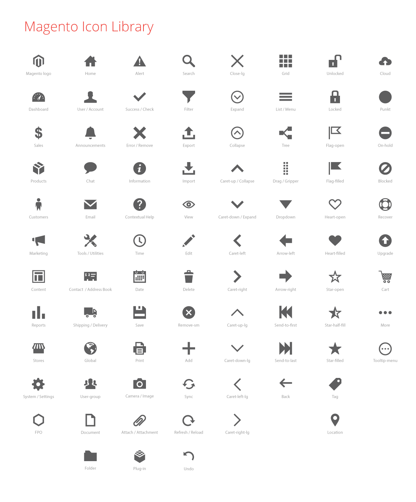
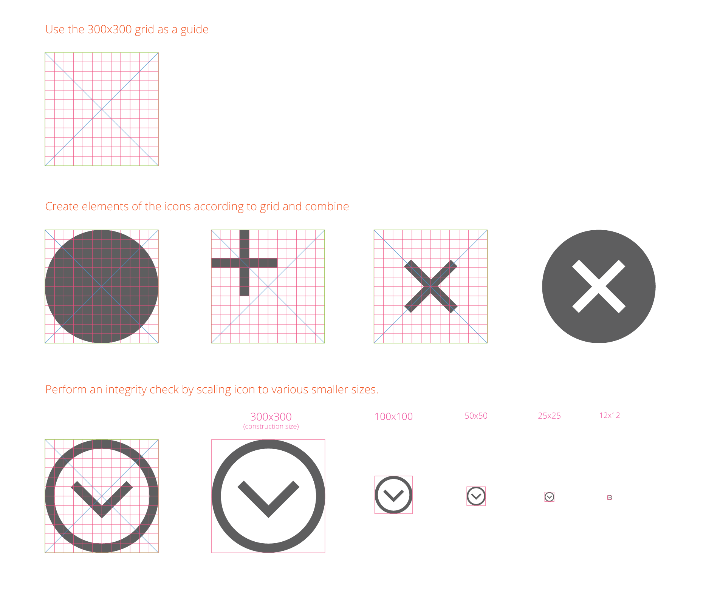

Icons are used throughout the [Magento Admin](https://glossary.magento.com/magento-admin) interface, often as controls to initiate a function (such as a "Filter") or to direct a user to a section (such as "Account").

Icons are meant to provide a visual representation of functionality or content and should therefore bear some conceptual resemblance to them. Icons should be able to communicate their "use" to the user without the assistance of a text label, though labels should be used in the UI whenever possible to minimize ambiguity.

## How Icons Are Used

Icons may appear in a variety of sizes within the interface as controls for tools and functions and to assist in "wayfinding" within the application.

Use touch-friendly UI principles — icons should be large enough to provide a reasonable target for a user's finger tap. The icon may be smaller than optimal touch size when it is coupled with a "target" area with the optimal size.

*Example:* A small "Expand" control icon can use a target area where the entire header row is tappable.

The functionality associated with a specific icon should be paired consistently, throughout the interface.

However, an icon or a design element in an icon can sometimes serve different functions. Icons usually function as a single, unique concept wherever they exist in a website, but some icons have dual purposes, relying on different size, placement, and context to communicate their meaning to the user.

*Example:* The "X" error icon and its the supporting elements of copy, position, and styling give an identity and meaning for the icon. However, when an "X" icon is used as a "Remove" or "Close" control, its supporting elements give it a different identity and meaning.

## Icon Library

In the Magento Admin, icons have a simple, flat, single-color, and two-dimensional style. This style prevents loss of detail at smaller sizes and makes the shapes easier to recognize.



## Creating Icons

### Instructions

*  Start by selecting an icon library file - download either the [Sketch (SKETCH)]({{ site.downloads }}/magento_icon_library.sketch) or [Illustrator (AI)]({{ site.downloads }}/Magento-icon-library.ai) files.

*  Use our standard 300 x 300 pixel icon grid - see the guidance that follows in the "Create With the Icon Grid" section.

*  Keep icons monochromatic.

*  Match other icons; make them "one of the family".

   *  Use the same line weights.

   *  Match the same style of elements used in other family icons. *Example:* Arrows

*  Cantered or rotated elements should use a 45-degree angle.

*  Keep a limited perspective — all icons should appear from the same perspective.

For any icon to be used in Magento Admin, ask the Magento Product Team to review the icon and add it to the "icon font".

### Create with the Icon Grid

Here's one method to get started:


Learn how to use the icon grid:



## Icon Fonts

We recommend using icon fonts to get the best quality for your icons. The Magento icon fonts can be found in [in GitHub]({{ site.mage2bloburl }}/{{ page.guide_version }}/app/design/adminhtml/Magento/backend/web/fonts/admin-icons).

If you want to add your own icons, each icon will need to be in its own SVG files. There are multiple ways to create icon fonts, here is one to get started:

1. Select an IcoMoon tool: Go to the [IcoMoon](https://icomoon.io/app/) website to use their browser tool or visit the [IcoMoon app page](https://chrome.google.com/webstore/detail/icomoon/kppingdhhalimbaehfmhldppemnmlcjd) in Google's Chrome Web Store to download the app.

1. Save your icons in SVG format and upload the files into the app.

1. Specify the desired font names and the Unicode characters to map the icons.

   {:.bs-callout-tip}
   Setting the icons to [Private Use Area](https://en.wikipedia.org/wiki/Private_Use_Areas#Private_Use_Areas) (PUA) will disable screen-readers and other accessibility tools. Disabling prevents the devices from mistakenly translating your icon's characters as words that users won't understand.

1. From the app, click "Download" to generate the icon font and [CSS](https://glossary.magento.com/css) style sheet.

## Accessibility

### How to Use "aria-hidden" Attribute

Icons are required to be optimized — and their font characters kept hidden — for users with assistive technology like screen-readers.

To hide these characters from assistive devices, use the "aria-hidden" attribute.

Modern versions of assistive technologies will announce CSS generated content, as well as specific Unicode characters. To avoid unintentional and confusing output in screen readers hide them with the aria-hidden="true" attribute.

*Source:* [Bootstrap Components](http://getbootstrap.com/components/)

**Code sample:**

```html
<style>
  .icon-star:before { content: "★ "; }
</style>

<span><span class="icon-star" aria-hidden="true"></span>Favorite</span>

```

*Source:* [filament group's "Bulletproof Accessible Icon Fonts"](http://www.filamentgroup.com/lab/bulletproof_icon_fonts.html)

### How to Easily Make An Icon Font Accessible

Icons should be very descriptive, especially if they stand on their own. Add descriptive text to clarify their meaning to users.

1. Don’t use "regular letters" for icons. Use a service like IcoMoon and use the Private Use Area (PUA) of the font. Those areas are specifically made for this usage and don’t have any letters attached to it. Screen readers won’t read letters in the PUA.

1. Use colors with enough contrast for your icons.

1. Never use an icon without a text (that you may hide). As icons are not read out, we don’t have any hint for a screen reader user what actually is on the screen, an alternative text is important as long as the content doesn’t make sense without an icon at all.

## Learn More

*  yatil.: [The best way to use icon fonts](https://yatil.net/the-best-way-to-use-icon-fonts/)
