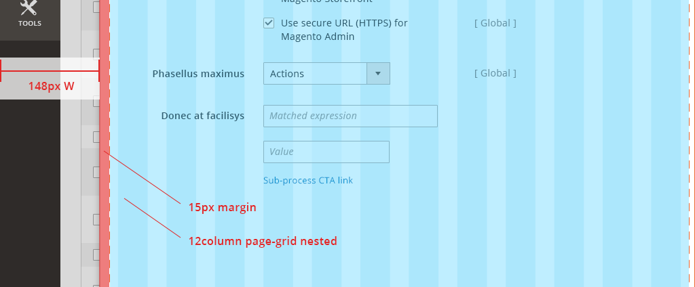

In the [Magento Admin](https://glossary.magento.com/magento-admin), a grid is used on all pages to establish global layouts for page templates. The grid assigns a set number of columns and rows for a page, and designers can create a layout by dividing the columns into sections, where design patterns and content can be placed.

## Page Grid {#page}

<ul>
   <li>A 12-column fluid-width content grid is placed next to the page’s 1-column fixed-width left navigation</li>
   <li>The 12-column grid’s minimum width spans 984px. The grid expands its layout across larger screens.</li>
   <li>For views smaller than 984px, a page’s layout doesn’t change as the page shrinks to fit smaller screen widths.</li>
</ul>

## Slide-Out Grid {#slide-out}

A Slide-out panel, similar to a modal window, breaks apart and simplifies a complex subtask that is included within a primary task.

For example:
<ul>
   <li>On a product details form page, a user clicks "Add Attribute".</li>
   <li>A panel slides over the parent page and shows "Add Attribute" functionality.</li>
   <li>When the user finishes adding attributes, the panel disappears, and the user returns the product details form page.</li>
</ul>

<b>Layout and behavior:</b> When a panel spawns, it slides from right to left atop and almost completely over the parent page. A narrow gutter of space remains at left, showing the left navigation and a small sliver of the parent page.

Standard [layout](https://glossary.magento.com/layout) within the edges of a browser screen

(Panel position in relation to browser edge)

<b>Spacing:</b> Slide-out content is contained in a 12-column page grid, with additional 15px padding on the left edge. The gutter spacing at left is fluid, based on browser width.

(Nested page-grid with additional padding)

<b>Nested Slide-outs:</b> For multiple panels displayed, additional gutter space is used at left to show a small sliver of a Slide-out below another Slide-out.

