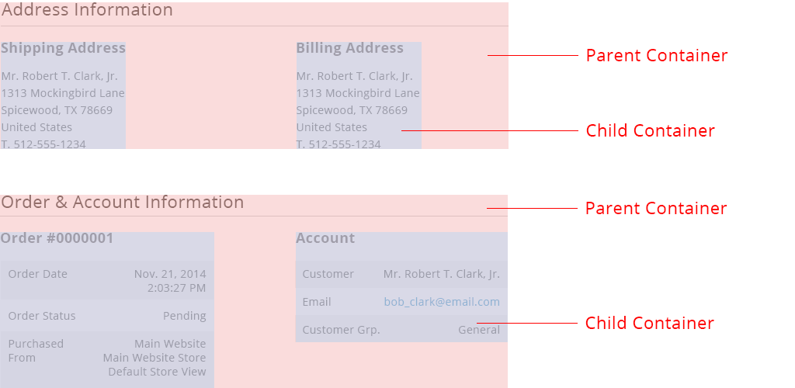

Within the Magento application, it is often necessary to display static information to the users. These [static content](https://glossary.magento.com/static-content) are considered Content Container and should follow the guideline in this article. For solutions not described in this article or for further information, please contact the Magento UX Design Team.

## When to Use

Use this pattern when we need to display static information to the users.

## When Not to Use

Do not use this pattern if users need to be able to interact with the information.

## Rule

The basic rule is that the content containers should have a title and a content below it. Refer to variations for the styling examples.

## Variations

### Parent and Child Containers

The following example, shows two sets of parent & child containers. Each parent containers has 2 children containers. There can be 1 or more children. It is not recommended to have more than one layer of parent-child (i.e. grand children are not recommended) But if there are exceptions made, the hierarchy should be shown clearly.

#### Structure

The parent container structure: title, rule, content.

#### Styling

Note that because the children containers can be any variations of other content containers, refer to other variations for styling. 

### Title with Body of Text

**Width:** based on the page grid

**Height:** as needed

### Title with Differentiated Rows

**Width:** based on the page grid

**Height:** as needed

This is used to clearly separate information for users to easily digest. The first row should be grey, and then, the rows alternate between grey and white.

### Pricing Breakdown chart

**Width:** based on the page grid

**Height:** as needed

This is used to clearly separate information for users to easily digest.

## Assets

[Download Static Content Container PSD source]({{ site.downloads }}/magento-static-content-container.psd)

Please reach out to the Magento UX Design team if you need anything else.
