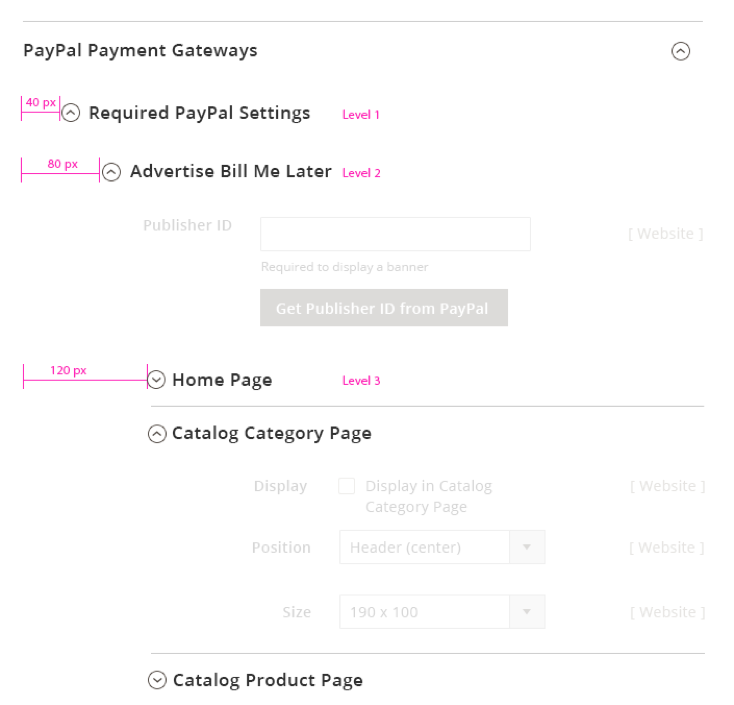
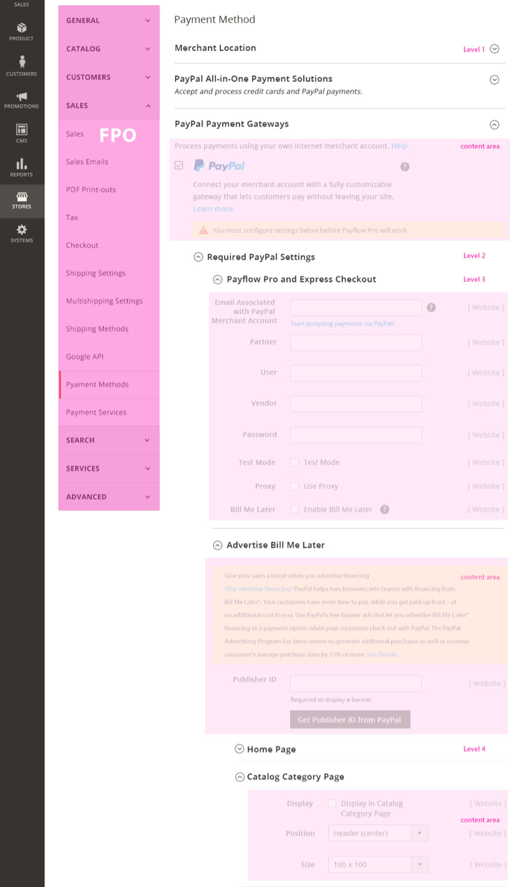

(AKA Expand-Collapse, Collapsible panels)

Expandable sections are expandable content areas which are useful in cases where a lot of information must be accommodated in limited space, thereby reducing clutter and allowing you focus on the primary task. Typically the information to be accommodated can be separated into various sections and/or sub-sections, or topics.

{:.bs-callout-info}
**Note:** Expandable sections should not be confused with the 'Progressive Disclosure checkbox' control.

## Appearance and behavior

Required fields should not be located within a collapsed section, as this increases the chance of error for the user. If a field within a collapsed section is _made a required field_ based on a User interaction, that section should be automatically expanded to reveal this requirement to the user. As a best practice, the first expandable section should be expanded by default. For pages with several expandable sections it is recommended to locate all required fields in a section that cannot be collapsed above the expandable sections.

### Position and dimensions

*  Expandable sections can exist with or without a left sidebar.
*  A level 1 expandable section has 24px top padding and 30px bottom padding of the section title.
*  Level 2, 3, and 4 expandable sections have 18px top and bottom padding of the section title. Each expandable sub-section is indented by 40px.

  

*  If the expandable section belongs to a [layout](https://glossary.magento.com/layout) with a sidebar, and the content area contains forms, then the form field starts at the 7th column for level 2 and at 8th column for levels 3 and 4.
*  The content areas in the expandable section have 30px padding at the top and bottom. _The current design proposal accommodates 4 levels of nested expandable sections._

### Visual appearance

*  A simple expandable section is a container with a border, section header, and a toggle arrow (right aligned) to control the showing and hiding of content.

  

*  A nested expandable section is a sub-section within an expandable section. The nested expandable section has all the same features as the "simple" expandable section, however the expand and collapse control is located on the left. This is to help the User more easily identify the expandable sub-sections within an expanded section.

  

*  When expanded, the control (chevron symbol) points upward, and it points downward when closed or collapsed. This indicates the direction the section will expand or collapse when clicked.

*  The section deader title font size is 17px semibold.

## Functional behavior

*  Expandable sections should expand to become visible when the heading or toggle arrow is clicked.
*  Several expandable sections can be kept open at the same time.
*  When a page contains several expandable sections, all sections remain collapsed by default.
*  Once the user expands or collapses a few panels, the system remembers the panels states and on a return visit the same states are displayed.
*  For nested panels, if a section is collapsed, all "nested" expandable sections within that section should be collapsed as well.

## Variations

1. Simple – section that contains a single level of expansion in a section (no nested expandable sub-sections).

   

1. Nested – section that contains one or more expandable sub-sections.

   

1. Single expandable – section that contains only one expandable section; usually used to hide additional information.

   

## Assets

[Download Expandable Section ZIP file]({{ site.downloads }}/Magento_expandable_section.zip)

Please reach out to the Magento UX Design team if you need anything else.
