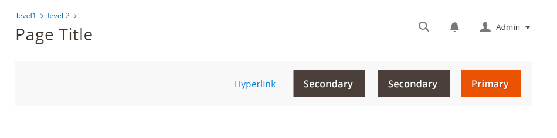
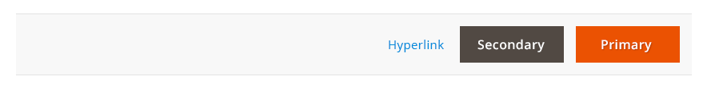
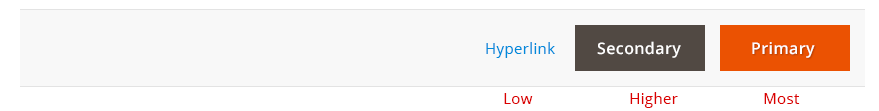
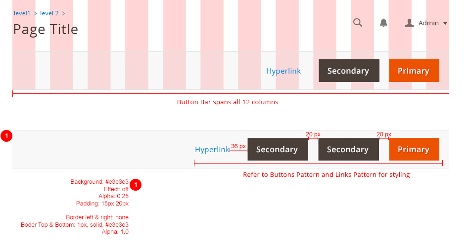

Within Magento application, it is often necessary to provide users with page level actions. These actions should be contain in a button bar as described in this guideline.

For solutions not described in this article, please refer to other related patterns or contact the Magento UX Design team.

## When to Use

*  When page level actions are necessary.

## When Not to Use

*  When there is already a button bar.
*  When there is a wizard bar.
*  When buttons are needed but they are not page level buttons.

## Rules

### General Rules

*  Only one button bar is allowed per page.
*  Either use a button bar or a wizard bar. Both cannot be on the page.
*  The buttons within the button bar must be one of the page-level buttons from [buttons pattern](../buttons/buttons.html).
*  All the buttons in button bar should be visible at all time.

### Location

*  Button bar can be used in a page or a slide-in panel.
*  Its location in either scenario must be right below the page title or the slide-in panel title.

#### Button Bar Position in Page

#### Button Bar Position in Slide-in Panel

### Page Level Button Order and Priority - General Rules

*  There should never be more than one primary page level button on a single page.
*  Primary page level buttons should always be placed on the far right of the button order.
*  If a Back button is present, it should always fall on the far left of the button order.
*  Buttons should be ordered by group as specified below. In situations where button groups do not apply, they should be ordered by importance.

### Ordering of Button Bar

Page level buttons can be logically grouped as follows:

*  Regress
*  Remove
*  Progress

Groups can contain multiple CTAs but only one primary CTA. Groups should follow the below order:

### Ordering by Importance

There should never be more than one primary page level CTA on the same page. Page level CTAs should assume an ascending order of importance from left to right wherever possible, i.e. least important buttons followed by most important.

## Style

All buttons should be right aligned. The button bar is spread across 12 columns and should be fluid.

## Recommendation

1. It is recommended that all buttons in button bar should only be in one line. Because the button bar is in fluid grid, it is possible for the buttons to be wrap around to the next line.
1. If you have multiple page-level buttons. We recommend using the split button rather having too many buttons that will clutter the page.

## Sticky button bar

To ensure page level actions are always visible, The button bar should stick to the top of a browser as the user scrolls and the top of button bar hits the top of browser.

### Initial State

### After user scrolls, the button bar sticks to the browser

## Accessibility

Buttons should make use of [CSS](https://glossary.magento.com/css) and [HTML](https://glossary.magento.com/html) so that button text is never dependent on a graphic asset.

## Assets

[Download Button Bar PSD source]({{ site.downloads }}/magento-button-bar.psd).

Please reach out to the Magento UX Design team if you need anything else.
