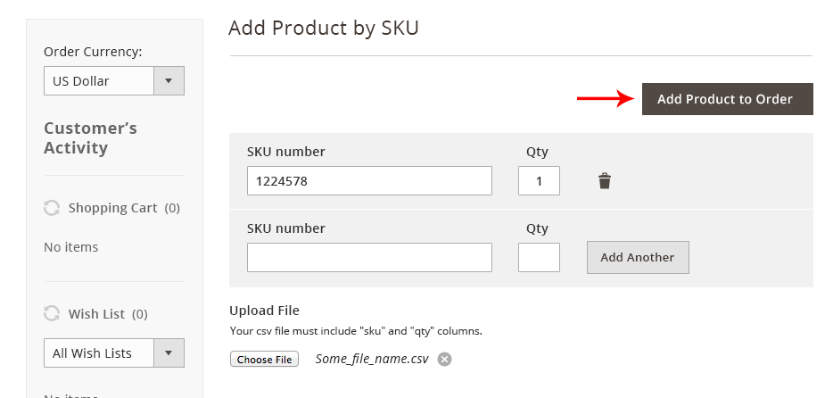
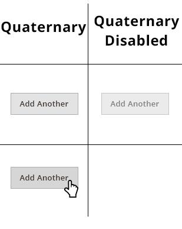
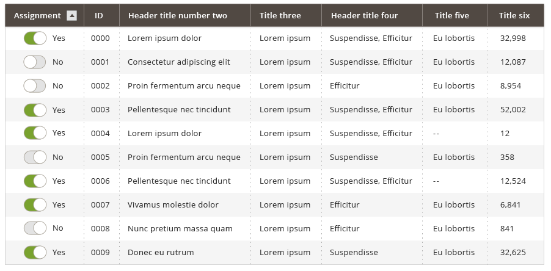

Buttons bring attention to actions on the screen. This article will cover the use of general buttons on Magento.

For solutions not described in this topic, please refer to other related patterns or contact the Magento UX Design team.

## When to Use

Buttons should be used anywhere a call to action(CTA) is needed. Discretion should be used when deciding when to use a button vs. a hyperlink, icon, or another call to action.

## When Not to Use

*  Do not use buttons to indicate actions that are better suited as hyperlinks such as "Cancel". Some exceptions may apply.
*  Do not use more than one primary page level action on a single page for different actions. Some exceptions may apply.
*  Do not use buttons to indicate a link to more information or to a task not related to primary flow.

## Variations

Variations of this pattern are as follows, and will be detailed in the section on Appearance and behavior:

*  Page level buttons are to be used for calls to action on pages.
*  Form level buttons are to be used on forms.
*  Table level buttons are to be used within tables or data grids

Buttons will be take on one of the below variations.

<table>
  <thead>
    <th> Page Level </th>
    <th> Form Level </th>
    <th> Table Level </th>
  </thead>
  <tbody>
    <tr>
      <td>Primary</td>
      <td>Primary</td>
      <td>Regular</td>
    </tr>
    <tr>
      <td>Secondary</td>
      <td>Secondary</td>
      <td>Icon</td>
    </tr>
    <tr>
      <td>Toggle</td>
      <td>Toggle</td>
      <td>Toggle</td>
    </tr>
    <tr>
      <td>Tertiary</td>
      <td>Tertiary</td>
      <td>Tertiary</td>
    </tr>
    <tr>
      <td>Table Button</td>
      <td>Table Button</td>
      <td>Table Button</td>
    </tr>
    <tr>
      <td>Primary Dropdown</td>
      <td>Primary Dropdown</td>
      <td>Primary Dropdown</td>
    </tr>
    <tr>
      <td>Secondary Dropdown</td>
      <td>Secondary Dropdown</td>
      <td>Secondary Dropdown</td>
    </tr>
  </tbody>
</table>

[CSS](https://glossary.magento.com/css) style classes will need to be established for any buttons that require a custom
defined style.

## Styles and Behavior

### Page Level Button

#### Font details

Family: Open Sans Semibold;

Size: 17px; (or 1.125em based on 14px default font)

Color: #ffffff

#### Background color

Primary: #eb5202; (CSS-$magento-orange-color)

Secondary: #514943; (CSS-$magento-dark-brown)

#### Hover background color

Primary: #aa2d00;
Secondary: #282421;

#### Disabled style

Opacity: 50%

#### Page Level Button Padding

Top/Bottom: 11px

Left/Right: 20px

#### Margin Spacing

Top/Bottom margin spacing should not be less than 10px

Left/Right margin spacing should not be less than 20px

### Dropdown Buttons

#### Font details

Family: Open Sans Semibold;

Size: 17px; (or 1.125em based on 14px default font)

Color: #ffffff

#### Background color

Primary: #eb5202; (CSS-$magento-orange-color)

Secondary: #514943; (CSS-$magento-dark-brown)

#### Hover background color

Primary: #aa2d00

Secondary: #28242

Dropdown stroke: #337ab7

Dropdown Highlight: #eeeeee

#### Disabled style

Opacity: 50%

#### Page Level Button Padding

Top/Bottom: 11px

Left/Right: 20px

#### Margin Spacing

Top/Bottom margin spacing should not be less than 10px

Left/Right margin spacing should not be less than 20px

### Tertiary Buttons

#### Font details

Family: Open Sans Semibold

Size: 14px; (or .750em based on 14px default font)

Color: #ffffff

#### Background colors

Secondary: #514943; (CSS-$magento-dark-brown)

#### Hover background color

Secondary: #28242

#### Disabled style

Opacity: 50%

#### Tertiary Level Button Padding

Top/Bottom: 12px

Left/Right: 30px

#### Margin Spacing

Top/Bottom margin spacing should not be less than 10px

Left/Right margin spacing should not be less than 20px

#### Tertiary Button Example:

### Quaternary Buttons

Quaternary buttons are only after all the buttons hierarchy have been used.

#### Font details

Family: Open Sans Semibold

Size: 13px; (or .750em based on 14px default font)

Color: #322923

#### Background colors

Light: #dcdcdc

#### Border

Solid

Width: 1px;

Border color: #9d9d9d;

#### Hover background color

Dark:#cccccc;

#### Disabled style

Opacity: 50%

#### Tertiary Level Button Padding

Top/Bottom: 12px

Left/Right: 15px

#### Margin Spacing

Top/Bottom margin spacing should should not be less than 10px

Left/Right margin spacing should not be less than 10px

#### Quaternary Button Example:

### Toggle Buttons

The toggle button acts like a checkbox. When you touch/click on it, the state toggles between "yes" and "no" and/or "on" and "off". 

#### When to Use/When Not to Use

Use toggle for:

*  Binary selection (true/false) when only a single option can be set
*  When multiple non-required selections can be set
*  In relation to other form elements when needed

Do not use checkboxes if:

*  Multiple options need visibility

#### Variations

No additional variations.

#### Font details

Family: Open Sans Semibold

Size: 13px; (or .750em based on 14px default font)

Color: #322923

#### Background colors

Light: #dcdcdc

#### Border

Solid

Width: 1px

Border color: #9d9d9d

#### Active background color

Dark: #cccccc

#### Inactive background color

Dark: #cccccc

#### Disabled style

Opacity: 50%

#### Tertiary Level Button Padding

Top/Bottom: 12px

Left/Right: 15px

#### Margin Spacing

Top/Bottom margin spacing should should not be less than 10px

Left/Right margin spacing should not be less than 10px

#### Examples of toggle buttons:

## Accessibility

*  [Keyboard shortcuts in Windows](https://support.microsoft.com/en-us/help/12445/windows-keyboard-shortcuts)
*  [Mac keyboard shortcuts](http://support.apple.com/en-us/HT201236)

(Keyboard shortcut same as checkbox)

## Assets

[Download Button PSD source]({{ site.downloads }}/magento-buttons.psd).

Please reach out to the Magento UX Design team if you need anything else.
