The data-table organizes [complex data](https://glossary.magento.com/complex-data) into a tabular view. Each data record has its own row with data elements presented in columns with meaningful column headings. This allows users to quickly scan and understand complex data and perform actions against the data.

Data-table requirements for Magento 2 include:

*  Improved search and filters
*  Draggable columns
*  Sortable columns
*  Ability to add and remove columns
*  Inline editing
*  Support for thumbnails
*  Consistent case and naming format
*  Functional parity with the existing Magento application

## Data-table

This specification defines the following features for the data-table:

*  Positioning of elements to allow for a more intuitive user experience
*  Pagination
*  Keyword Search
*  Allowing for user-defined number of items per page
*  Allowing users to go directly to a specific page
*  Filtering
*  Sortable columns
*  Ability to add and/or remove columns
*  Single item select and edit
*  Multiple item select and edit
*  Image/Thumbnail placement

## Data-table Visual Architecture

The data-table will contain the following elements where applicable and as needed:

*  Pagination controls
*  Actions
*  Settings, bookmarks and search
*  Filters
*  Column headers
*  Data

## Modularity

The data-table will be designed in such a way that any of the above controls can be removed, collapsing the table gracefully.

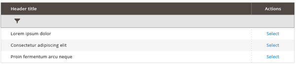

## Pagination

Pagination controls allow the user to easily page through and organize data. Pagination controls will contain the following:

*  Drop-down select for number of items per page
   *  Increments TBD
   *  Custom field for user-defined increments
*  Page number (skip to) field and action button
*  ‘Next’ button
*  ‘Previous’ button when applicable

### Pagination Rules

*  The pagination controls will only be present if the number of table items exceeds the lowest increment for number of items per page.
*  The ‘Previous’ button should be disabled when viewing the first page of results.
*  The ‘Next’ button should be disabled when viewing the last page of results.
*  The ‘Skip to’ field will allow only numeric values.
*  ‘Skip to’ will be instantiated once the value is changed and [Return] or [Tab] is clicked.
*  A custom number of items per page can be set by selecting the "Custom" link which will allow users to specify a number. This number can be edited.

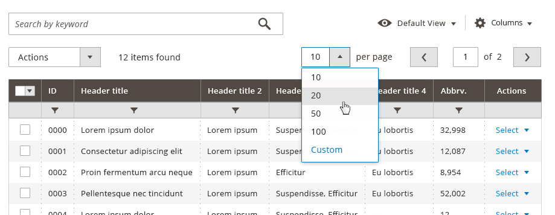

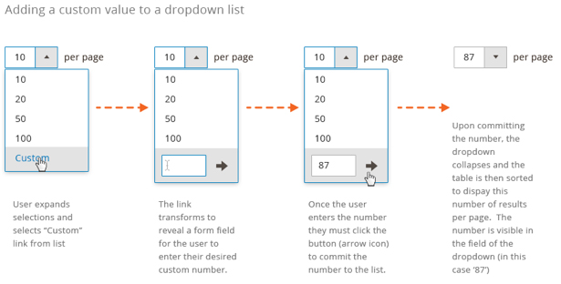

## Mass Actions

A common [theme](https://glossary.magento.com/theme) across the existing Magento user experience includes mass actions that can be taken. This is a convention used on both data-table and non-data-table pages. Not all pages have these action buttons. This document will not attempt to capture all actions that appear here or how they might be redesigned for Magento 2. This document will make note that these actions exist on many of the data-table pages and will use the area directly above the table to indicate placement of such action buttons where they might be needed.

Actions will be positioned above the table . Each table  will have it’s own set of actions, some tables will have no actions. This new proposal removes the submit button which is currently visible next to the "Actions" drop down selector. In the [event](https://glossary.magento.com/event) that any confirmations are needed for actions, modal dialogs will be used.

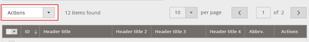

### Single Actions

These actions will appear within the data area of the table where applicable. When this action column is applicable, it will always appear on the far right of the table . Single actions will allow users to take action on a record within the table . In most cases, no more than one action will appear here. In the event that additional actions are needed, they will appear in the form of a drop down. These actions are specific to the single record in which they are associated. In the event that a user selects multiple items in the table, these actions will be disabled or hidden.

### Messaging and Confirmation

There are times when an action needs to be confirmed. In these cases, the user’s task will be interrupted with a message asking the user to confirm the operation before proceeding. This message is presented via a modal dialog.

Once an action is taken, success/fail messaging should appear as an overlay which fades away. Certain actions mayrequire that an Undo action be provided. This experience should be the same whether a single file is being deleted via the "actions" button for that record or 1 or more files have been selected via a checkbox and deleted via the mass actions delete.

## Table Control

This section will cover the ability to set column visibility, save view state, and search. Filters will be covered in the following section.

### Keyword Search

A [keyword](https://glossary.magento.com/keyword) search will allow users to search on the data that has been loaded into the table  being viewed. This search is a part of the table, and is separate from the global record search in the page header. It will allow for exact phrases(using quotations) and the following boolean operators:

### Placement and Behavior

The keyword search function and table controls will be:

*  Displayed above the table
*  Actions
*  Remain visibly persistent as the table scrolls

## Sticky Headers and Controls

As the table  scrolls, the table controls will dynamically condense to a single row. All functionality of the controls will remain available.

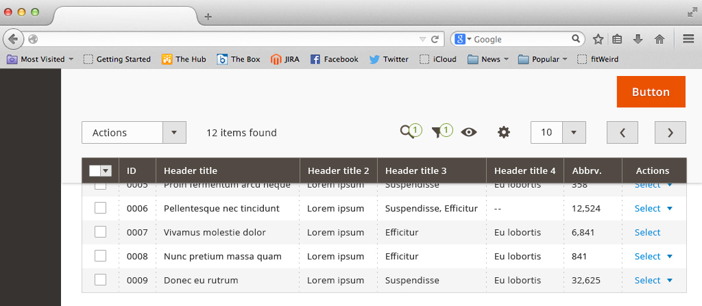

The persistent header will reactivate when you scroll back up:

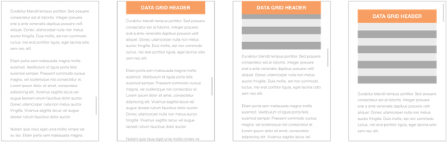

### Multiple Data-tables on Page

The header will stick to the first table until the user scrolls past the bottom of that table . The header will have the same behavior for each subsequent data-table.

### Interactions

The data-table will reset to the top of the table  when the user:

*  Submits a search query
*  Applies a filter
*  Sorts a column
*  Selects a mass action
*  Loads up a saved view
*  Clicks to the next page of results
*  Changes the number of items per page

The data-table will remain in the current viewport when the user:

*  Creates a new saved view
*  Edits cells in-line

### Sticky First Column

The table can be scrolled horizontally. And to keep the row identifiable, the checkbox column and first column will be sticky. In creating the grid, the first column must always be an identifiable attribute such as name.

If there are more columns than can be shown in one view, the vertical scroll bar should appear for navigating to the rest of the column options as seen in the image below. Only 6 options should be shown per each vertical column, we should ensure that the all area of panel will be visible above the page fold.

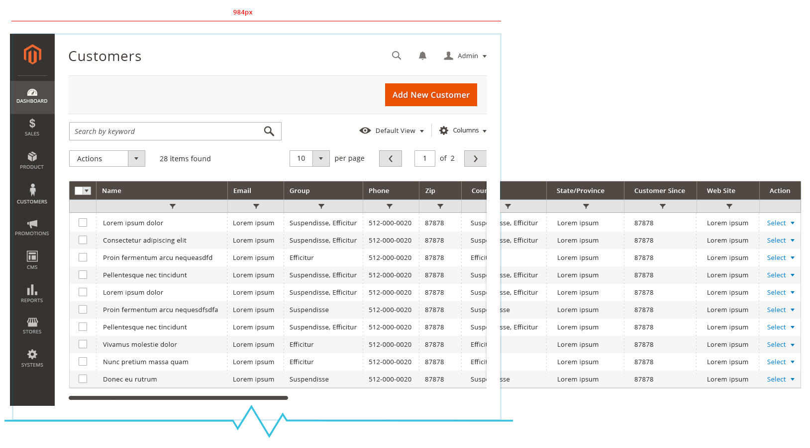

In the example below, the first column is "Name" rather than "Customer ID."
This horizontal scroll should still work with page scroll and sticky header.

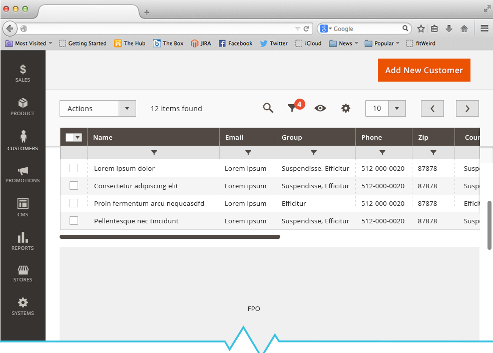

## Search

When the user enters a keyword in the search field and submits the query (by clicking the spyglass icon), the table will display only records that contain the designated keyword. The search term is displayed as a "chip" below the search field (and inline with any additional filters that were applied). In this layout, additional search terms can be paired with the initial term to further refine the results. Each time a term is submitted, the data is filtered, the term is displayed as a "chip" and the search field returns to it’s initial state (it does not retain the term entered my the user).

### Autocomplete

As text is added to the search field, the system will suggest terms and phrases based on data contained in the table being searched against.

*  No more than 5 suggestions should be displayed at a time

### Search/Filter Tags

Once a search term or filter is applied and results are loaded into the table, the terms or parameters used to filter by are displayed in the minified version of the "filter chip(s)". If the user removes all the tags, the filters row would disappear.

### Error Checking/Validation

There will be no form validation or error checking for search queries since any combination of characters may be searched. Messaging will display in the data area when no results can be returned.

### User Flow

Upon conducting a query, a result set is returned based on the above rules. Once results are loaded, the keyword search field will be empty, and a chip for the keyword will appear. If a user clears the chip, the table will then refresh, reloading data based on any filters that are applied.

### Columns

The user will be able to select which columns are visible from here. Settings will also be contained in a panel that can be activated by clicking on the columns action. Users will also have the ability to cancel out of this prompt, as well as reset (restore) the table back to it’s default column view. These settings will be ‘sticky’ per table, so users returning to any particular table will see the table the way it was last configured.

### Custom Views

Custom views allow the user to save the state of a table. When a view is saved, the table settings will be stored. These settings include column visibility and position, as well as any filter or search that has been applied to the table. Saving a ‘view’ will be done via a dropdown control. Saved views will be available per table.

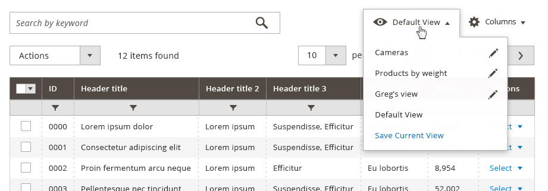

### Editing Saved Views

Views can be named or deleted by clicking an edit icon. Refer to "Adding a custom value to drop down list" above for more detailed behavior.

## Filters

Filters allow users to customize the display of information in an associated data-table. By entering desired parameters (for example, a date range) in the available filter input sections table returns a modified view, making visible only the records meeting the user-determined criteria.

### Advanced Filters

To access the Advanced Filters the user may click/tap the "Filters" button found in the table controls area. When activated, the button transforms into a tab and displays the available filters in a 'drawer' which opens between the table controls and the table data. The available filters are determined by the columns present in the table; therefore, if the user customizes the column visibility of the table to show some columns and hide others, the corresponding filters for these columns will display or hide in the filter 'drawer'.



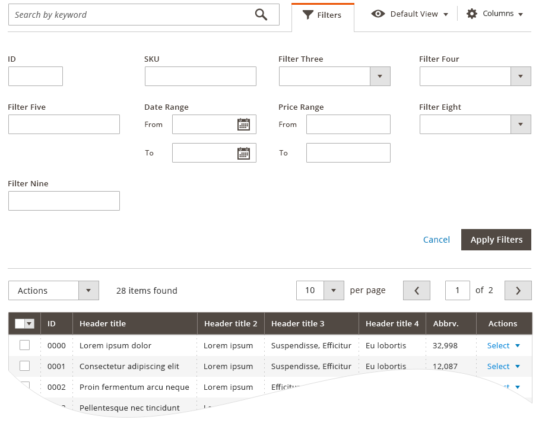

To apply filters, the user sets the desired parameters in the input fields of the appropriate filters. The action initiated by clicking/tapping the "Apply" button (found in the advanced filters area). When applied, the advanced filter 'drawer' closes and the data-table refreshes to display the filtered data. The applied filters are indicated to the user in the form of filter 'tags' that appear between the filter button and the table data. Filter 'tag' are listed in the order that they are applied and each individual 'tag' has a control for removing it.

### Removing Filters

Users may remove a filter setting by clicking/tapping the remove control next to the filter 'tag'. Doing so removes the particular filter from the *query*, the table refreshes and the data excluded by that filter then appears in the table. The user can quickly remove all applied filters by clicking/tapping the "clear all" link that follows the list of 'filter tags'.

<!---
### Quick Filters

In some instances, pre-determined "quick filters" may be present in the form of links. These are filter shortcuts of common filtering attributes to assist users who may not readily consider filtering the table for results. Quick Filters are perhaps most useful for extracting ‘reports’ from tables.  These filters are elevated above the ‘advanced filters’.

<strong>Step 1:</strong> Starting state. User click on a quick filter link.
 
 
 
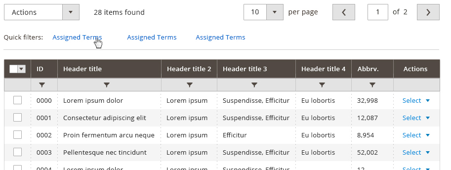
 
 
 
<strong>Step 2:</strong> Quick filter is applied.
Once user click on the quick filters, that quick filter is shown as a chip. The user can add additional quick filters.
 
 
 
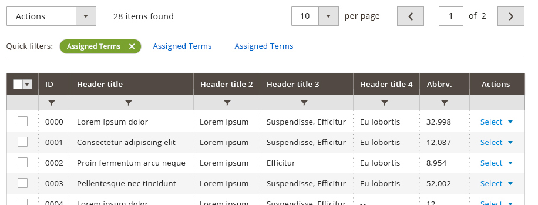
 
 
 
<strong>Example:</strong> Quick filters and active filters are present.
 
 
 
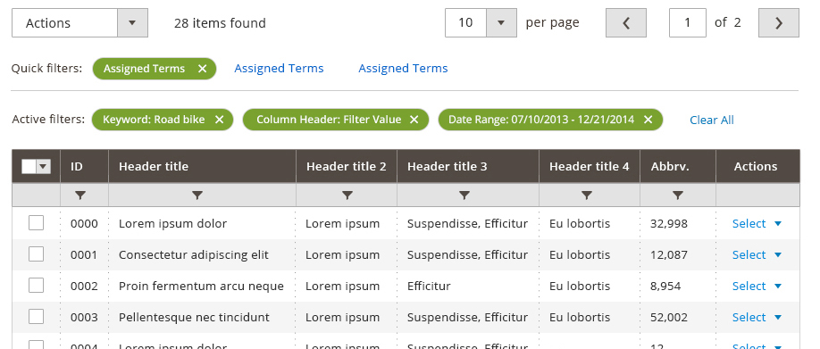
 
 
 
-->

## Data Table Views

The data-table will support up to 30 columns, with up to 8 being visible by default. While there will be a default view for each data-table in the system, users will have the ability to show, hide, drag and change the order of columns. This interaction will include the ability to resize the width of columns.

The only columns which cannot be moved are the checkbox(select) column and the action column. The select column will always appear on the far left while the action column will appear on the far right of the table

### View Stickiness

As a user rearranges, adds, and resizes the columns of a particular table , it’s view state should be saved so that when a user leaves and the returns to the table , it will appear the way the user last viewed it.

The following parameters will be saved:

*  Columns displayed
*  Column arrangement
*  Column width
*  Number of items per page

### Resetting the View

This will be handled by the ‘Reset’ function in the settings drop down button. A modal dialog should appear, allowing the user to confirm the reset.

## Select All

This feature will allow users to make bulk selections to items within any given data-table. Because users may be dealing with many "pages" of data, this function needs to be specific in respect to what is being selected. Thus a drop down will be used to allow for multiple options for selecting records.

This drop down will include the following:

*  Select all on a page, or all visible
*  Select all on all pages
*  Invert selection (appears only after a selection has been made)
*  Deselect all

This drop down only needs to appear where more than one page of data is available. In cases where only one page of data is available, only a checkbox allowing the user to select or deselect all is necessary. Options in the drop down select should be dynamic. For instance, deselect options should not be displayed if nothing is selected.

### Number of Records

The total number of records loaded into the table  will display above the column headers.

As items are selected on the grid, a count for the number of items selected should be displayed next to the total count. This will give the user confidence that records are selected though they may not be on the current page view.

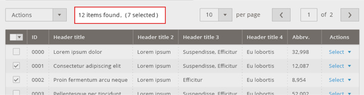

### Select

For tables which require a select column:

*  The select column will always be the first column appearing on the left side of the table.
*  This column will be fixed and stationary (it cannot be moved or resized).
*  Users may select multiple rows by using the checkboxes or the select all function.
*  Selected rows will be indicated by a checked box and a highlight and/or border style which will delineate the selected rows from unselected rows.

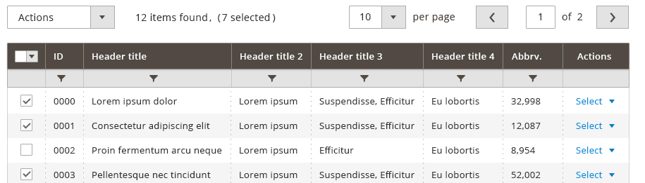

### Toggle Switches

Some data-tables will be used to display "settings" content. In these instances a checkbox is not ideal for the experience, as it can be confusing to the user when pre-selected settings are displayed. Switches make the action and intent more clear to the user for these tasks. Therefore, if switches are present, checkboxes should not; the two should never be used in the same table. Since switches replace the functionality of checkboxes they should be the first column of the data-table.

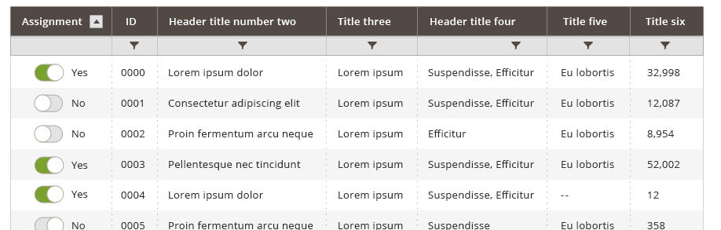

### Single Select Button

The data table can also accommodate buttons in rows, and has a special case in the "Single Select" button.  This button functions not unlike a typical radio button control, but is used instead of the radio button when the task flow or experience in the [Admin](https://glossary.magento.com/admin) application are better served with the more implicit action of selecting a single choice from a data table. This provides greater visibility and immediate confirmation of the action to the user. The use of this should be carefully considered in the context of the experience to determine if it provides greater understanding to the user than radio buttons.

## Editing

Single item and multiple item edits are explained below.



### Single Item Select and Edit Interactions

*  Inline editing can be instantiated by single clicking on the field to be edited. Once inline editing is instantiated, all appropriate fields within a row will be editable.
*  Non-editable fields will require a disabled treatment.
*  Once a row becomes editable, action buttons will appear below the row allowing a user to commit or cancel the edit.
*  Editable fields will have a left-to-right tab order. [Tab] and [Enter] will set focus on the next editable field in the tab order, unless the focus is set to the last field in the tab order in which case [Enter] will commit the edit while [Tab] will set focus to the Save button.

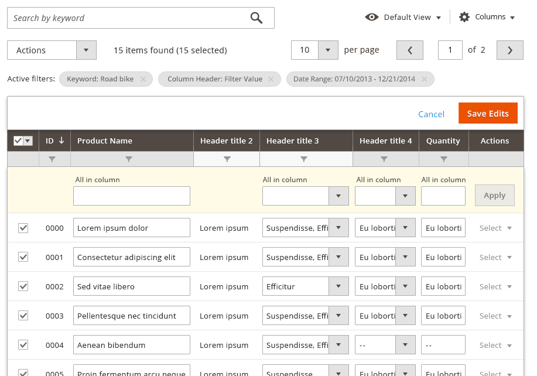

Inline editing may require error handling on some fields. This should be done using real-time field validation. Some fields may allow for only a specific set of values. In these instances, a select or multi-select interaction should be used.

## Miscellaneous Features

This section will outline additional features which may be needed for some but not all tables in Magento.

### Drag and Drop Columns

Some data-tables will allow users to arrange columns in a customized order. A user "picks up" a column by click and hold or touch and hold of the column header, then drags the column into the desired position. A highlight appears between columns in the table to indicate where this column will appear when "dropped". Columns will not be allowed to precede the column of checkboxes in a table, likewise columns may not be positioned after the "Actions" column.

When dropped on an area that is not highlighted (or off target of the highlighted area) the column will return to it’s original position. If the user wishes to maintain this position for future viewing, they must set a "Saved View", otherwise the default column order will prevail for following sessions.

### Drag and Drop Rows

Some data-tables will allow users to specify an order for the records within the table. If a position has been assigned to a record, the position number will display in the ‘Position’ column. Changing position order should always shift the greater numbers in an ascending fashion, and lesser numbers in a descending fashion. E.G., if position 5 is changed to 10, the previous position 10 would become position 11, shifting all ascending records up. Position 6 through 9 would then shift down in the same manner. 6 would become 5, 7 would become 6, so on and so forth. If the ‘Position’ column is sorted, users can drag and drop single or multiple(once selected) to a different position on the table.



### Single rows may be arranged via drag and drop

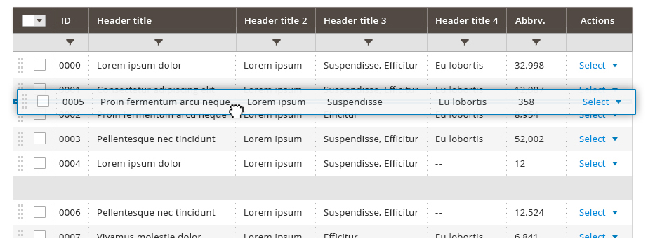

### Multiple rows may also be arranged via drag and drop

### Thumbnails

In cases where an image is associated with the data, as in the case of a product, the data-table will display a thumbnail view of the primary or default image (typically the first image in a series of image). By default the thumbnail image will appear to the far left of the table (after select checkboxes when present). The thumbnail image is a ‘clickable target’ independent of the typical click behavior of the row.

When the thumbnail is clicked a modal is presented over the data-table to provide a larger, more detailed view of the image. This modal should contain a heading that corresponds to the associated product name; a close control for the modal; a hyperlink that redirects the user to the details page.

### Parent-Child relationships

The data-table will support parent-child relationships. Parent and child records will be delineated via style and/or iconography. Parent nodes will be expandable/collapsible.

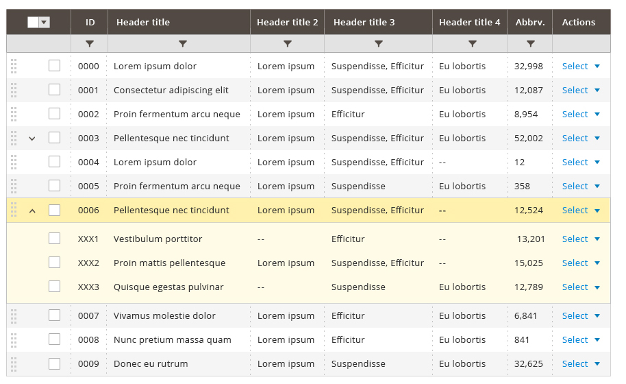

## Interactions

General interaction should follow standard web conventions. Interaction around dragging and resizing columns will utilize the cursor to indicate when an area can be dragged or resized.

### Viewport Considerations

*  The default data-table will display within a 1024px screen resolution without the need for horizontal scrolling.
*  Horizontal scrollbars will be present whenever the data-table’s width expands beyond the browser’s viewport.
*  The data-table controls should not expand with the table , instead the controls will float as the table is scrolled in both the vertical and horizontal direction.

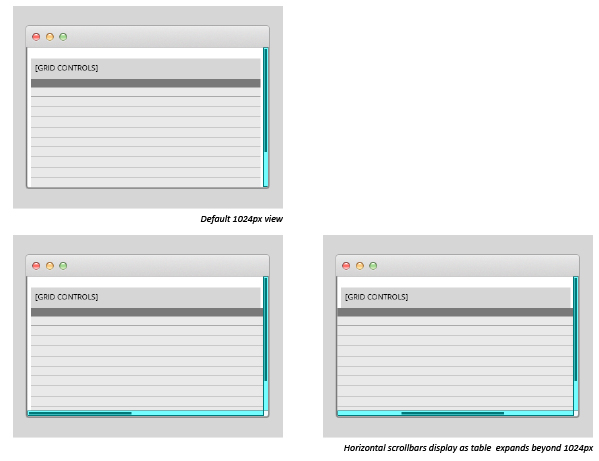

### Column Headers

*  Clicking on a column header sorts the data ascending/descending.
*  Column headers are draggable and can be re-sized.
*  Can be added and removed using the settings action located on the list.
*  Data can be displayed in ascending or descending order by selecting the column header
*  The actively sorted column is indicated by style and an ascending/descending indicator (Style is TBD).
*  Can be resized by dragging the edge of the column.

### Cursors

Cursors will be used to indicate which actions the user can take in any particular situation. While cursors may differ slightly depending on operating system and browser, the below cursors are examples of what should be used per standard web conventions:

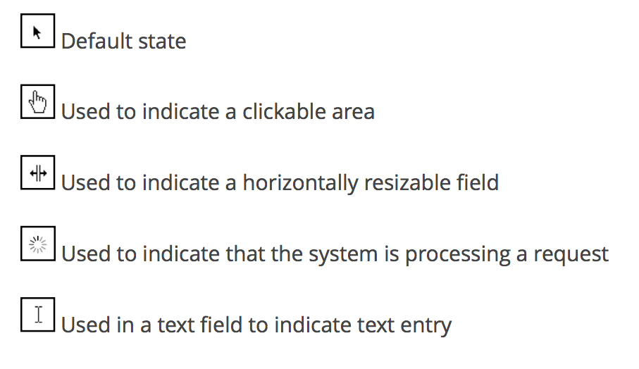

## Summary

This specification proposes a new version of Magento’s administration data-table. Features of the existing data-table have been analyzed to best represent the existing functions of the data-table.

## Backwards Compatibility

This new version of the data-table will fully support the existing Magento data-table functionality. Where this document may not be explicit, it should be assumed that any existing function of the table  will be supported with this new version.

## Assets

Download [ZIP]({{ site.downloads }}/datatable-pattern-styles.zip) of PhotoShop source files.
