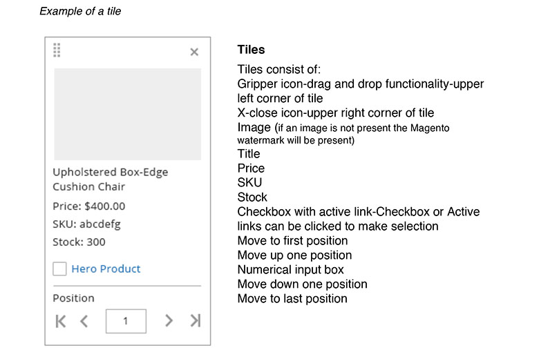
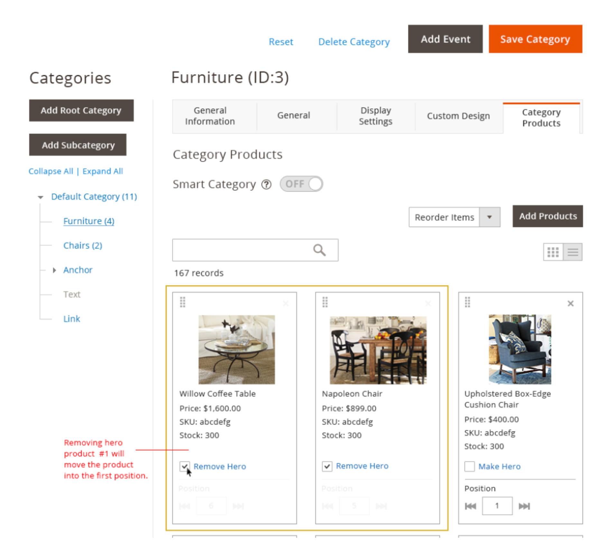
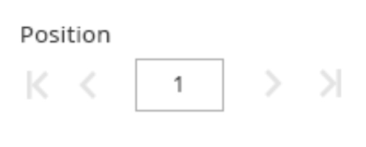
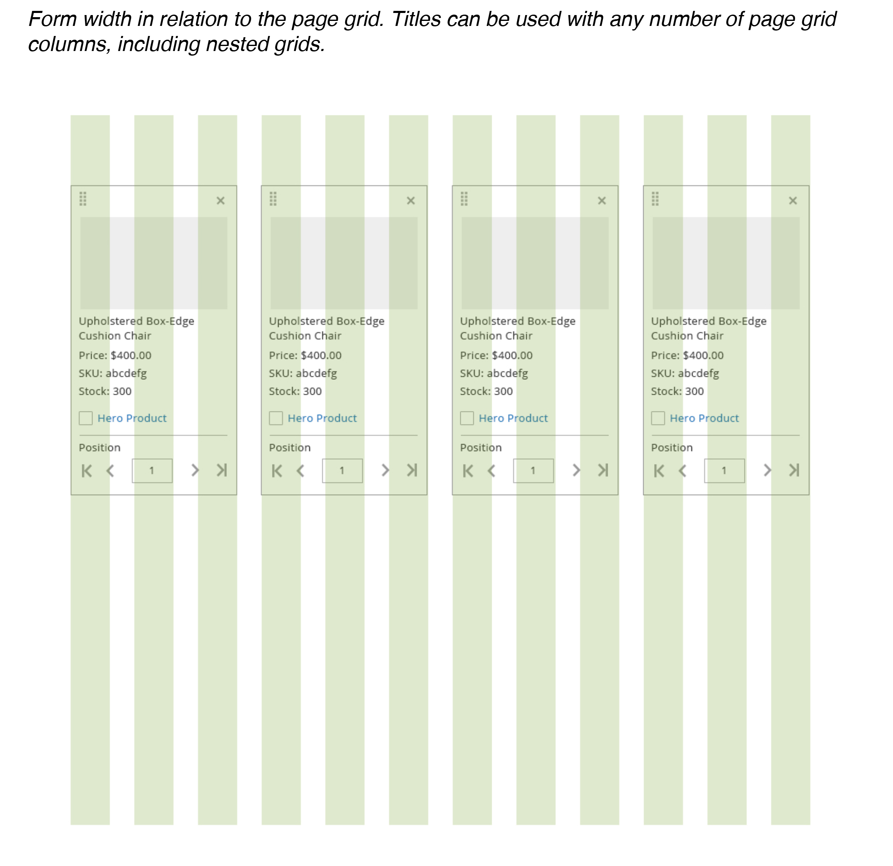

This topic contains examples of the Tile pattern used in the [Admin](https://glossary.magento.com/admin) with functions for single selection, multi selection, drag and drop, and editing inline position. For solutions not described in this article, please refer to other related patterns or contact the Magento UX Design team.

## Functional Behavior

*  Drag and Drop
*  Remove
*  Hero Product checkbox and link
*  Advance position left and right
*  Numerical input box
*  Multi selection
*  Hero Product Section

## Use of Tiles

Tiles will be needed anytime there is a grid view option available. Tiles are a visual representation of the data table and are easily scan-able.

## Drag and Drop

The gripper handle in the top left corner of the tile is used when the capability of dragging and dropping is needed. When an item is dragged out and moved to a desired location, the drop area is highlighted to show the acceptable region. Once dropped, the pick-up area disappears. If an item cannot be dropped into a specific location-the drop area will not be shown. Drag and drop functionality can only be used on a single page, the user cannot drag and drop across multiple pages.

## Removing Tiles

The X in the top right corner of the tile will remove the tile from the [category](https://glossary.magento.com/category) but not delete it from the actual product [catalog](https://glossary.magento.com/catalog). When a tile is selected to be removed, the user is prompted with a 1-2 second alert stating, "This product is now being removed from the category."

## Hero Product Checkbox and Link

To make a product a Hero Product, the user must select the checkbox and/or the Hero Product link to promote the tile to the top of the category. When the checkbox and/or Hero Product link is selected, a 1-2 second alert stating "This product is now a hero product" will appear and fade away. (The user has the option to opt out of these alerts.) Once a tile becomes a "Hero" a 1px yellow stroke highlights the tile at the top of the category.

## Removing Hero Product Checkbox and Link

To remove a product from the hero space, the user must deselect the checkbox and/or click the Hero Product link. When the checkbox and/or Hero Product link is selected, a 1-2 second alert stating, "This product is being removed" will appear and fade away. (The user has the option to opt out of these alerts.) Once selected, the tile will move to the first position in the category.

## Advancing Position

The user has the ability to advance a tile to the first position in the category and/or the last position in a category by selecting either the move first position icon, move up one icon, move down one icon or move last position icon. These icons help a user quickly move products around in a category and across multiple pages.

## Numerical Input

Clicking in the input field will allow the user to manually enter a numeric order and have the tile move to the position entered. If a tile is already in the chosen position, the tile will then move one space to the right and the new numeric value entered will take the position. Once the user enters a numeric value, using the keyboard and hitting return will move the tile to the entered position.

## Hero Product Section

Once a tile becomes a "Hero" a 1px yellow stroke highlights the tile at the top of the category. The user can have infinite hero products in a category. When there is more than one product highlighted in the hero space at the top of the category, the user can drag and drop tiles within the highlighted hero space. (Ex: A user can drag and drop the first hero tile to the last hero position as long as it is on the same page) The advance position icons and numeric input field are not active while a tile is in the hero position. To activate the advance position and numeric input field, the user must remove the tile from the hero space.

## Styling and Spacing

For specific details concerning styling including fonts, colors and effects and spacing and padding, please refer to the source PSD files and exports located on Box or contact the Magento Product Design and User Experience team.

## Assets

Download [PhotoShop source file]({{ site.downloads }}/tile-pattern-styles.psd).
