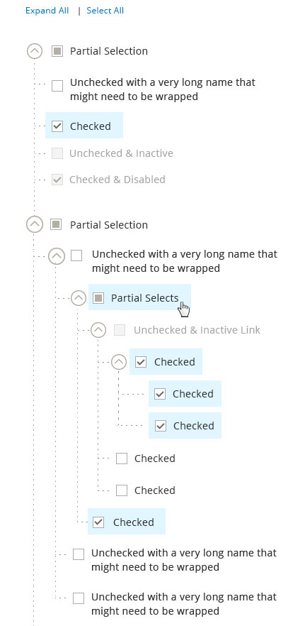
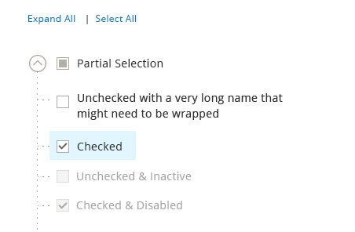
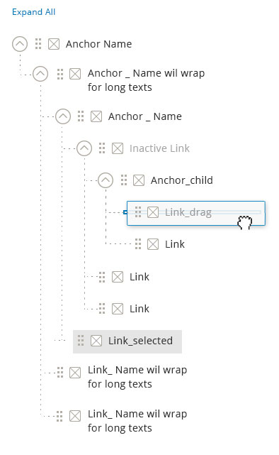
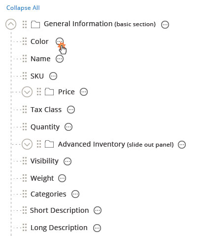
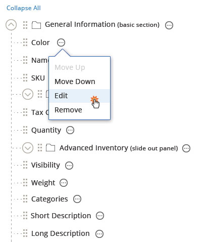
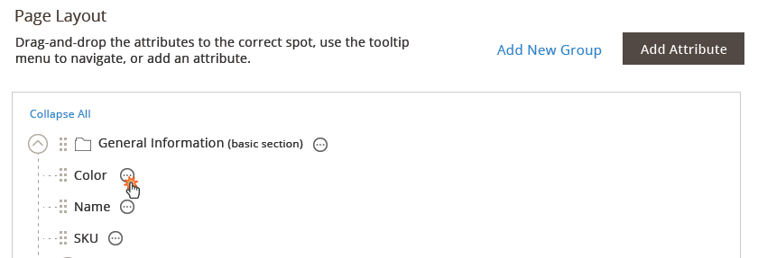
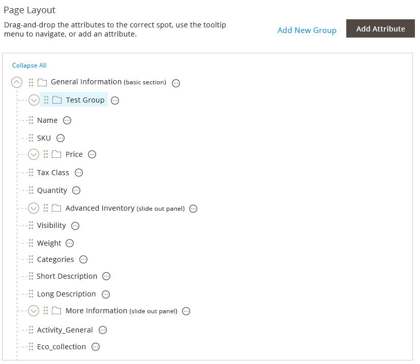
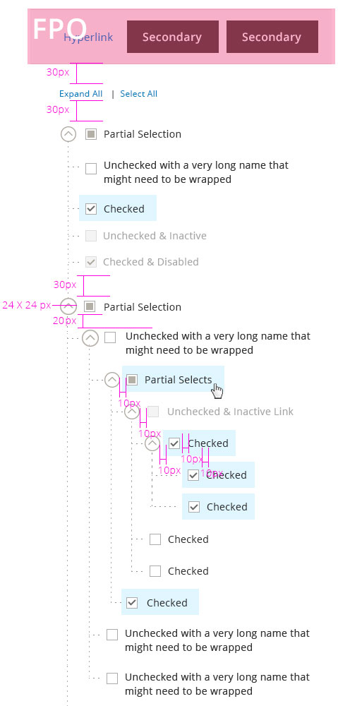

This topic contains various types of Tree structures used in [Admin](https://glossary.magento.com/admin) with functions for navigating, multi-selecting, adding nodes, editing inline, and dragging items.

For solutions not described in this article, please refer to other related patterns or contact the Magento UX Design team.

## When to Use

Tree component will be needed anytime it is required to navigate though multiple layers of information and / or places where the information hierarchy needs to be shown to the user.

## Components of Tree

The tree consists of two main "Anchors" and "Links":

### Anchors

Anchors are items that always contain at least one child item and offer "expand" / "collapse" functionality by hiding or revealing its direct children.

### Link

Link is a leaf level item which user can select to navigate to detail page or display details on same page.

_Active Link_ - Links that are active state and can be clicked to navigate to detail page.

_Inactive Link_ - Links that are inactive state and can't be clicked.

## Basic Functional Behavior

All trees must have these basic functional behaviors.

### 'N' Number of Levels

The propose tree can accommodate "n" levels of parent child relation. But only 2 levels of nesting is recommended.

### Collapsing/Expanding individual tree items

The arrow to the left of the item can be used to expand or collapses the children of an item you are interacting with.

### Expand All

Clicking "Expand All" will open all the nodes in the tree structure. Expand All link is the default state. Once "Expand All" is clicked the link changes to "Collapse All" If user manually expand all the items, this control should also be changed to "Collapse All."

### Collapse All

Clicking "Collapse All" will condense all the nodes in the tree structure. Once "Collapse All" is clicked link changes to "Expand All".  If user manually collapsed all the items, this control should also be changed to "Collapse All."

## Usage: Navigation

This is used to navigate to the detail page of the selected item in the admin or used as navigation to display more information on the same page.

When tree is used to display more information on the same page the item clicked remains in selected state.

## Usage: Multi-Select

This is used when multiple selection of items are needed.

### Multi Select without Icon

### Multi Select with Icon

This tree has all functionality of multi-select tree along with having icons. Icons can be used along with the checkboxes to denote the difference in item types. (e.g. In Media management Icons can be used to differentiate between audio, video, image and folder types.)

Icons should always be placed on the left of the icon label and Icons should NOT be used as default feature for trees pattern.

### Behavior and Details of Multi Select Tree

#### Select All/Clear All

Select All is the default state for tree with multi select functionality. When this functionality is triggered:

*  All checkboxes are checked
*  Complete tree DOESN’T highlight
*  "Select All" link changes to "Clear All".

When Clear All functionality is triggered – All the checkboxes are deselected. The "Clear All" link is only shown when everything is selected.

Otherwise, the link remain "Select All."

_Note:_ The "Expand All/Collapse All" control can appear simultaneously with the "Select All/Clear All" control. They operate independently.

#### Select Indicators

*  Partial Selection – this appears when a parent has items BOTH in checked and unchecked states. Partial selection only occurs at anchor level
*  Unchecked State – Item not selected and can be clicked for selection
*  Checked State – item selected and can be unchecked for de-selection
*  Unchecked and Inactive – this state appears when the item is unselected and not active
*  Checked and Inactive – this state appears when the item is selected and not active.

*3. Checking a checkbox for a child item should automatically change its parent state to:*

*  Partially selected – if parent also contains unchecked children
*  Checked – if all checkboxes for all children are in "checked" state
*  Unchecked – if all children are in "unchecked" state.

*4. Checking a checkbox for a Parent item should automatically change its child state to:*

*  Checked – if the parent state is changed from "unchecked" to "checked" state
*  Unchecked – if the parent state is changed from "checked" to "unchecked" state
*  Partial Selection – if parent has a partial selection state, clicking on it will deselect all the child items.

## Drag and Arrange

This can be used when user can drag and arrange items in tree.

### Functional Behavior: Drag Handle

Drag handles are used when the capability of dragging and arranging in a tree is needed. When an item is dragged out and moved to a desired location, the drop area is highlighted to show acceptable region. Once dropped, the pick-up area disappears.
If an item cannot be dropped into a specific location – the drop area will not be shown.

### Rule: Drag Handle Vs Checkbox

Checkboxes and Drag handles are mutually exclusive features. i.e. Tree structure that has checkboxes will NOT have drag feature and viz.

_Notes:_ Moving the Items in the tree will also affect the parent – child relationship.

### Type 1. Drag and Arrange with Icon

### Type 2. Drag and Arrange without Icon

## Action Menu

Action icon is used for any action that will be perform to the items in the tree. This may include edit, delete, move up, move down, etc.

The action icon is not required for the tree. It only appear as needed.

*Step 1:* User click on the action icon.

*Step 2:* The list of available actions against this item is shown.

*Move Up* Once clicked, the item should be moved up within the parent. If the item is the first child, it cannot be moved up and the option will be disabled.

*Move Down* Once clicked, the item should be moved down within the parent. If the item is the last child, it cannot be moved down and the option will be disabled.

*Edit* Once clicked, this opens up a [slide-out panel](../../containers/slideouts-modals-overlays/slideouts-modals-overalys.html).

*Remove* Once clicked, the item should be removed.

## Add to Tree

### Triggers

The 'Add' triggers should be placed above the tree container area. (Note: the outline of the container is not always needed.)

There are two types of items that can be added:

1. *A Group item* This is the parent item, which means there can be children. Example: a folder for the media [library](https://glossary.magento.com/library) or a new [category](https://glossary.magento.com/category). The group item can also be added to another parent group. This allows for n-level tree.
1. *An item* This is the child. Example: a media item or a sub-category. The child item will be added to whichever parent is selected or to the same parent as sibling.

The "add child" button should always have more importance than the "add parent" button.

## Interaction

*Step 1:* User click on the add button.

*Step 2:* A [slide-out panel](../../containers/slideouts-modals-overlays/slideouts-modals-overalys.html) should opens up to get the details of what to be added.

*Step 3:* The item is added. The placement of the items will be determined as stated above.

## Style

## Assets

Download [PhotoShop source file]({{ site.downloads }}/magento-tree-pattern.zip).
