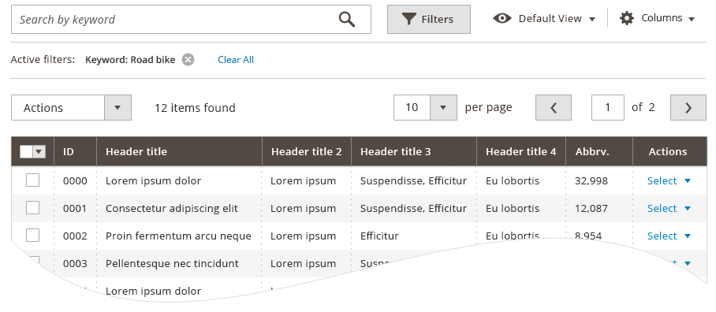
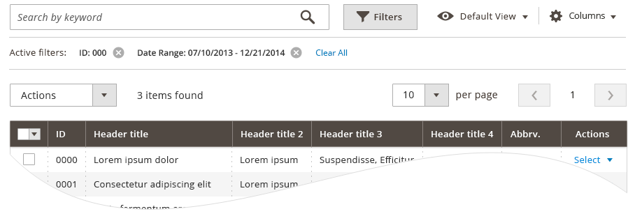
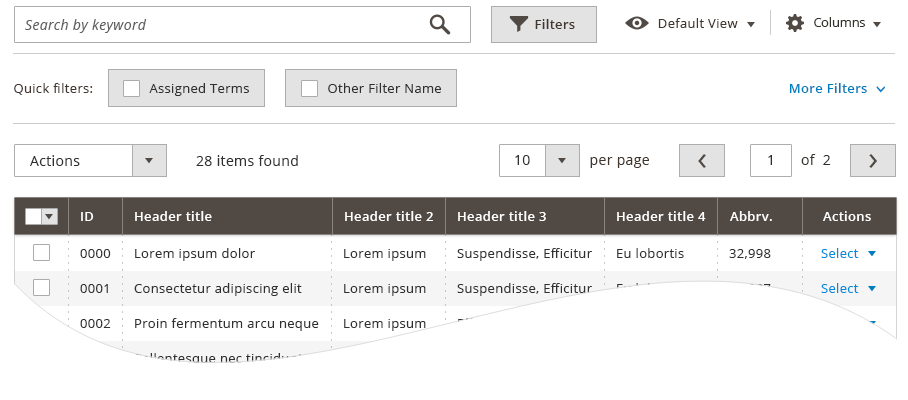
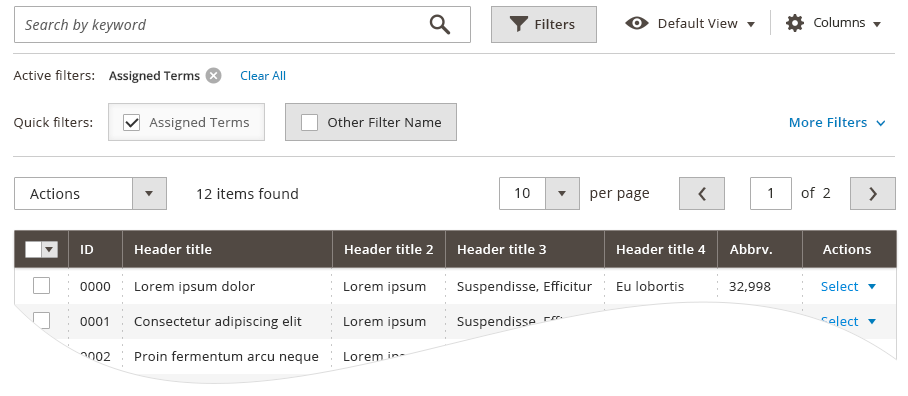

Filters allow users to customize the display of information in an associated data-table. By entering desired parameters (for example, a date range) in the available filter input sections table returns a modified view, making visible only the records meeting the user-determined criteria.

## Filter by Search

A search box associated with a data-table allows users to filter table data by entering a term(s) in the field and clicking/tapping the search icon. The table refreshes to display only rows of data that have a relationship to this 'keyword'. The term(s) is displayed as a filter 'tag' in an area just beneath the search box. Users may add subsequent search terms to create a combination of filtering parameters to more specifically filter data.

In the [event](https://glossary.magento.com/event) that the user enters a term that is not found in the data, the table will display a message to the user: "Your search term did not return any results". When this happens the user-entered term will remain in the search field for the user's reference.

Applied search terms (filters) may be removed by clicking the remove control, just as with any other filter.

## Advanced Filters

To access the Advanced Filters the user may click/tap the "Filters" button found in the table controls area. When activated, the button transforms into a tab and displays the available filters in a 'drawer' which opens between the table controls and the table data. The available filters are determined by the columns present in the table; therefore, if the user customizes the column visibility of the table to show some columns and hide others, the corresponding filters for these columns will display or hide in the filter 'drawer'.



To apply filters, the user sets the desired parameters in the input fields of the appropriate filters. The action initiated by clicking/tapping the "Apply" button (found in the advanced filters area). When applied, the advanced filter 'drawer' closes and the data-table refreshes to display the filtered data. The applied filters are indicated to the user in the form of filter 'tags' that appear between the filter button and the table data. Filter 'tag' are listed in the order that they are applied and each individual 'tag' has a control for removing it.

## Removing Filters

Users may remove a filter setting by clicking/tapping the remove control next to the filter 'tag'. Doing so removes the particular filter from the *query*, the table refreshes and the data excluded by that filter then appears in the table. The user can quickly remove all applied filters by clicking/tapping the "clear all" link that follows the list of 'filter tags'.

## Future Capabilities

Additional capabilities have been designed to further increase the functionality of filtering, however these features have not, as of yet, been developed. These include **"Quick Filters"**.

## Quick Filters

In some unique instances a table may have "Quick Filters" associated with it. These Quick Filters allow the user to filter data based on pre-determined parameters, and are intended to help users quickly filter data to perform a *common user task* - reporting functions. Not every data-table will have Quick Filters. "Search Term" filtering and Advanced Filtering may be used in conjunction with Quick Filters. Quick Filters may be removed in the same manner as other filters via the remove control.

## Assets

Download [ZIP]({{ site.downloads }}/filter-data-table.zip) of PhotoShop source files.
