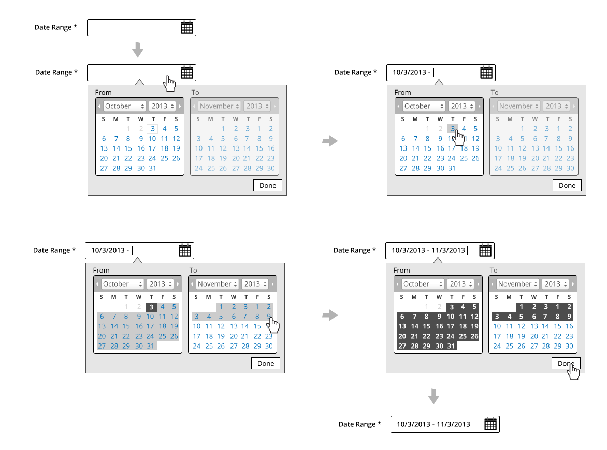
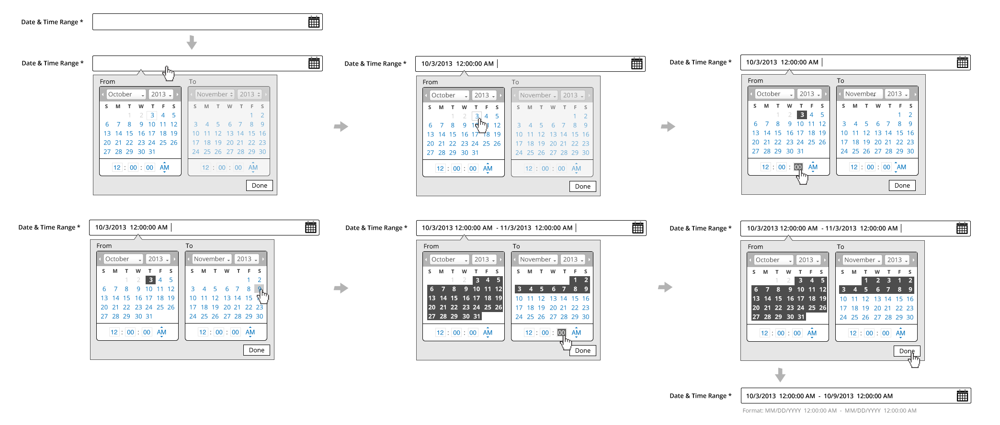
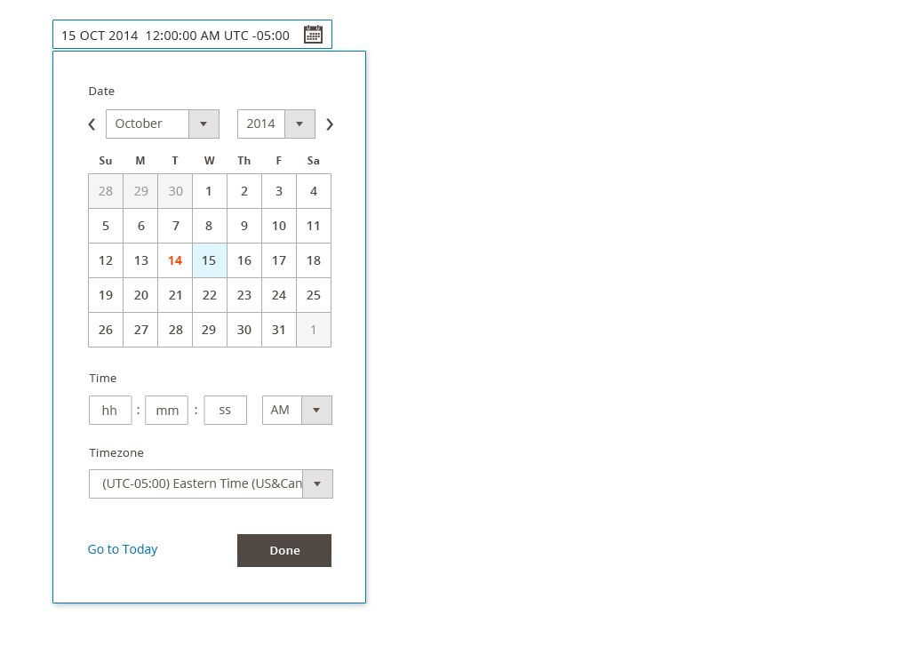

This topic discusses design standards and rules for date and time selection in Magento. This article is related to the Form Elements pattern. Please refer to [Form Elements](../form_elements/form_elements.html) for general rules on form usage and placement.

## When to Use

Use this element whenever a date, date range, time or time range needs to be gathered from the user.

## Variations

### Single Date Picker

### Date Range Picker

### Single Time Picker

### Time Range Picker

### Single Date and Time Picker

### Date and Time Range Picker

## Formats

Date:

*  DD MMM YYYY (ie. 01 JAN 2014) The letters should be localized.

Time:

*  The examples in this article use the 12 hour clock format. It should be noted that the 24 hour format will be supported as well.
*  Time Zones are in UTC offset

## Interaction

*  Tabbing to or clicking into the field activates the [widget](https://glossary.magento.com/widget)
   *  The Date/Time widget should animate down and be displayed underneath the field
*  The user is free to select available dates by clicking on the date
*  Days in the calendar will have the following states, each with unique styles:
   *  Current day
   *  Selected day(s)
   *  Disabled day(s)
   *  Hover state for days
*  Month and Year will behave as drop selectors
*  Clicking the "Done" button, clicking outside the widget, or clicking outside the text field completes the entry with the field still in focus
*  The user has the ability to edit date/time via text field
*  For Ranges, the calendars will be sequential
*  When selecting a month/year in the To area, the month/year in the From area should update to the month immediately following the month/year selected in the To area

## Disabled State

The following applies to ranges only:

*  Months will appear in sequential order
*  The calendar/time widget will require a unique style for active and inactive areas
*  User will not be able to select date or time on the To area until selection is made on the From area first

(Styles will support a disabled state for areas which depend on sequence for ranges)

## Time Selection Behaviors

Within the calendar widget, the following will apply to time fields:

*  Tab order will be applied to time fields
*  (HH:MM:SS) and TimeZone Offset will assume text field behavior
*  Limited to numeric entry only
   *  1-12 for Hour (12 hour format), 1-24 for Hour (24 hour format)
   *  1-60 for Minutes and Seconds
*  (12 hour format) AM/PM will behave as a dropdown
*  AM/PM should be removed for 24 hour format
*  Time Zone will be a dropdown selection

## Text Field Entry & Validation

*  Users have the ability to click-in to the text field to add/edit the Date/Time at any time when the field is active
   *  Format will be enforced
   *  Validation will require post-back
   *  Refer to the Form Error Messaging pattern for additional details
*  Tabbing out completes the entry, removing focus from the field
*  For date fields, user have the ability to enter any formats besides DD MMM YYY, and the system should automatically correct the date format. (For example: user enter 10/3/2013, and the system will make a guess and reformat to 3 OCT 2013 once on keystroke up.)
*  Date format input accepted:
   *  MM/DD/YYYY **
   *  MMM DD YYYY
   *  DD MMM YYYY
   *  DD/MM/YYYY **
   *  YYYY/MM/DD
*  Date automatically correct for user and display:
   *  DD MMM YYYY

**Note:**

MM/DD/YYYY can be confused with DD/MM/YYYY, so please assume the following:

*  If either MM or DD is above 12, then we can tell which one is the date vs month.
*  If both slots are below 12, make a guess based on the region. For example, if the user is in the US, guess MM/DD/YYYY format. If the user is in the London, guess DD/MM/YYYY. The more commonly used ones are DD/MM/YYYY.

Field selection works the same as a typical text field with

## Style

**Single Date Picker:**

**Date Range Picker:**

**Single Time Picker:**

**Time Range Picker:**

**Single Date and Time Picker:**

**Date and Time Range Picker:**

## Accessibility

### Date or Time Input Fields

The initial text field assumes the typical tab orders used in form field pattern.

### Date Picker Widget

Reference: [Date Picker Widget](http://www.w3.org/TR/2009/WD-wai-aria-practices-20091215/#datepicker)

As a general rule the actual calendar portion of the date picker should follow a table structure where days of the week and calendar day numbers are laid out in table cells. This provides context so an assistive technology can render the day of the week; its corresponding numeric calendar day, and week number if necessary. Consequently, it is best to start with an [HTML](https://glossary.magento.com/html) table and apply WAI-ARIA semantics for a grid. However, should the author wish to uses a div or span to represent the cells then the DOM structure for a table should be duplicated with rows marked with role="row."

### Keyboard Interactions

Keyboard navigation on days that are not included the currently displayed month should move to the month automatically and lead to the day in the next or previous month.

*  Space and/or Enter selects a day and deletes all multiple or range selection.
*  Left Arrow moves the focus to the left, continued to previous week and previous month.
*  Right Arrow moves the focus to right, continued to the next week and next month.
*  Up Arrow moves the focus to the same weekday in the previous week, continued to the previous month.
*  Down Arrow moves the focus to same weekday in the next week, continued to the next month.
*  Page Up moves the focus to same day in the previous month.
*  Page Down moves the focus to same day in the next month.
*  Shift+Page Up moves the focus to same day in the previous year.
*  Shift+Page Down moves the focus to same day in the next year.
*  Home moves the focus to the first day of the month.
*  End moves the focus to the last day of the month.
*  Ctrl+Home moves the focus to the first day of the year.
*  Ctrl+End moves the focus to the last day of the year.
*  Shift+Arrow performs continuous selection to the next/previous day/week/month.
*  Ctrl+Space multiple selection of certain days.
*  Esc closes a DatePicker that is opened as a Popup.

Do not implement keyboard navigation schemes that would place more than one calendar day in the tab order at any time as this impacts the [usability](https://glossary.magento.com/usability) of keyboard navigation. For example, using HTML anchors for the gridcells places them all in the tab order impacting the usability of keyboard navigation.

### WAI-ARIA Roles, States, and Properties

*  The current month should have a label representing the month and year. This should have a role header but is not essential. This "label" should have a unique ID.
*  If the author would like to ensure that a label is announced by a screen reader, as the label changes, the label should include live region properties: aria-live="assertive" and aria-atomic="true"
*  The container for the day of week headers and numeric days of the week should have a role of grid
*  The grid should have an aria-labelled by property with a value equivalent to the id of the label for the grid
*  Each name for the day of the week should have a role columnheader and they should not be navigable via the keyboard.
*  Each numeric day of the week should have the role gridcell.
*  When a day is selected it should have aria-selected="true" otherwise it should be set to "false" or removed.
*  Changes in aria states, identified here, as well as focus, should be clearly styled to show the user where their point of regard is and what days are selected.

When the datepicker is active a calendar day of the week should always have focus. This can be achieved by setting the tabindex on that day as appropriate and then using script to give it focus. Alternatively, the grid container could set aria-activedescendant to the id of the currently focused gridcell. Keep in mind that older browsers may not support aria-activedescendant.

### Time Picker Widget

*  (HH:MM:SS) will assume text field‘s accessibility behavior
*  TimeZone Offset will assume dropdown accessibility behavior
*  AM/PM will assume dropdown accessibility behavior

## Assets

[Download Date&Time PSD source]({{ site.downloads }}/date&timepicker.psd).

## Implementation

Date and time selectors are implemented using the standard [jQuery UI datepicker widget](https://jqueryui.com/datepicker/) and Magento [addon]({{ site.mage2bloburl }}/{{ page.guide_version }}/lib/web/jquery/jquery-ui-timepicker-addon.js).
