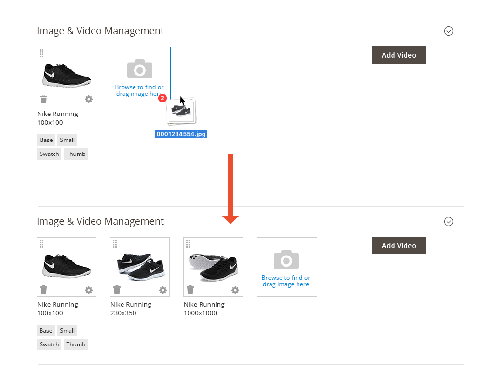
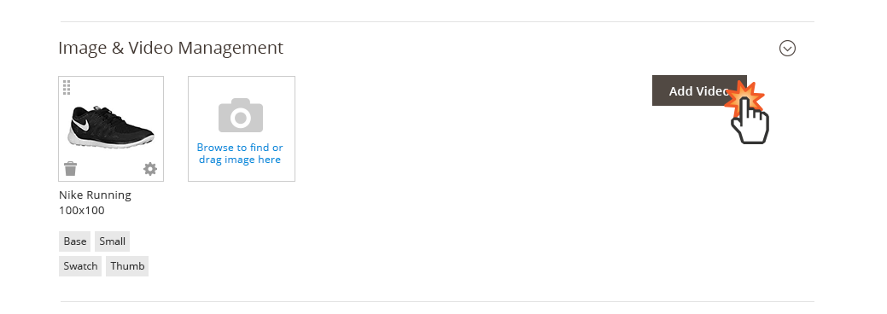
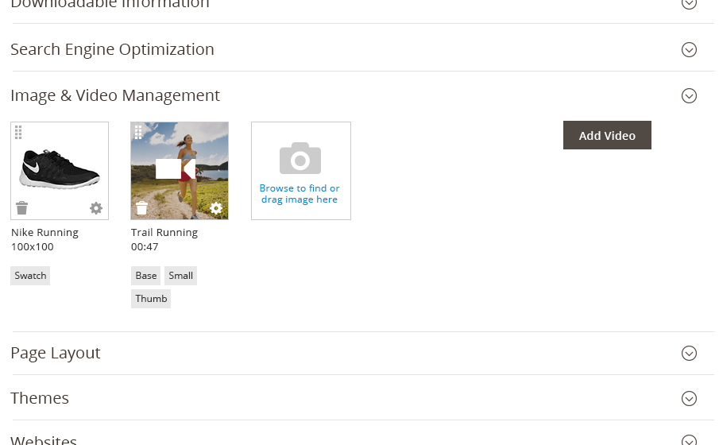
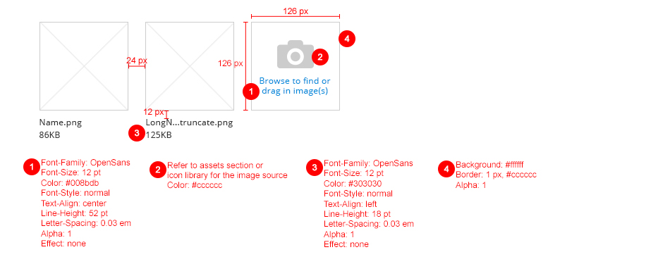

The Image uploader provides the ability for users to upload a single image, or group of images, to the application, most commonly images associated with Products (during the Product Creation process). These images may serve as thumbnail images, detailed Product images, images to within a product gallery, etc.

## When to Use

When it is desirable to allow users to upload a single image or multiple images for display within the [Magento Admin](https://glossary.magento.com/magento-admin) or on the [Storefront](https://glossary.magento.com/storefront).

## When Not to Use

This pattern should be used specifically to upload images, and not to upload documents such as PDFs, WordDocs, Spreadsheets, etc. Please refer to the "File Upload" pattern.

## Variations

1. Upload Single Image
1. Upload Multiple Images
1. Upload Video Content

## Behavior

**Uploading via Browser:**

The Image Uploader allows the user to browse for images to upload to the [Admin](https://glossary.magento.com/admin) application. This can accommodate single or multiple image upload. To initiate this behavior the user clicking on the "Upload Image" link (target area). The user then proceeds to select the desired images via the browser, using SHIFT + click or ALT/COMMAND + click to select multiple image files.

**Uploading via Drag and Drop:**

The user may also upload images (single or multiple) by dragging the desired images onto the Image Upload target area.

**Uploading Video Content:**

To upload a video to the Magento Admin application the user taps the "Add Video" button.

A video settings panel is revealed that allows the user to provide the [URL](https://glossary.magento.com/url) location of the video, write a description and upload a preview image for the video. The user taps the "Save" button to upload the information.

Once the video information is saved, the video settings panel closes and the user is returned to the image uploader (section) where the video preview image now appear.

NOTE: Currently Magento 2 does not allow Drag and Drop for Video Content.

**Drag to Arrange Order:**

The order in which images are displayed can be arranged by dragging the image or video to the desired position.
. These settings can be accessed via the "gear" icon found on the image thumbnail.

**Deleting an Image:**

Likewise, an image may be removed from the Magento Admin application by tapping the "trashcan" icon.

## Dimensions

## Accessibility

To initiate the uploader, the buttons should follow button accessibility guidelines: [http://www.w3.org/TR/WCAG10-HTML-TECHS/#forms-graphical-buttons](http://www.w3.org/TR/WCAG10-HTML-TECHS/#forms-graphical-buttons)

In the browser upload window, standard behavior should be kept.

## Assets

[Download Image Uploader PSD source]({{ site.downloads }}/Image_Video_Uploader.psd).
