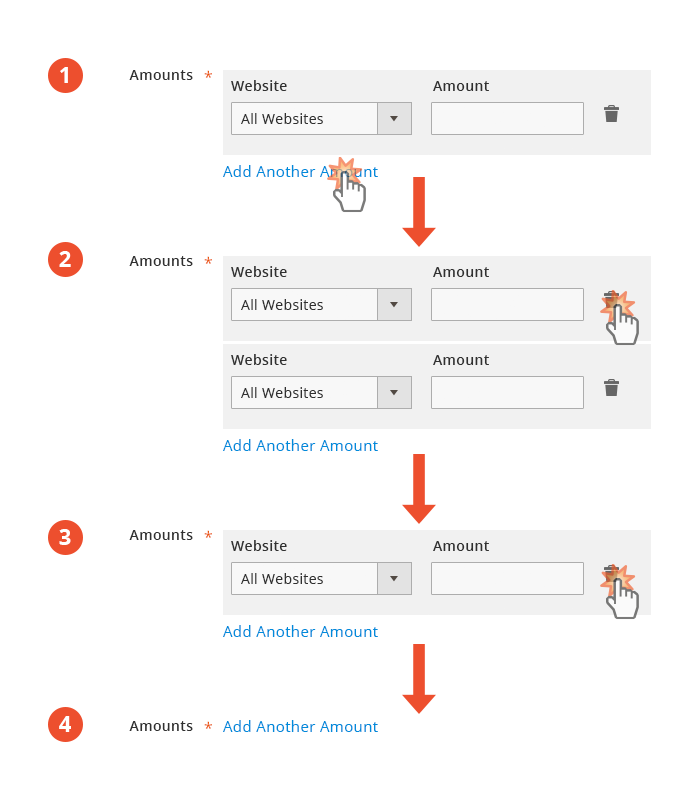
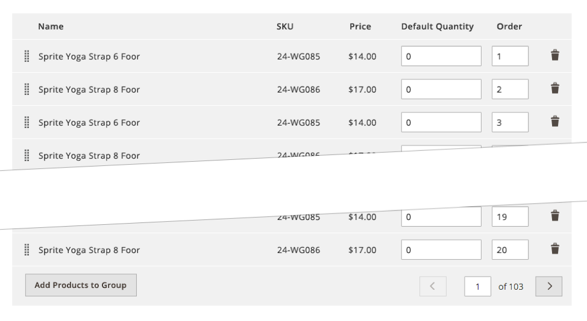
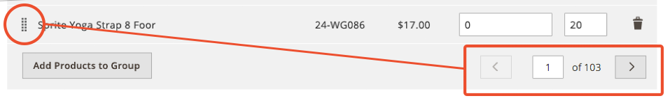
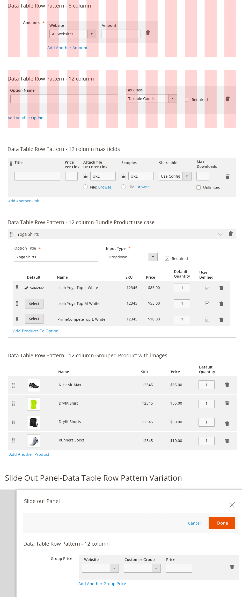

The "row pattern" (also referred to as _table light_ and _mini grid_) is used in the [Magento Admin](https://glossary.magento.com/magento-admin) interface wherever the User is expected to want to input tabular data. This pattern allows the user to add as many rows of data as they desire. "Light tables" are used when the User needs to add/edit a relatively small amount of items (rows).

The pattern supports following actions:

*  Add new row
*  Remove row
*  Rearrange/drag the rows
*  Edit fields in a row
*  Pagination (for 20 > more rows)

The pattern does _not_ support:

*  Filtering, sorting, searching the table
*  Adding, removing, rearranging of _columns_

## Anatomy of a Row Pattern

May include any of the following elements:

*  Table Body
*  Table heading
*  Row
*  Text in the row
*  Form elements inside the row
*  Drag handle
*  "Add row" button
*  "Remove row" icon
*  Pagination (for more than 20 rows)

All these elements are optional, depending on the functions needed.

## Behavior and Interaction

The Row Pattern, by default, will display one row to indicate to the User that data input is available (or required). A link beneath this initial input row will allow the User to add an additional row if desired.

Each row will have a delete control on the far right, often represented by a _"trash can"_ icon. This will allow the User to remove any unwanted rows, along with any data that has been input into them (prior to saving the form).

The delete control _CAN_ allow the user to remove all rows, even the initial row displayed upon page load.

The "Add" link however should always be present to allow the user to add a row, even in the [event](https://glossary.magento.com/event) of deleting all rows.

## Pagination

For better performance, the Row Pattern pagination should be enabled automatically whenever 20 (or more) rows are present. Once pagination is enabled an "Order" column should be appended to allow the user to rearrange the rows.

Once pagination is enabled an "Order" column should be appended to allow the user to rearrange the rows.

## Examples

Typically the Row Pattern will span either 8 or 12 columns for the page grid, depending on the [layout](https://glossary.magento.com/layout) of the page or panel on which it appears. The Row Pattern should accommodate all typical form elements as are necessary, but discretion should be used to insure the elements within the row are easy to read and interact with and do not become to cramped within the space.

## Accessibility

The form drop down, scroll area, and selections should be accessible via keyboard.

Follow this form control accessibility guideline: [http://www.w3.org/TR/WCAG10-HTML-TECHS/#forms](http://www.w3.org/TR/WCAG10-HTML-TECHS/#forms)

## Assets

[Download Row Pattern ZIP file]({{ site.downloads }}/Magento_Row_pattern_src.zip).
