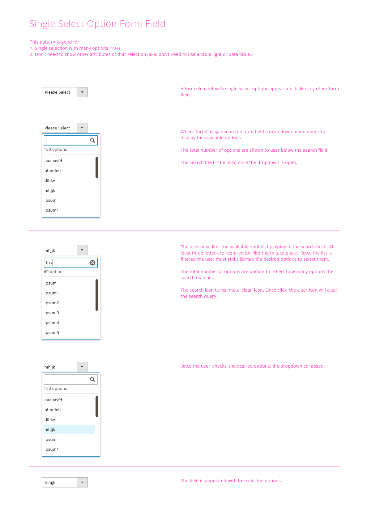
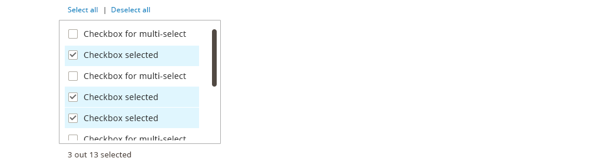

In the Magento Admin, user will often times need to select item(s) from a list of items. This pattern address the variations of list pattern.

## When to Use

When user need to select item(s) from a list of items, and each item can be identified simply by one label

## Variations

### Multi-select Dropdown (aka ultra-selector)

This variation is good for Multi Selection with many options (10+), when the option does not need to be shown immediately or when space needs to be preserved.

### Single Select Dropdown

This variation is good for Single Selection with many options (10+), when the option does not need to be shown immediately or when space needs to be preserved.mmediately or when space needs to be preserved.

### Multi-Select List Box

The advantage of a list box is that it exposes more options to the user. The list can be made scroll-able when space is a consideration and/or the list is long. A list box is mandatory when the list of options exceeds 6 items.

### Single Select List Box

The advantage of a list box is that it exposes more options to the user. The list can be made scroll-able when space is a consideration and/or the list is long. A list box is mandatory when the list of options exceeds 6 items.

## Accessibility

The form drop down, scroll area, and selections should be accessible via keyboard.

Follow this form control accessibility guideline: [http://www.w3.org/TR/WCAG10-HTML-TECHS/#forms](http://www.w3.org/TR/WCAG10-HTML-TECHS/#forms)

## Assets

[Download Variations of Select-From-List ZIP File]({{ site.downloads }}/Magento_select_from_list_srce.zip).
