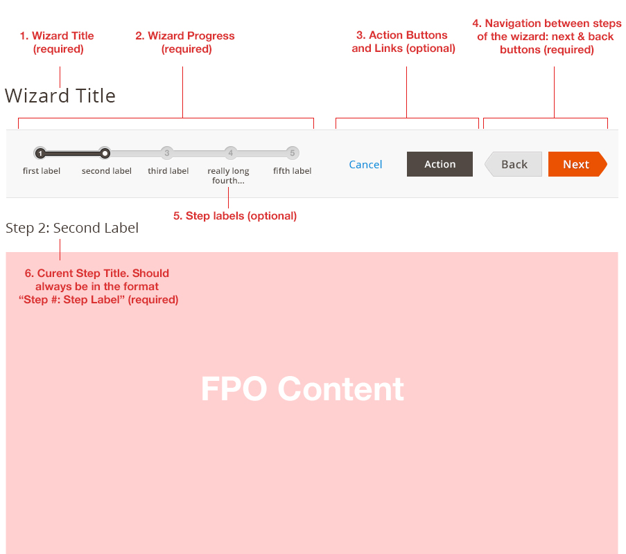
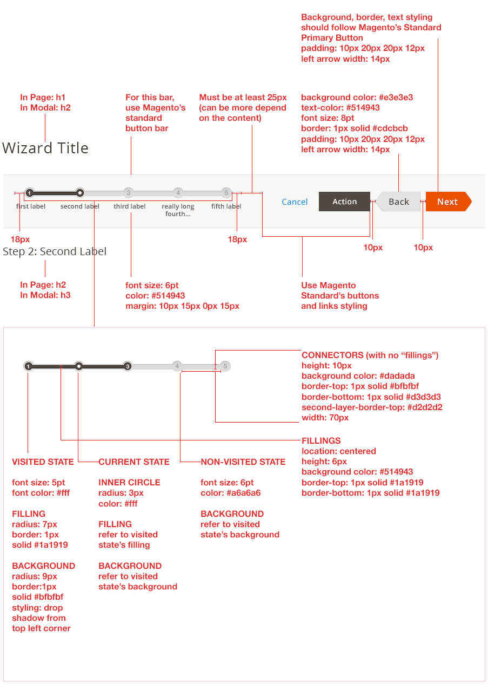
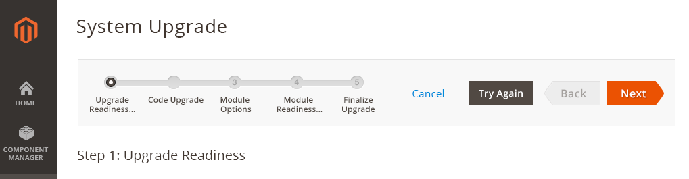
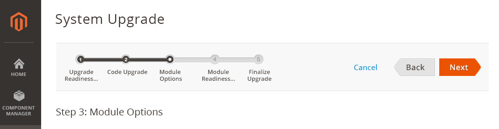
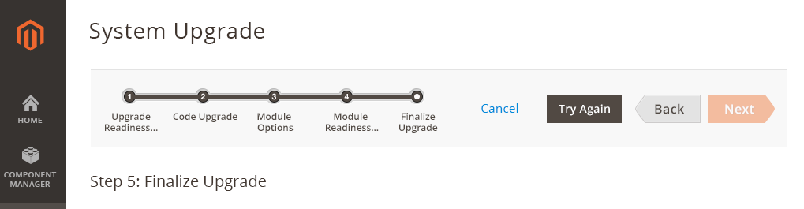
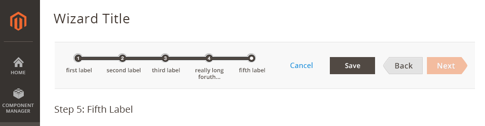
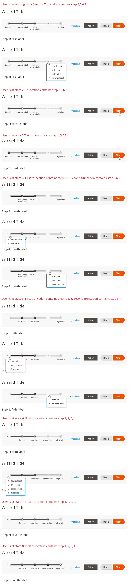

Within the Magento application, it is often necessary to guide a user step-by-step through completing a process. By using a wizard, user can complete a task easier because the user can just follow a preplanned, step-by-step path to accomplish his/her goal. It also increases the chances that the task gets completed successfully.

For solutions not described in this article or for further information, please contact the Magento UX Design Team.

## When to Use

Use this pattern when the user needs to go through a process to accomplish a task that is complex and contains several steps.

## When Not to Use

*  The wizard bar should not co-exist with a button bar. Only one can be present per page/modal.
*  Be careful when using this pattern. Wizard is a bad choice when users are experts and/or the task is done often, because Wizard has negative effect on efficiency and user control.

## How to Use

*  Break up a task into logical, titled steps.
*  Keep the number of steps at the minimum.
*  Remove or hide unnecessary interface elements that are not necessary for completing the task.
*  If possible, allow some freedom for the experts.
*  Show a sequence map of all the steps in the Wizard at the top of each page.
*  Show a summary on the last page (if necessary).

## Structure

The whole structure must be responsive and fluid.

**1. Wizard Title:**

This would be the page/modal title

**2. Wizard Progress:**

Placement is always on the most left. The width is fluid, depending on the screen size. Must be in one line. The width can go as long to reach the buttons. But if there is not enough room, see **Variation 4** at the bottom of this document.

**3. Action Buttons and Links:**

The additional links and buttons needed must be between the Wizard Progress and Next & Back buttons.

**4. Next & Back buttons:**

These buttons must be present at all time and in every step of the wizard. If the button is not needed, it can be disabled. Placement is fixed at the most right of the whole container.

**5. Step Labels:**

These labels are optional. Although long labels are not recommended, it is possible. The labels can flow to the next line but only two lines permitted. Any extra text are not shown but the '...' will be use to indicate that the label has extra text.

**6. Current Step Title:**

This should always be in the format "Step #: Step Label".

## Style

Refer to below for basic styling. The special cases of styling can be found under variations.

## Interaction and Behavior

**Content Behavior:**

User navigate between steps of the wizard by clicking 'Back' or 'Next' button.
The 'Back' or 'Next' buttons should only change/refreshes the content area, not the whole page.

**Fillings Animation:**

No animation

**Back Buttons behavior:**

In every first step, back button is disabled. In all other steps, back button becomes enabled.

**Next Buttons behavior:**

If next button exist in the very last step, it should always be disabled. (Note: refer to variations section of this document, some cases may not have next button in last step.

If a step required that the user complete the steps before proceeding, next button maybe disabled for that step.

**Visited States behavior:**

If the user is creating a new flow using wizard, the future steps can be disabled. But if a user is EDITING an existing flow using wizard, all steps in the progress-bar will be accessible. The visited states does NOT behave like a visited link. The system should remember if the flow have been visited before even though the visitation is not from the same browser session.

**Other Navigation** (besides back and next buttons)

## Variations

### 1. Basic Process (i.e. Deploy tool)

In the first step, back button is disabled.

In the last step, next button is disabled.

### 2.Process with Save Functionality at Any Step

In the first step, back button is disabled, and next button is enabled. Save button is present so the user who only need to edit specific step, can 'Save' right after they are done editing.

Any other steps, Save button is present. Both 'Back' and 'Next' buttons are enabled.

'Next' button becomes disabled. The user will use 'Save' button for saving.

### 3. Process with many steps that cannot fit in the given section

It is not recommended to have too many steps for a wizard. But if a use case arise such that your [extension](https://glossary.magento.com/extension) will have many steps that cannot fit the available space, please follow this truncation rule if not all steps in the navigation can be visible at once. This case may happen based on multiple reasons such as screen size changes, too many buttons, or simply too many steps.

(for specific styling of this variation, refer to the link to .psd files in Assets.)

## Assets

*  [Download Wizard Style - PSD source]({{ site.downloads }}/wizard-pattern-styles.psd)
*  [Download Variation 1 - PSD source]({{ site.downloads }}/Variation1.psd)
*  [Download Variation 2 - PSD source]({{ site.downloads }}/Variation2.psd)
*  [Download Variation 3 - PSD source]({{ site.downloads }}/Variation3.psd)
*  [Download Variation 4 - PSD source]({{ site.downloads }}/Variation4.psd)

Please reach out to the Magento UX Design team if you need anything else.
