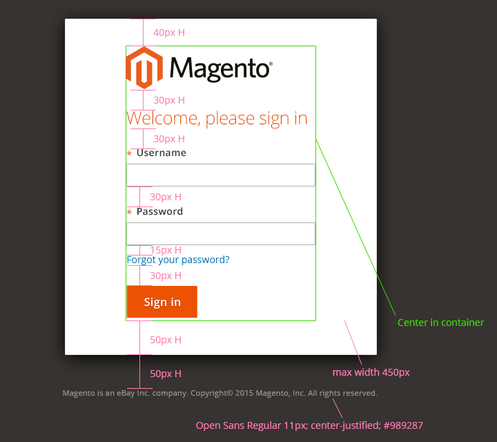
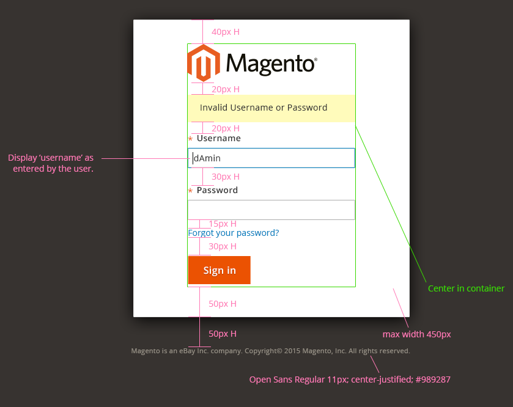
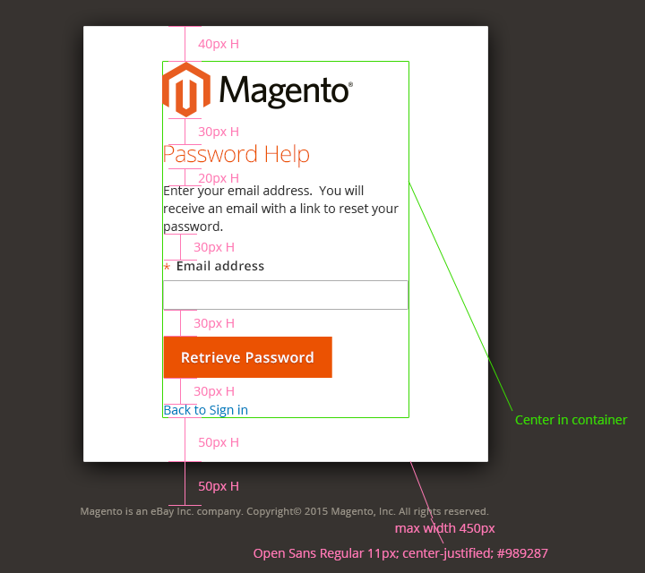
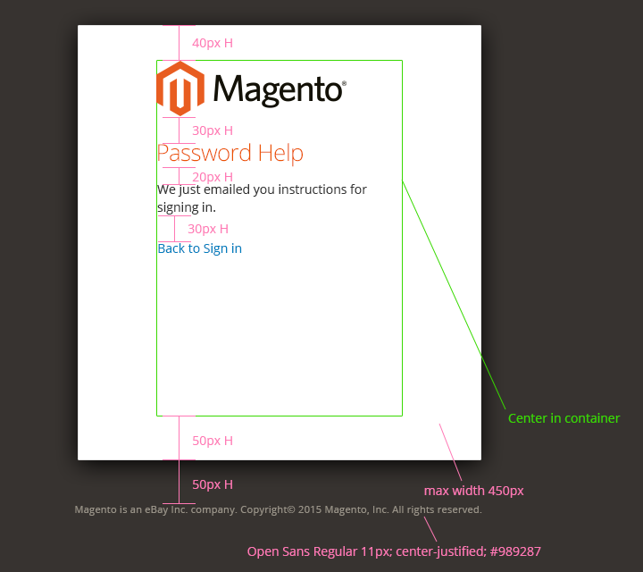
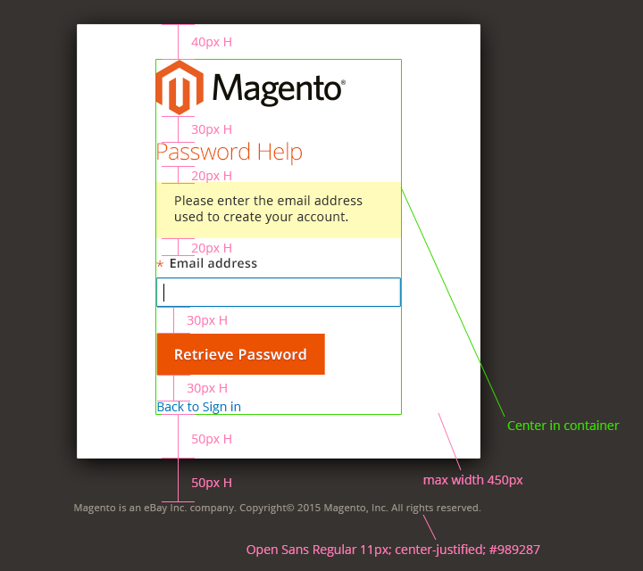
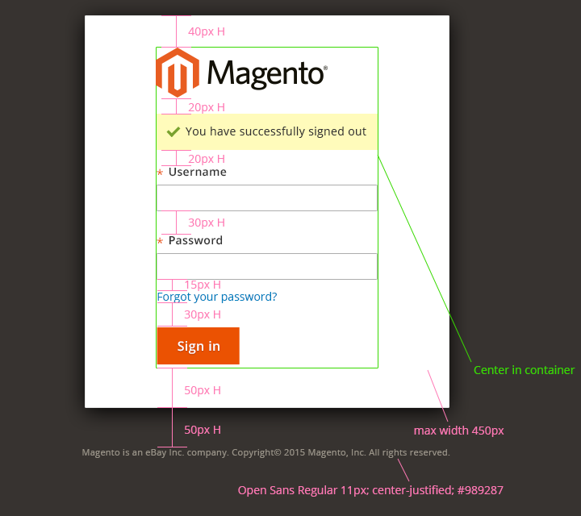

"Sign in" is used to log into the system, or to recover a lost password.

## When to Use

Use this pattern when user needs to sign into the system.

## Interaction and Behavior

### General

The user may "tab" to navigate the form in the following order:

1. First tab = active "Username" field
1. Second tab = active "Password" field
1. Third tab = focus on "Sign in" button
1. Fourth tab = focus on hyperlink ("Forgot your password?")
1. Fifth tab = return to top of the order.

### Initial state

In its initial state the sign-in [module](https://glossary.magento.com/module) consists of

*  a Welcome message
*  two text fields – **Username** and **Password**
*  a link to retrieve the user’s password
*  a button to submit the user’s credentials – **Sign in**

### Error state

In the [event](https://glossary.magento.com/event) that invalid credentials are submitted the sign-in module consists of

*  an alert message informing the user that either the Username or Password is invalid
*  two text fields – **Username** and **Password**, where the Username field will retain the initial entry as typed by the user and be the active field and the password field will be blank
*  a link to retrieve the user’s password
*  a button to submit the user’s credentials – **Sign in**

### Password retrieval

If the user opts to retrieve their password via the hyperlink ("Forgot your password?") the sign-in module will display

*  the title **Password Help** in the style of the Welcome message from the initial state
*  instructional text explaining the process for retrieving one’s password
*  a text field to enter the user’s email address used at the time of registration; a button to submit the user’s email address and initiate the process – **Retrieve Password**
*  a link to cancel the retrieval and return to the initial state of the sign-in module – "Back to Sign in"

### Confirmation of password retrieval

Once a user submits their email address to retrieve their password, the module will provide a confirmation on the action via text in the module.

*  the title **Password Help** in the style of the Welcome message from the initial state
*  text confirming that an email has been sent
*  a link to return to the initial state of the sign-in module – "Back to Sign in"

### Error of password retrieval

In the event that the user enters an invalid email address, either by mistyping or by entering an unregistered email address, the module will display an alert message.

*  the title Password Help in the style of the Welcome message from the initial state
*  an alert message indicating the email address failed
*  a text field to enter the user’s email address used at the time of registration; a button to submit the user’s email address and initiate the process – Retrieve Password
*  a link to cancel the retrieval and return to the initial state of the sign-in module – "Back to Sign in"

### Successful sign-out

When the user signs out of the system they are presented with the sign-in module as follows

*  an alert message informing the user that sign-out was successful
*  two text fields – **Username** and **Password**
*  a link to retrieve the user’s password
*  a button to submit the user’s credentials – **Sign in**.

## Style

Suggested specifications.

The module container should be centered in the browser and should be some percentage of the width viewport (about one-half) but no less that 450px on desktop and tablet form factors.

### Initial state:

### Error state:

### Password Retrieval:

### Confirmation of password retrieval:

### Error of password retrieval:

### Successful sign-out:

## Assets

[Download Sign-In form source]({{ site.downloads }}/magento-sign-in.psd).

For any questions or additional information about the sign-in module please contact the Magento User Experience and Product Design team.
